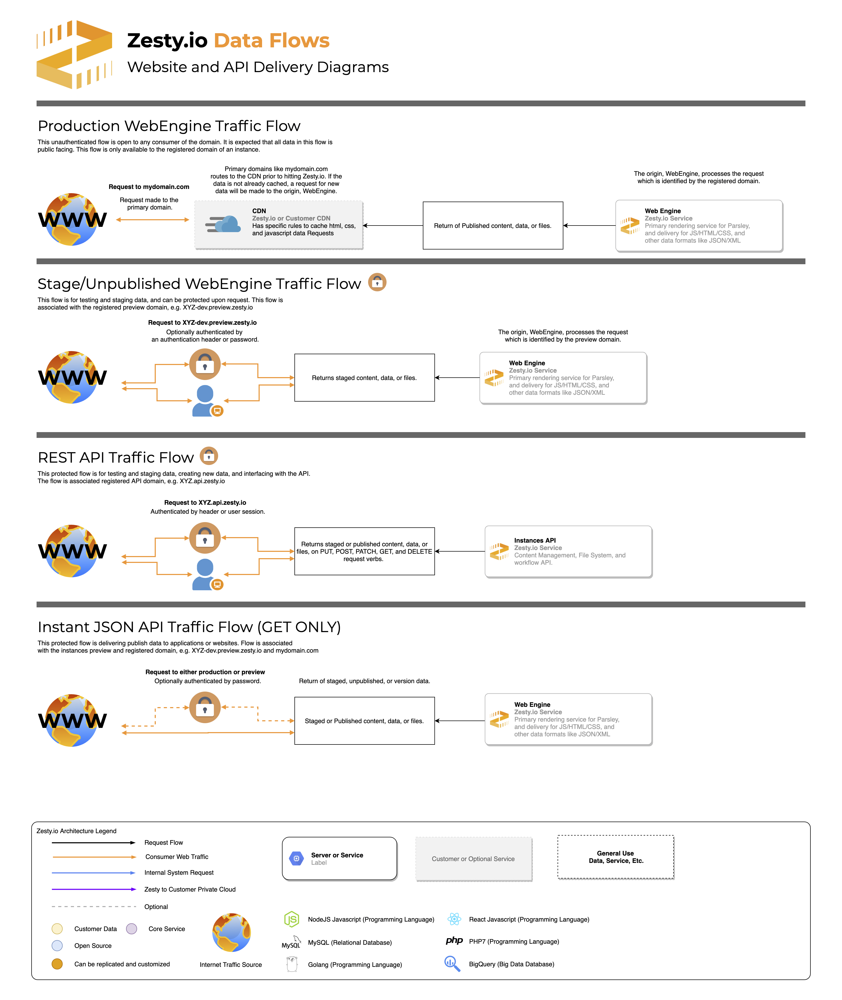

# API Overview

### Available APIs

Every item of content that is authored in Zesty.io has a paired API endpoint that gives developers JSON access. Two are auto generated, Instance Content API \(open\) and Instances REST API \(authenticated\).





Specific custom endpoints which can combine data and other information can be created through the zesty.io code editor.



### API Data flows Diagram

See the following graphic for data flow examples which can be used to apply your custom workflows for headless, desktop, or IoT applications.

