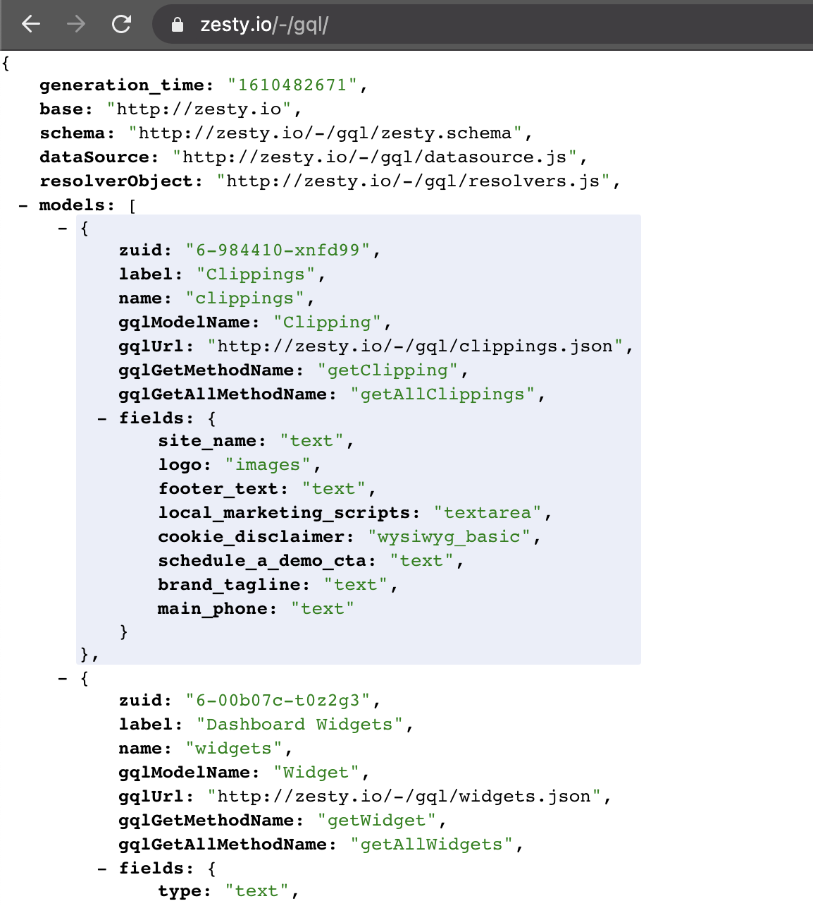

# GraphQL

Zesty.io provides endpoints to power a GraphQL server for any instance, you can follow a full tutorial to launch an Apollo GQL server by using this code base on Github [https://github.com/zesty-io/graphql-zesty](https://github.com/zesty-io/graphql-zesty)

### How to Turn on GQL

For any Zesty.io Content Instance you may turn on the GQL setting in the content manager &gt; settings &gt; developer. The settings are named \[developer\]\[gql\] and \[developer\]\[gql\_origin\], if these setting are missing from your instance, reach out to the support slack to have them added.

### How to Use GQL

When GQL is turned on, endpoints will become available at the instance domain like `https://www.acme.com/-/gql/` which is a map file that shows all the endpoints needed. 

### Deploy a GQL Server

To Deploy a GQL server using Zesty.io, use this code base  [https://github.com/zesty-io/graphql-zesty](https://github.com/zesty-io/graphql-zesty)

