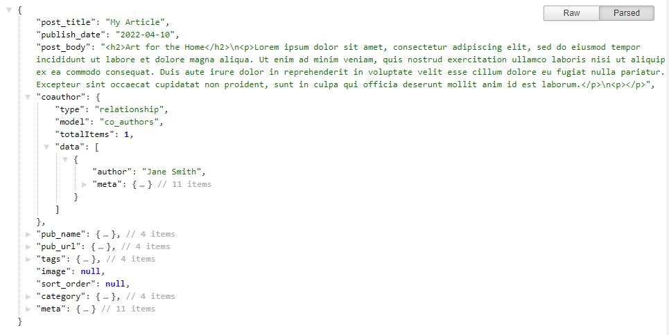

# Headless & Hybrid toJSON

To aid in the consumption of content the toJSON endpoint is available in both Headless and Hybrid WebEngine Modes. The endpoint will render an object containing a content item's meta, stored and related data when `/?toJSON` is applied to the end of the established URL routing of the item. &#x20;

**For example:** `https://www.mydomain.com/blog/my-article/?toJSON`

The URL routing utilizes the established route configured for the content items view. It can be added to _**live**_ or _**preview**_ _**branch**_ URLs. However, when accessing the content for production using the _**live branch**_ is the best practice to ensure that only live published content is rendered.

### Content Output

The content item's fields and their contents will render in key-value pairs. Related content obtained through One-to-One or One-to-Many fields will render as a sub-object with a corresponding data array. The data array will include hydrated objects of the related items. For example, below the coauthor field is a One-to-One relational with the selected items data object.

The content hydration level of the returned object has a default depth of three. The top-level is the first and two lower depth levels of related content. The hydration depth cannot be set via URL.

### No Meta Option

The meta data provided in the object may not be necessary when consuming the content. These can be removed before the object is returned by adding a `nometa` query parameter value to the end of your URL. &#x20;

**For example:** `https://www.mydomain.com/blog/my-article/?toJSON=nometa`

This will remove the meta data from the primary content item's rendering and the related items' objects as well.
