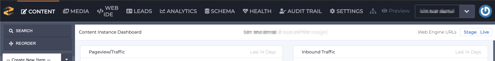
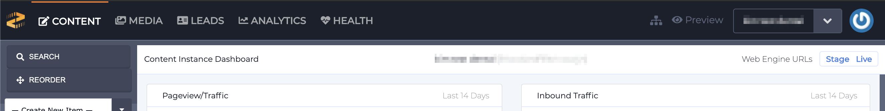
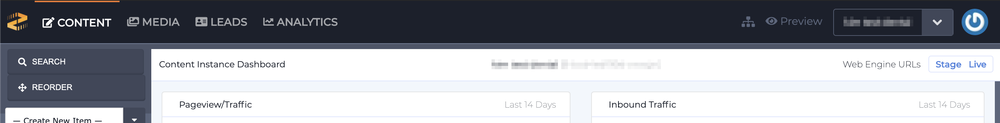
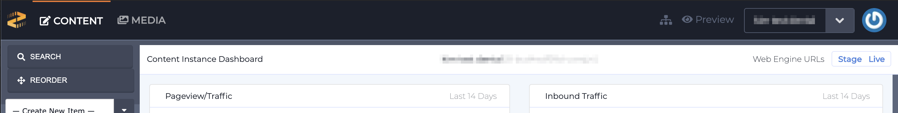
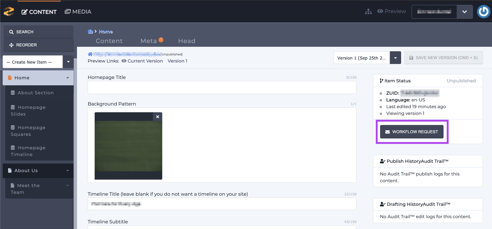

# Roles & Permissions

User Roles and Permissions are applied to User or [Team access](https://zesty.org/guides/adding-a-team) to via the Accounts [instance settings drawer](https://zesty.org/services/accounts-ui/instance-settings-drawer). Role permissions range from limiting the types of resources a user can access to whether they can save, create, delete or publish.

All users are managed by Owner and Admin user roles. Access and roles are specific to an individual user's role on a single instance. If they are a member of a team then their access will be limited to the team's role as its assigned on an instance.


Note: the Leads and Analytics in the screenshots below are only visible if an instance has[ form that uses Zesty's ZLF](https://zesty.org/services/manager-ui/leads#how-to-connect-forms-to-zlf) and if [analytics have been activated](https://zesty.org/services/web-engine/analytics).  
  
All roles have access to publishing/unpublishing and deleting content _except for the Contributor role_. 


### Base Roles Types

#### **Owner**

Full access to all sections: Content, Media, Web IDE, Leads, Analytics, Schema, Health, Audit Trail, and Settings. In Accounts they have full access as well which includes the ability to: launch instances, add domains, invite new users and set their roles, add a team, create tokens, and reset the blueprint. 

#### **Admin** 

Admins have the same privileges as the Owner role.

#### Developer

Access to: Content, Media, Web IDE, Leads, Analytics, Schema, Health, and Settings sections.

#### SEO 

Access to: Content, Media, Leads, Analytics, and Health sections.

#### Publisher

Access to Content, Media, Leads, and Analytics sections. 

#### Contributor

Access to Content and Media sections. 

Contributors can create and edit but they **cannot publish** content. To publish new content, contributors must submit a workflow request to a user with publishing access. 

Contributors can access media and add files, but they **cannot delete** files.

