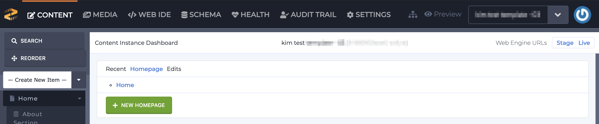
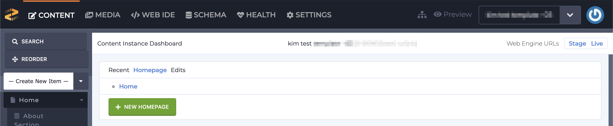
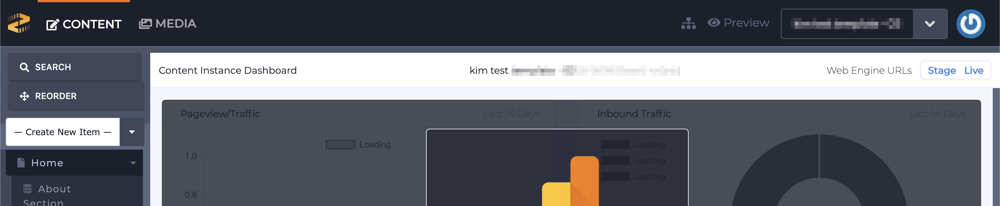
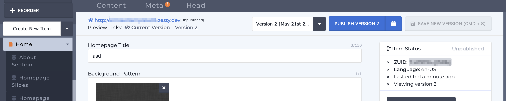
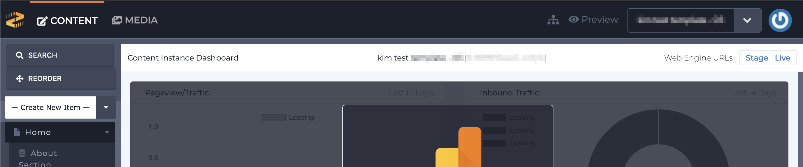
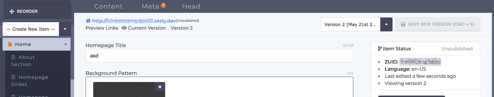

# Roles & Permissions

User Roles and Permissions are applied to User or Team access to Content Instances. Controls range from types of resources they can edit to whether they can save, create, delete or publish.

All users are managed by Site Administrators. Access and roles are specific to the users role to a single instance, or the team's role to a single connection to other Zesty.io platform instances.

### Base Roles Types

#### **Owner**

Access to Content, Media, Leads, SEO/Health , Schema, and Code Editor sections. In Zesty.io accounts, they can access the billing section and assign admins. Owners can publish both content and code and can invite users to Content Instances.

#### **Admin** 

Access to Content, Media, Leads, SEO/Health , Schema, and Code Editor sections. Admins can publish both content and code and can invite users to Content Instances.

#### Developer

Access to Content, Media, Leads, SEO/Health, Schema, and Code Editor sections. Developers may publish both content and code.

#### SEO 

Access to Content, Media, SEO/Health, Content Configurator, and Code Editor sections. SEO users may edit and publish both content and code so they can update keywords and relevant HTML tags.

#### Publisher

Access to Content, Media, and Leads sections. Publishers may edit, authorize, and publish both content and update meta titles and descriptions.

#### Contributor

Access to Content, and Media. Contributors can manage and add new content to be saved for review, but cannot publish new content. To publish new content, contributors must submit a workflow request to a user with publishing access.

