# Adding Image Alt Text

### Overview

Adding alt text to images makes sites more accessible for users who are unable to see them. 

### Implementation

There are several ways that alt text can be implemented in Zesty.io. We recommend using the [Media section](https://zesty.org/services/manager-ui/media)'s Title field, or a text [field](https://zesty.org/services/manager-ui/schema/fields) in the [Content section](https://zesty.org/services/manager-ui/content) to make the alt description easily accessible to and editable by the content owner. 

Alt text can also be hardcoded in via the [Web IDE](https://zesty.org/services/manager-ui/editor), however this approach will not give your content owners the flexibility to edit that text as necessary. 

The steps below will cover how to use the Media sections Title field or a text field in the Content section to add alt text.  

### Steps: Media Section Title Field

1. Navigate to the Media section.

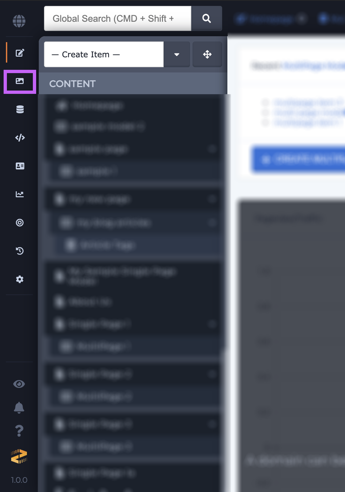

2. Upload an image via drag n' drop or via the file manager.

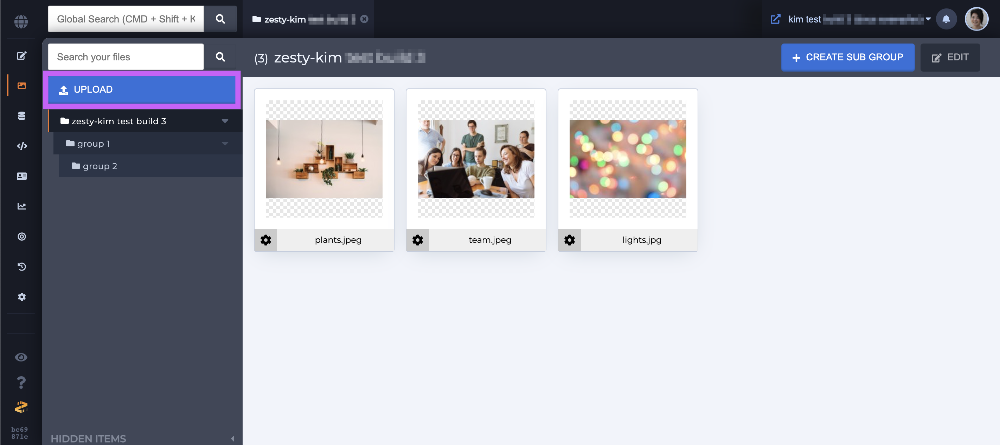

3. The Title field will automatically be filled out with the image's file name. Edit the Title field and add your image alt text. 

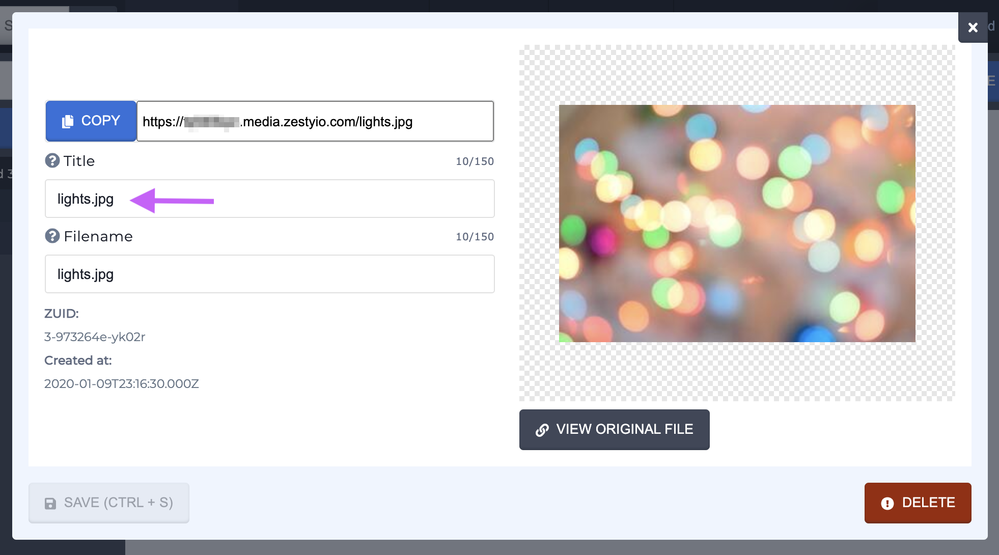

4. Save your changes to the Title field by clicking the green Save button.

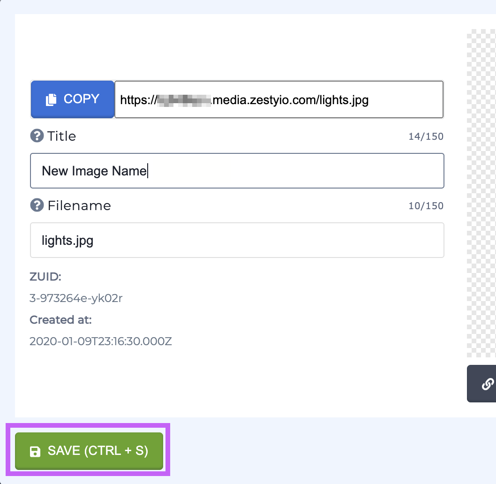

5. Navigate to the Content section.

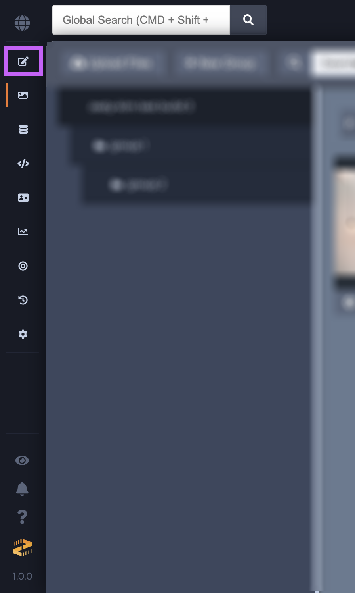

6. Add your image to your content and save \(and publish as necessary\).

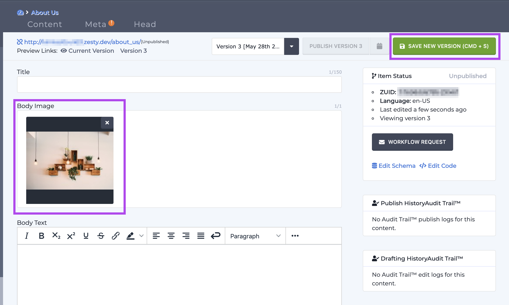

7. Navigate to the Web IDE. 

8.  Locate your view and add an HTML image tag and with an alt attribute. Fill out the alt attribute with the Parsley {{ .getImageTitle\(\) }} call. 

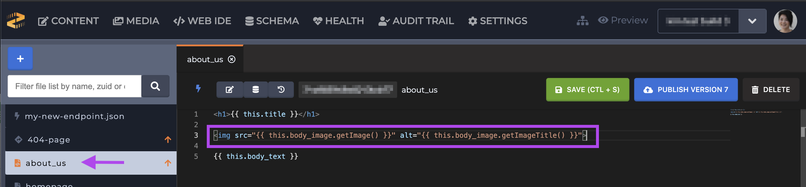

### Steps: Content Section Text Field

1.Navigate to the Media section. 

2. Upload an image via drag n' drop or via the file manager. 

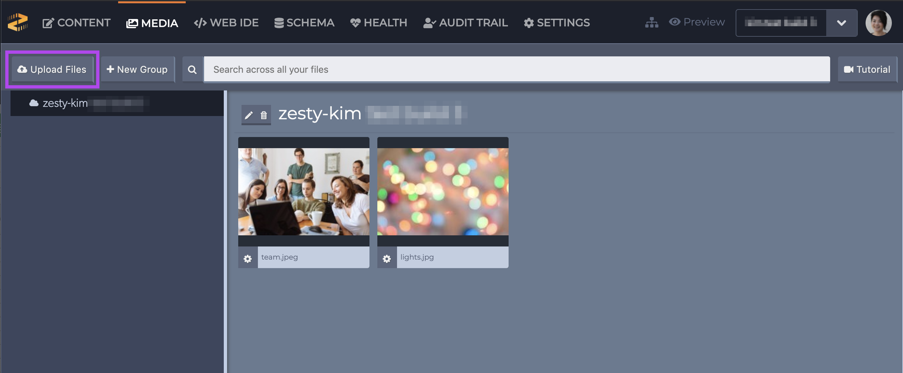

3. Navigate to the Schema section.

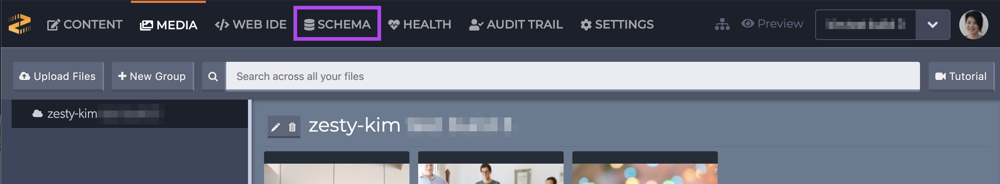

4. Locate the content model that you want to add the your alt text field to. In this example we're adding it to the About Us page.

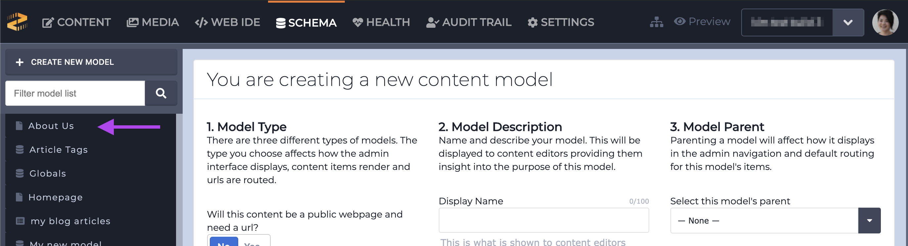

5. Add a text field type called Image Alt Text. 

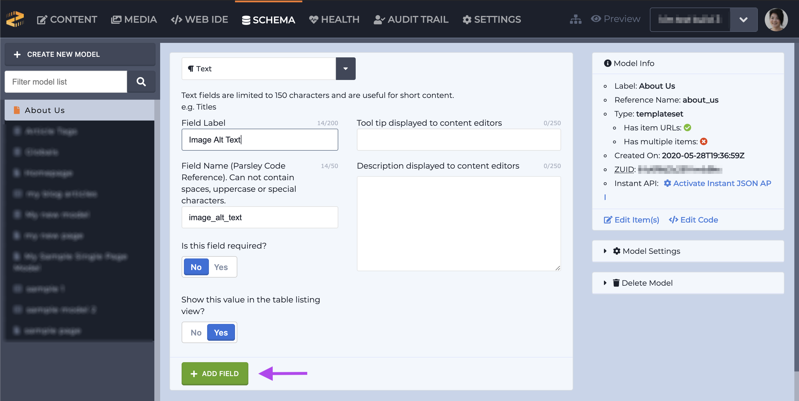

6. Navigate to the content section and locate the content model that you added your alt text field to.

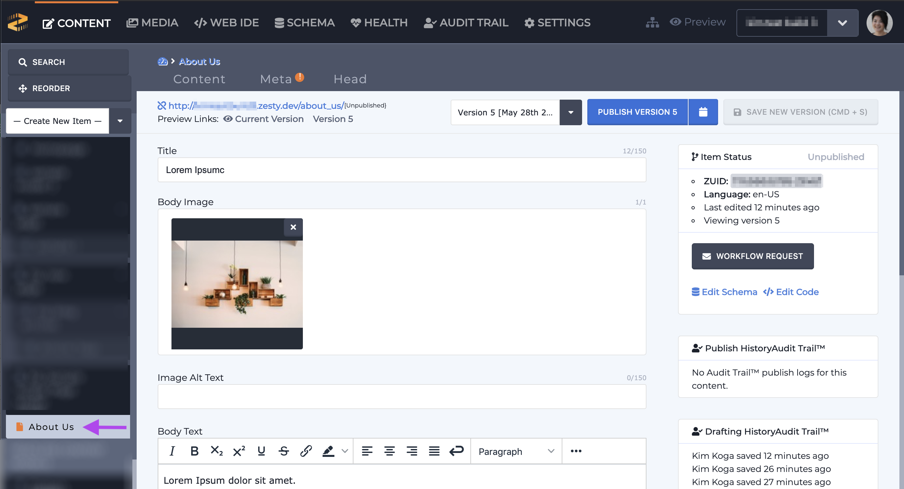

7. Add or update your image, and add your alt text and save \(and publish as necessary\).

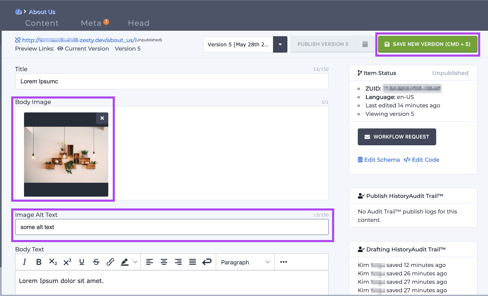

8. Navigate to the Web IDE.

9.  Locate your content model's related view. Add an HTML image tag and with an alt attribute. Fill out the alt attribute with the Parsley {{ this. }} call and complete the call with the name of the field that you created in step 2.

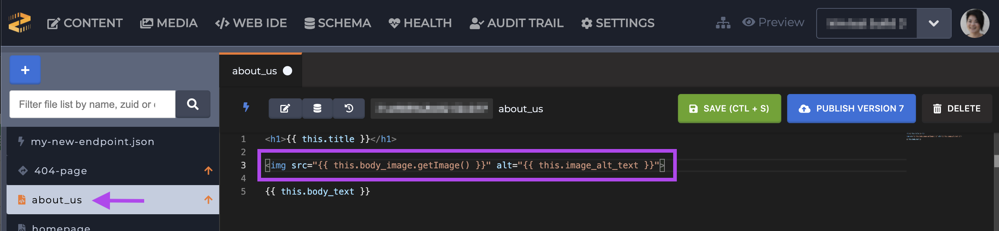

