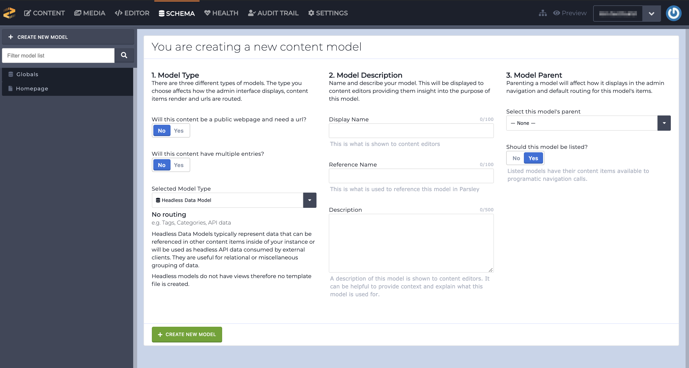
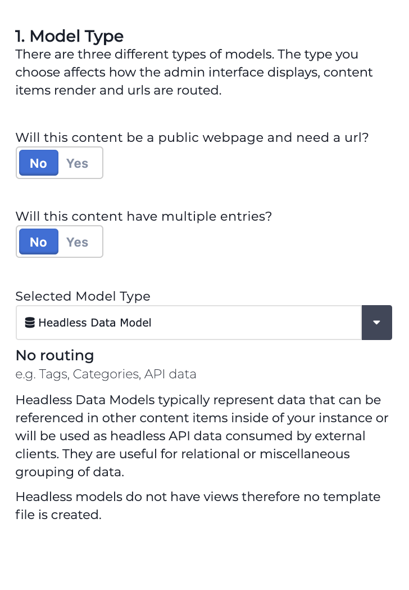
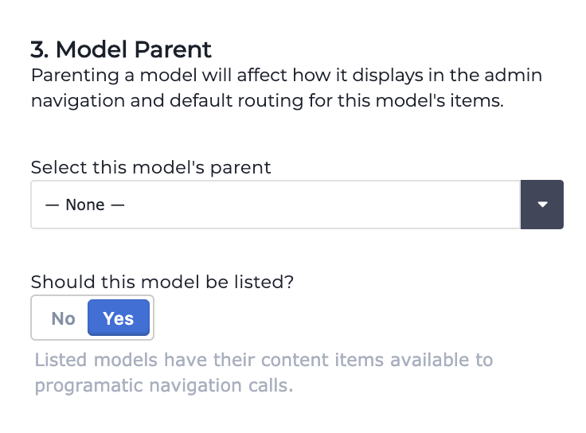
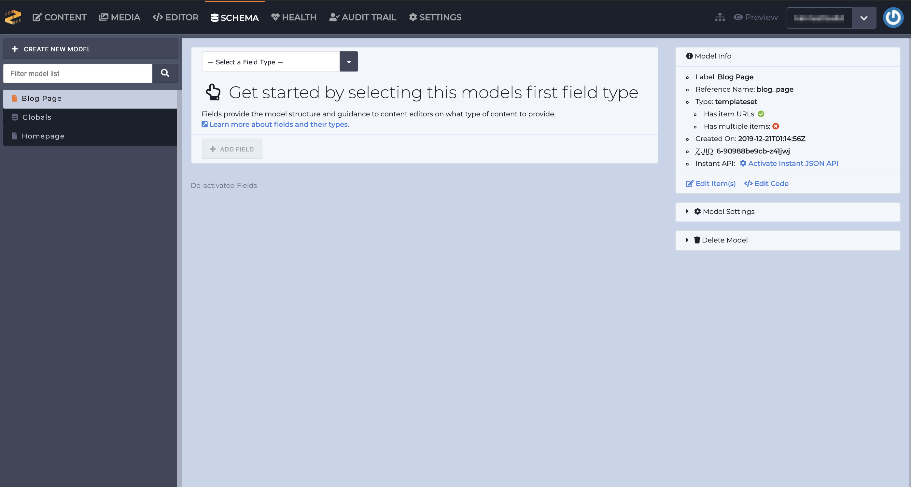
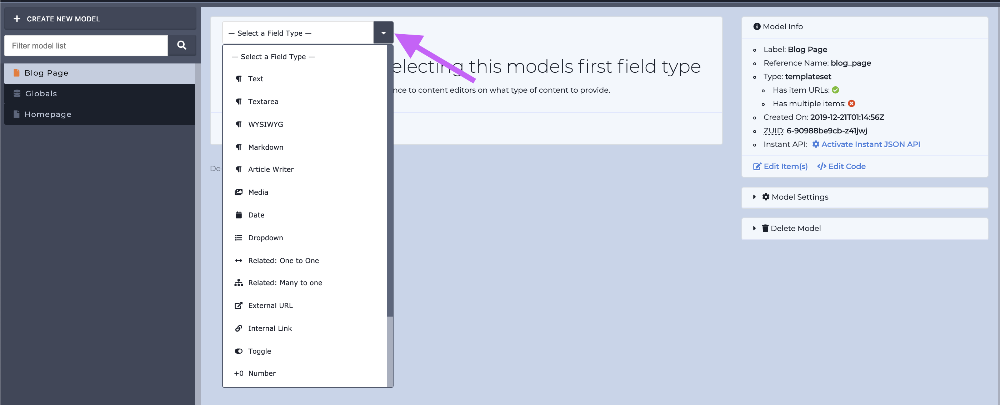
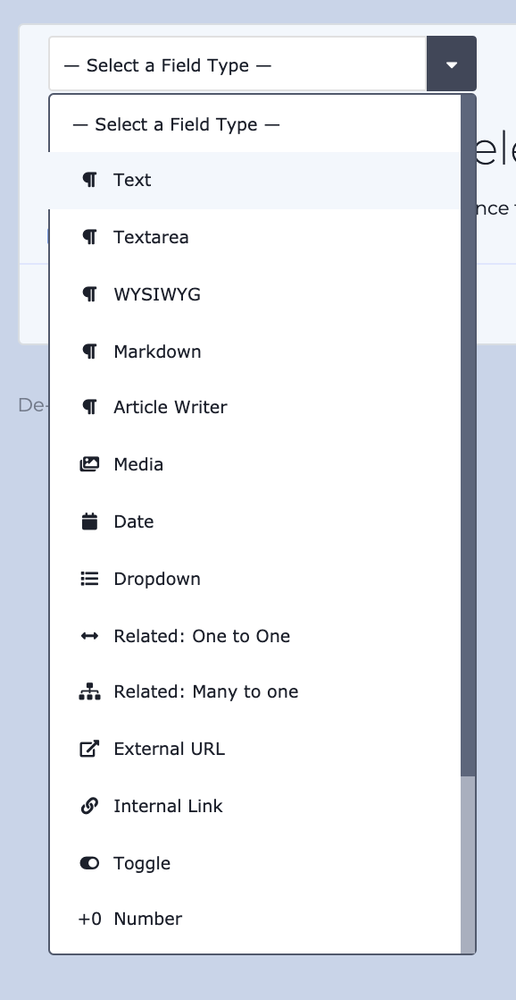
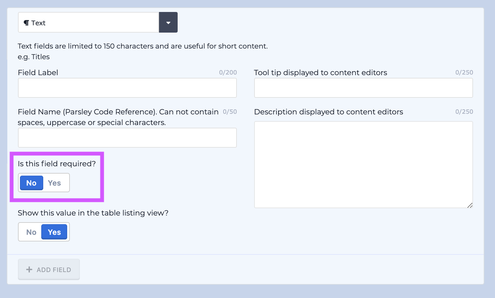
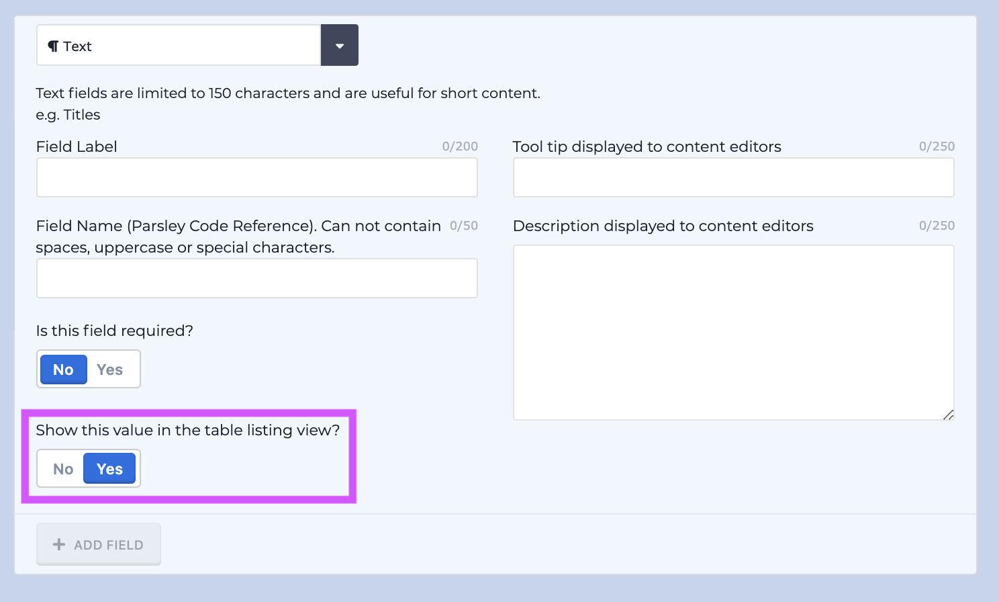
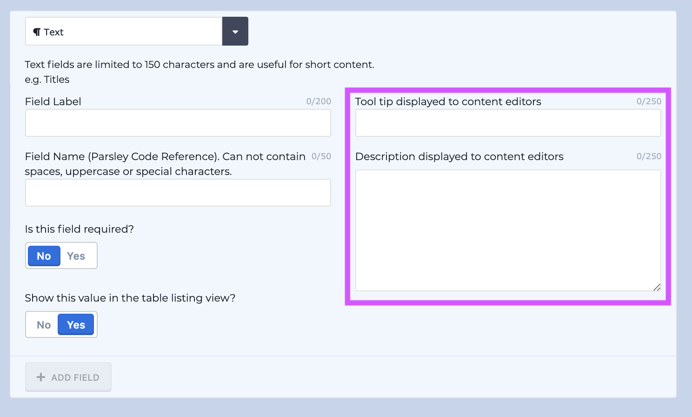
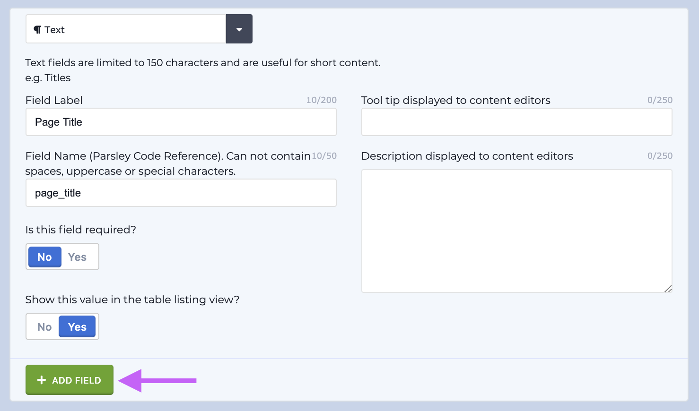

# Building the Schema and Selecting Fields

## Introduction

Building your instance's schema is the first step to getting started with your new instance. Building your instance's schema means that we'll be creating content models and adding fields to those content models. There are 3 types of content models:

1. Single Page \(e.g. about us page\)
2. Multi-page sets \(e.g. blog articles\)
3. Headless sets \(e.g. blog tags\)

After we create content models, we'll add fields to them. Fields allow users to enter their content.

## Content Models

The Schema section's home screen has a step-by-step guide to help you choose the right content model for your needs. After the content model type is selected, you'll name it, then select a parent if necessary, and create it.

### Step 1

Use the toggles to answer the prompts and the content model type will be automatically selected based on your answers. If you already know what you need go ahead and select your content model type from the dropdown.

### Step 2

Fill out the Display Name textbox and the Reference Name will auto-populate. The Display Name is used to identify the model in the Content section. The Reference Name is used to identify the model in the Editor section. The Description is optional. The model's Display Name, Reference Name, and Description can all be edited after it's been created.

### Step 3

Selecting a parent for your model will affect how it displays in Content section and will create default paths for its routing. For example if you have a set called Articles and you select a page called Blog Page as its parent, the URL path for the articles will be: `/blog-page/article-name`. The model's parent can be edited after it's been created.

### Step 4

Click the green Create New Model button to create your model.

## Fields

Fields are added to a content model after it's been created. Fields allow users to enter their content.

### Step 1

Click the dropdown to select a field. Determine the field type you need by thinking about the type of content that will be entered. Learn more about field types by reading this [article](https://github.com/zesty-io/zesty-org/tree/e76310312201061ff526540e6164d65245ee9d9b/services/web-engine/interface/schema/fields.md#table-of-field-types).

### Step 2

Select a field from the dropdown by hovering over it and clicking it.

### Step 3

Fill out your field's attributes:

1. Field Label
2. Field Name
3. Is this field required?\*
4. Show this value in the table listing view?\*\*
5. Tool Tip and Description\*

   \* denotes optional attributes.

\*\* denotes an optional attribute that apply to Multi-page and Headless sets only.


All of these attributes can also be edited after the field is created. _\*\*_


**Field Label and Field Name**

Give your field a Field Label and Field Name.The Field Label will be displayed in the Content section when you're adding content. The Field Name will be used to identify a content model's field in the Editor. The Field Name will auto-populate based on the Field Label's text.

**Is this field required?**

If this toggle is flipped to Yes then an asterisk will appear next to the Field Label in the Content section. This field will be required to have content in it prior to saving and publishing in the Content section.

**Show this value in the table listing view?**

This attribute only applies to multi-page sets and headless sets. If you'd like this field to show in the [table-listing view](https://zesty.org/services/manager-ui/content#table-listing-view) make sure this attribute is toggled to Yes.

**Tool tip and description**

The Tool tip and Description attributes are used to direct your content editors when they're entering content. For example, if you have a text area and you want to limit its content to 3 sentences you can instruct your content editors to limit the content to 3 sentences.

### Step 4

Once you're finished filling out the attributes click the green + ADD FIELD button to add the field to your content model.

Repeat this process to add more fields to your content models.

## Conclusion

Once you've completed this process with all of your content models hop on over to the Content section to enter your content.

If you need to create more content models and add more fields in the future simply navigate back to the Schema tab and create more content models and add fields.

