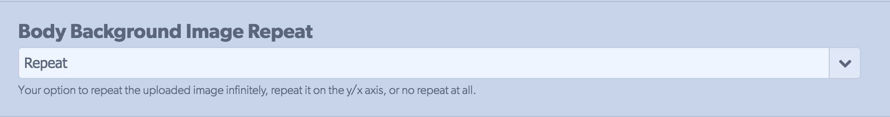
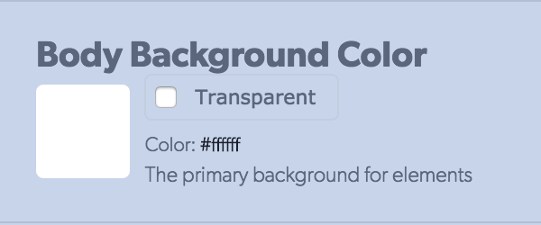
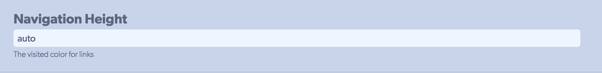

# How do Instance or Blueprint LESS Variables Work

Plate-Variables describe how the LESS Variables in the CONFIG tab are constructed. It creates placeholder content about how the variables work as well as the type of variables you have access to.

### How Variables Work

There are a few default variables in each template \(there is no limit to how many you can add\). The four default variables are dropdown, color, text, and image. These variables help get you started and stay consistent when creating your site.

[Github link](https://github.com/zesty-io/plate-starting-foundation/blob/master/plate-variables.xml)

### Examples

#### Example Dropdown Variable:

Dropdown are used to give the user a preset of options. This is helpful for things such as font weight and background position.



#### Example Color Variable: 

Color variables help you keep a reference to the colors used on your site. This is helpful for keeping a consistent color palette throughout your site. 



#### Example Text Variable: 

Text variables controls the options for styling related to text. An example would be the visited color for links and setting the curvature for borders. 



#### Example Image Variable: 

Image variables are default images that come with the template.



#### Example Font-Picker Variable:

Font-picker is used to select font styling.



#### Example Font-Weight Variable:

Font-weight specifies the weight or boldness of the font.



