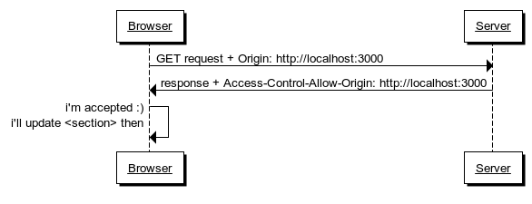
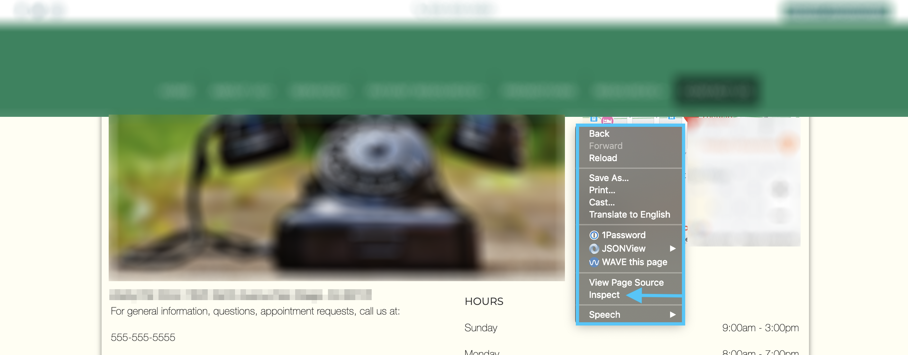
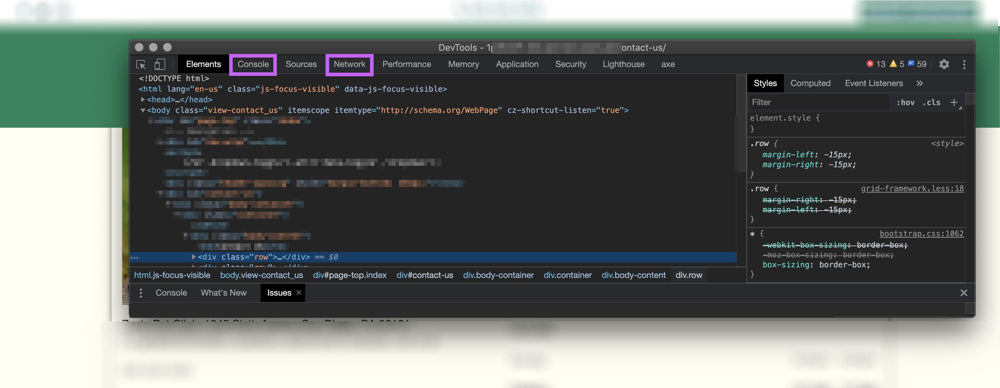
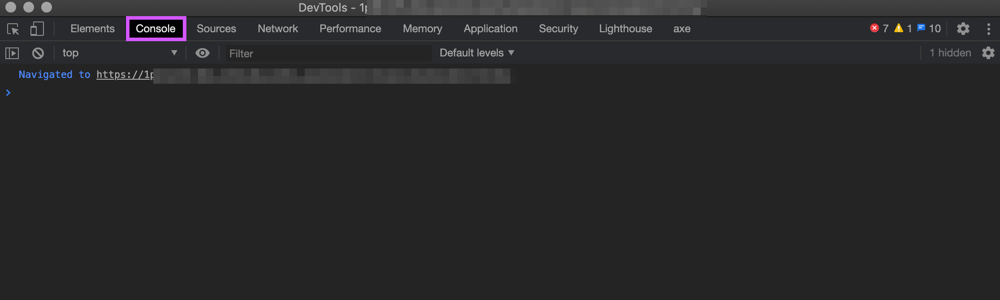
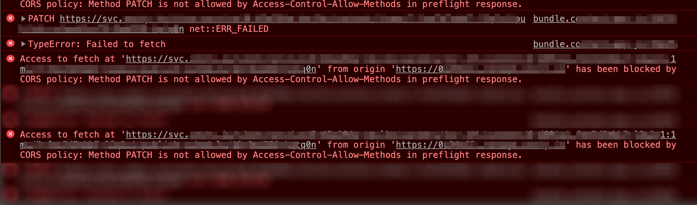
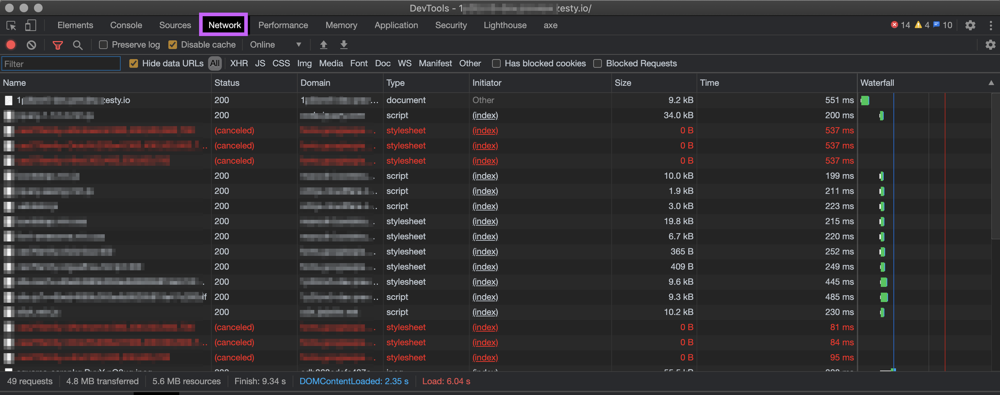
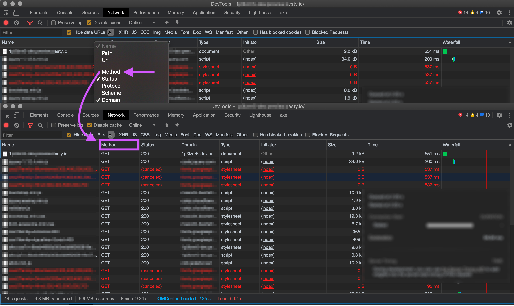
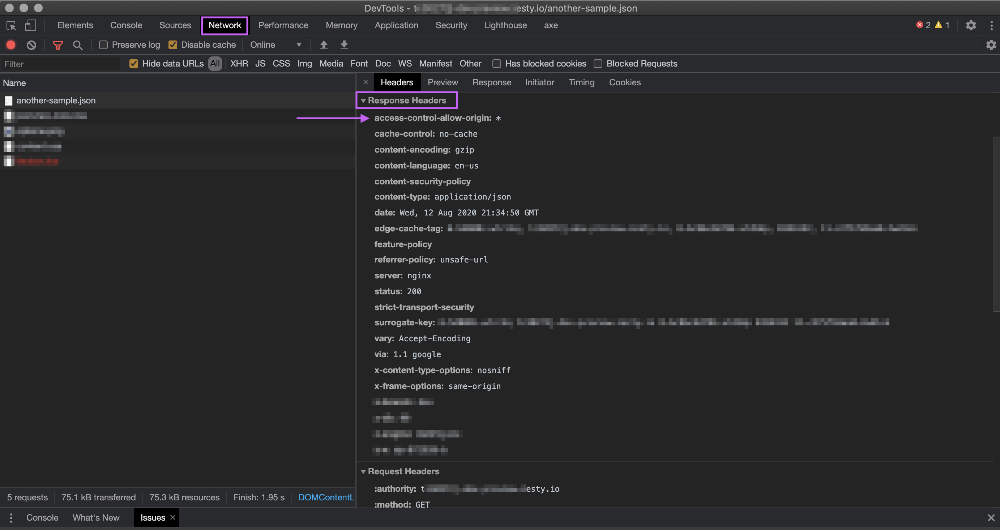
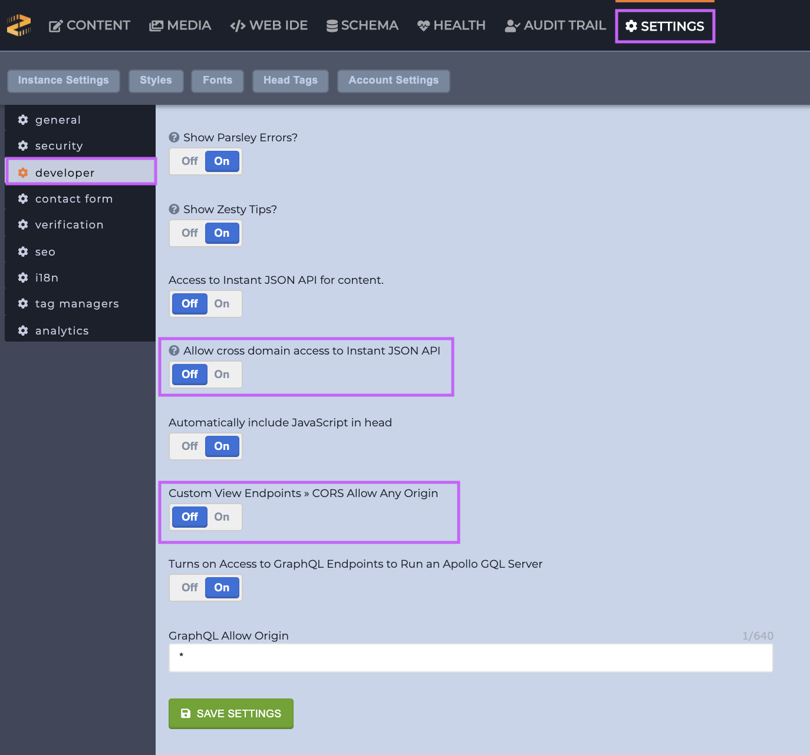

# How to Deal With CORS

### Overview

CORS can be one of the most frustrating things to debug when working with front-end code. This guide provide steps for determining if you are having a CORS issue, ways to resolve them, and how to configure CORS on your Zesty.io instance.


If you are just starting to learn about CORS one of the best places to start is the [Mozilla Developer Network \(MDN\) documentation on CORS](https://developer.mozilla.org/en-US/docs/Web/HTTP/CORS). It is an excellent resource for all things front-end.


### What is CORS?

CORS is an acronym for Cross-Origin Resource Sharing. CORS is when one domain makes an XMLHttpRequest \(XHR\) to another domain. This commonly occurs when using JavaScript to make an HTTP request to an API. ****

CORS provides instructions by the requested server to the requesting client \(your web browser\) on what its rules are on requests from other domains which aren't itself. A basic example of CORS is as follows: When domain-A makes a request to domain-B, domain-B will send instructions back to domain-A stating whether or not domain-A is _allowed_ to make that request to domain-B. _We will refer to this example throughout this guide._

Those instructions act as a security mechanism to limit _how_ data is accessed. However, it should be noted that CORS is _not_ _an absolute_ measure to prevent access to an API as it is up to the requesting client \(domain-A\) whether to respect the instructions returned by the requested server \(domain-B\). This means that things such as cURL \(Client URL\) can be used to bypass these instructions.

The "instructions" we are referring to are the HTTP headers `Access-Control-Allow-*` returned when accessing a domain's URL which has a CORS policy in place.

CORS requests are known as "complex requests" which trigger a web browser \(domain-A\) to send a "preflight" OPTIONS request. The preflight request is an HTTP request which the browser \(domain-A\) makes in order to ask the requested server \(domain-B\) what its policy on CORS is. Based upon the response, the browser \(domain-A\) will then decide whether it should proceed with making the intended HTTP request. This is usually where we begin to see errors being thrown.

### Debugging CORS

While CORS policies are set by the back-end server \(domain-B\) there are a few things that you'll want to test on the front-end \(domain-A\) to ensure that your request is being sent correctly.

#### Browser Extensions

One of the biggest "gotchas" in front-end development can be browser extensions. When installed you've given them permission to run code on the browser tabs you are viewing and  as such they have the ability to modify functionality happening on a web page. Not all extensions are good actors and can cause intentional and unintentional side effects; one of those being modifying network requests. Whenever you are debugging front-end issues we always suggest using a "clean-room" profile.  A "clean-room" profile is a browser profile without any extensions installed. This will ensure that you don't have any unexpected changes in behavior from 3rd party code locations.

#### Investigating HTTP Response Headers

Whenever you need to debug front-end code your best friend will be a [browser's inspector](https://developer.mozilla.org/en-US/docs/Learn/Common_questions/What_are_browser_developer_tools). A browser's inspector is a browser's internal tool for examining the source code and resulting behaviors of a web page. 

_Please be aware that not all browser inspectors are created equal and can have significant differences in available functionality; these differences can impact a user's ability to debug their code._

Most browsers' inspectors can be accessed by right-clicking on a web page to show the context menu and selecting the "inspect" option. 

This should open the inspector which will contain multiple tabs. The two we are interested in will be the "Console" and "Network" tab.

**Console**

The console is where we can see errors and logs from both the browser and our page's source code. 

When a CORS error occurs you should see a console error stating what the error was.


Sometimes when a server error occurs the browser will display it as a CORS error. When you see a CORS error in the console it is important to inspect the request in the Network tab and confirm the response headers. 


Typically the displayed error will point out the exact header which caused the CORS failure.

 This information is usually enough to understand what caused the failure and what is needed to allow the request to succeed. Most commonly this is a mismatch between the origin-domain \(domain-A\) and requested-domain \(domain-B\). If your response header `Access-Control-Allow-Origin` value does not match the domain you are on, then it will fail. If this is the case you will need to communicate with the back-end server owner \(domain-B\) to determine a solution. For example: they would need to allow the domain \(domain-A\) you are requesting from.


The origin value of `Access-Control-Allow` is the combination of the protocol, domain, and port. 


`Access-Control-Allow-Origin` has a special value which can be set, an asterisk `*`. This is known as a wildcard which means that the back-end server \(domain-B\) allows requests from _any_ origin \(domain-A\). Public APIs need this value set in order to allow requests from any origin.

In addition to the `Access-Control-Allow-*` headers there are also [`Access-Control-Request-*`](https://developer.mozilla.org/en-US/docs/Web/HTTP/Headers/Access-Control-Request-Headers) headers. It's important to have a cursory understanding of the available values here to more fully understand how CORS requests are formulated. If you need more information, please refer to the CORS article linked at the top of this guide.

**Network**

By using the network tab we can inspect all the network traffic to and from the domain we are on. 

When clicking on a request, such as our HTTP [OPTIONS](https://developer.mozilla.org/en-US/docs/Web/HTTP/Methods/OPTIONS) method request, \(OPTIONS is a type of [HTTP request method](https://developer.mozilla.org/en-US/docs/Web/HTTP/Methods) like GET, POST, etc.\) we will see both the request and response headers. 

_Note:_ In order to see the requests' methods you may need to right-click in the inspector and select _Method_ from the menu shown.

In looking at the response headers of our OPTIONS request we will be able see what `Access-Control-Allow-*` were returned from our back-end server. These instructions are the instructions that the browser then follows.

If the domain we are on is _not_ shown in the `Access-Control-Allow-Origin` value then we will not be able to make the CORS request.


Most browsers' network tabs allow for filtering types of requests, such as XHR, CSS, etc. When an OPTION request fails some browsers will not make the actual request which will cause it to _not_ appear in the filtered XHR list. For this reason it is important to be on the "All" filter to ensure you are seeing any failures which could be occurring.


#### JavaScript Fetch Settings

When authoring code which will make a `Fetch` CORS request one setting you will want to be familiar with is [`mode`](https://developer.mozilla.org/en-US/docs/Web/API/Request/mode). This is the setting which explicitly states what type of request you want to make. It is useful to define this to ensure consistency in how a browser makes  requests along with communicating to yourself or other, future developers what the intent and expectations of network requests are.

### Solving CORS Issues

The most important thing to understand is that **CORS policies are set by the requested domain's server** \(domain-B\). When making a network request with JavaScript in a web browser \(domain-A\) if the back-end server \(domain-B\) does not want to serve requests across origins there is nothing you will be able to do with your JavaScript code to circumvent that. At that point you would need to work with whoever maintains the back-end \(domain-B\) to understand what their CORS policy is.

That being said sometimes there are things in the front-end \(domain-A\) JavaScript that can be setup incorrectly. Before you contact the back-end \(domain-B\) owners you'll want to ensure you've gone through the steps here to debug your CORS requests.

#### CORS Settings on Zesty.io Instances

Since your Zesty.io instance can act as an API to front-end code you have the option of controlling how CORS requests are responded to by your instance.


[Learn more about using your instance as an API](https://zesty.org/guides/how-to-create-a-customizable-json-endpoint-for-content)


Your instance has two types of APIs the [Instant JSON API](https://zesty.org/apis/instant-content-api) and [Custom Endpoints](https://zesty.org/services/manager-ui/editor/custom-file-types-endpoints). By [turning on the CORS setting](https://zesty.org/services/manager-ui/settings/instance-settings#developer) for these APIs in the [instance Developer settings](https://zesty.org/services/manager-ui/settings/instance-settings#developer) you will allow  requests from external domains to yours. This is how you can allow public browser access to your APIs.

## Conclusion

CORS errors can be one of the biggest points of frustration when authoring front-end code. Hopefully with this guide we have given you some helpful insights and strategies for debugging these error when they occur.

**Sources**

* [https://developer.mozilla.org/en-US/docs/Web/HTTP/CORS](https://developer.mozilla.org/en-US/docs/Web/HTTP/CORS)
* [https://developer.mozilla.org/en-US/docs/Web/HTTP/Headers/Access-Control-Allow-Origin](https://developer.mozilla.org/en-US/docs/Web/HTTP/Headers/Access-Control-Allow-Origin)
* [https://developer.mozilla.org/en-US/docs/Web/HTTP/Headers/Access-Control-Request-Headers](https://developer.mozilla.org/en-US/docs/Web/HTTP/Headers/Access-Control-Request-Headers)
* [https://fetch.spec.whatwg.org/\#http-cors-protocol](https://fetch.spec.whatwg.org/#http-cors-protocol)

