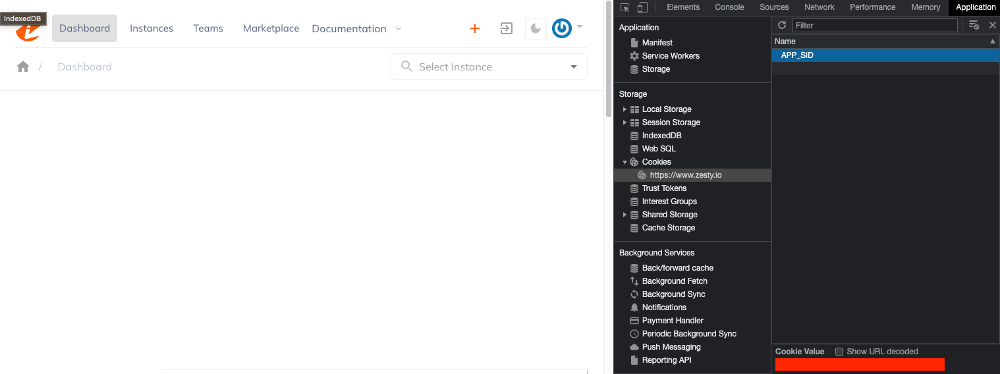

# Okta and Zesty.io SSO Integration

This document is a guide on how to configure [Okta](https://help.okta.com/en-us/Content/Topics/Apps/apps-about-sso.htm#:~:text=The%20Okta%20app%20integrations%20in,without%20re%2Dentering%20their%20credentials.) as the Identity Provider to facilitate SSO with Zesty.io application.

## Supported Features

* IdP-initiated Single Sign-On ([OIDC](https://openid.net/connect/)) via Okta
* Support user login to Zesty from Okta end-user dashboard
* Automatic account creation in Zesty.io on initial SSO

## Requirements

* User should have access to an [Okta tenant](https://developer.okta.com/docs/guides/oin-oidc-multi-tenancy/main/#tenants-in-okta)
* User registering the organization’s client_id, client_secret and client_domain in Zesty MUST have an admin or owner role
* Email that will be used to login in Zesty.io MUST match the email registered in Okta

## Configuration Steps

1. Install Zesty.io application in Okta instance
2. In the Okta admin page, click on the Zesty.io application and go to ***"Sign On"*** tab
3. Copy the values of **Client ID** and **Client Secret**
    * Client ID is a public identifier for the client that is required in OIDC/OAuth flows
    * Client Secret is a private identifier that SHOULD NOT BE SHARED
4. Get your organization’s **Okta domain** (or **Issuer URL**) which can be found in the top-right dropdown button under your email
    * Domain SHOULD CONTAIN **https://** i.e. https://org.okta.com
5. Assign people or group who can use the Zesty.io SSO application in ***"Assign"*** section
6. Zesty admin MUST register their organization’s **Client ID**, **Client Secret** and **Client Domain** in Zesty
    * The Zesty user who will register the organization’s secrets MUST be an existing Zesty user with **admin** or **owner** role
    * 3 steps to accomplish this: get token, get ecosystem_zuid and register
    
### **Get token**
    
1. Login to https://www.zesty.io/ and open developer tools in browser
2. Go to the ***"Application"*** tab and navigate to ***"Cookies"*** and open https://www.zesty.io
3. See **APP_SID** cookie and copy the cookie value (see image below)

<figure><figcaption></figcaption></figure>
        
### **Get ecosystem_zuid**

1. Use Zesty’s [Get Ecosystems API](https://accounts-api.zesty.org/#750eb50b-c53c-44aa-aa4a-b0b1199fb4bf) as seen below, replacing the token for Authorization (obtained in get token step)

**NOTE**: This API requires the user to have access to an instance. You will not get an ecosystem_zuid unless you have access to an instance in an ecosystem

2. This will return the Ecosystems you have access to in JSON format, select one ZUID in the data returned and use that as the ecosystem_zuid in register step. 
    
```
curl --location 'https://accounts.api.zesty.io/v1/ecosystems' \
--header 'Authorization: Bearer token'
```

Sample Response:

```
{
    "_meta": {
        "timestamp": "2023-03-29T03:07:28.911229564Z",
        "totalResults": 2,
        "start": 0,
        "offset": 0,
        "limit": 2
    },
    "data": [
        {
            "ZUID": "ecosystem_zuid_1",
            "name": "name",
            "description": null,
            "orgID": null,
            "createdByUserZUID": "user_zuid",
            "updatedByUserZUID": "user_zuid",
            "createdAt": "2023-03-23T06:23:57Z",
            "updatedAt": "2023-03-23T06:23:57Z"
        },
        {
            "ZUID": "ecosystem_zuid_1",
            "name": "name",
            "description": null,
            "orgID": null,
            "createdByUserZUID": "user_zuid",
            "updatedByUserZUID": "user_zuid",
            "createdAt": "2023-03-23T06:39:41Z",
            "updatedAt": "2023-03-23T06:39:41Z"
        }
    ]
}
```

### **Register**
1. Use Zesty’s [Create Okta API](https://accounts-api.zesty.org/#357198d6-6dd3-4002-ba02-f04e94985fcb) as seen below, replacing the actual values for ecosystem_zuid (obtained in get ecosystem_zuid step), client_id, client_secret, client_domain (from Okta) and token for Authorization (obtained in get token step)
2. To know if the organization’s client information was successfully registered, the API will respond with status **“OK”**

```
curl --location 'https://accounts.api.zesty.io/v1/vendors/okta' \
--header 'Authorization: Bearer token' \
--header 'Content-Type: application/json' \
--data
'{
    "oktaorg_zuid": "ecosystem_zuid",
    "client_id": "client_id",
    "client_secret": "client_secret",
    "client_domain": "client_domain"
}'
```

## Notes

* Zesty.io’s integration with Okta can only be used for user authentication.
* Users who haven’t used their email in Zesty will have a new account created for them with the default role.
* All permissions and roles will be updated within Zesty.
* Okta users can authenticate in Zesty from the Okta end-user dashboard via the Zesty application button