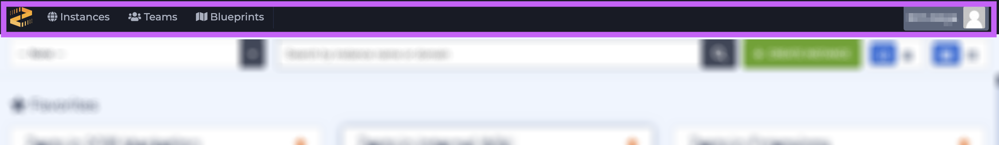
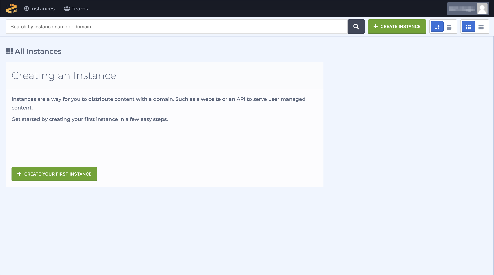
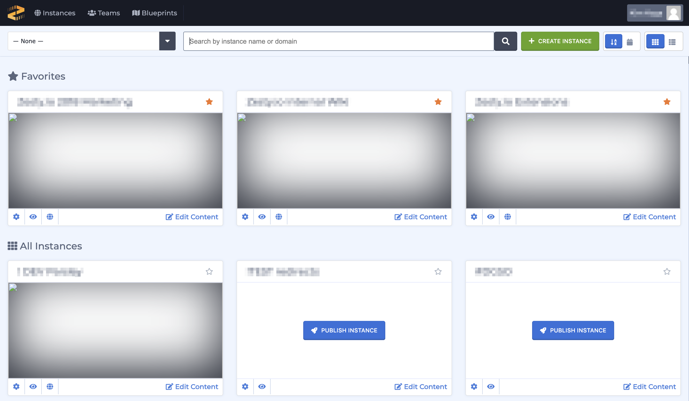
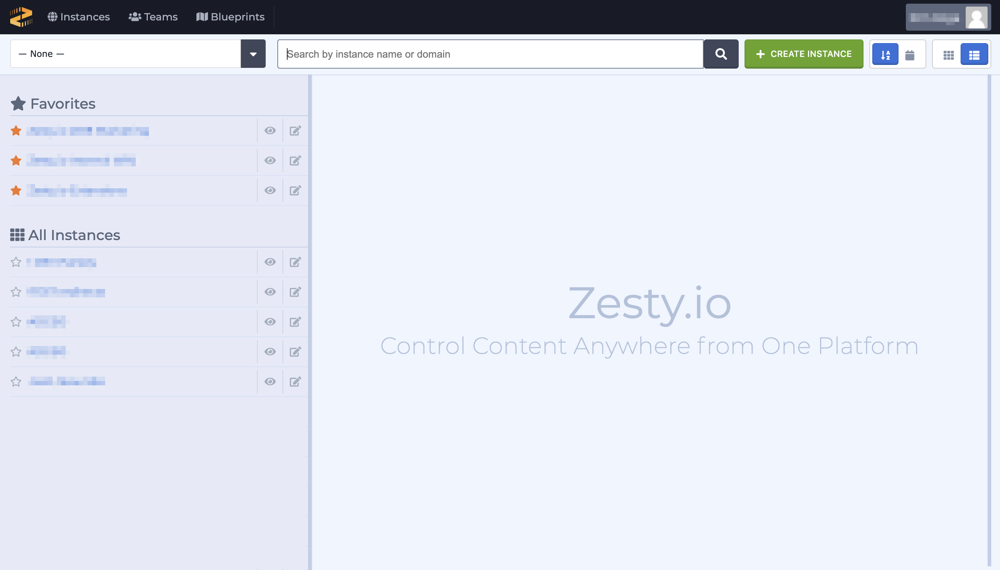

# Instances

## **Overview**

The Accounts Interface is also known as the all-instances view. This is the homescreen for the Accounts Interface when a user first logs in to Zesty.io. If a user has not yet created any instances they will be prompted to create an instance. However, if a user has already created instances they will see all of their instances, as well as have the option to create a new instance. If a user has invites to access instances those invites will appear at the top of the instances grid \(or list\). Aside from creating new instances, this interface allows users to search for instances, access Blueprints, Teams, Account profile and more. Keep reading for a brief tour of this interface.

## Accounts Interface Tour

Below we'll review the different sections of the Accounts Interface from top to bottom.

## Menu Bar

The black menu at the top of the screen contains several links, however, depending on your settings you may not see all of them. The links from left to right are:

* Instances: navigates to the all-instances view
* Teams: allows users to create and manage teams
* Blueprints: allows users to create and manage blueprints
* \[username\] \(profile\): allows users to update their password, add [2FA](https://zesty.org/guides/how-to-set-up-two-factor-authentication), and more

## EcoSystem, search bar, create new button, and filtering options

All of these items are shown just below the black menu bar near the top of the screen. From left to right the items are:

* EcoSystem dropdown
* Search bar
* Create new instance button
* Sort instances: alphabetically or by creation date
* Toggle instances view: grid-view or by list-view

## Instance Views

The Accounts Interface will look slightly different based on whether you've created instances or not. We'll cover both of them below.

### No-instances view

Users who have not created any instances will see an interface similar to the image below. If a user has signed up for Zesty.io because they were invited to access an instance they'll see an invite to that instance.

### Grid View

Users who have previously created an instance\(s\) will see their instances in a grid or list of all of their instances. The first row is reserved for Favorites if any have been marked with a star in the upper right-hand corner of the card.

### List View

The list view shows the same information as the grid-view except it's in a list.

