# Settings

## Overview

Users can access their account settings and links to [support resources](https://zesty.org/services/accounts-ui/user-account-settings#support-resources-tour) through the Account's interface. There are multiple account settings that a user can change including:

* [Update username](https://zesty.org/services/accounts-ui/user-account-settings#your-profile)
* [Change password](https://zesty.org/services/accounts-ui/user-account-settings#password)
* [Add an email address](https://zesty.org/services/accounts-ui/user-account-settings#email)
* [Activate 2-factor authentication](https://zesty.org/services/accounts-ui/user-account-settings#two-factor-authentication-2-fa)
* [Update preferences](https://zesty.org/services/accounts-ui/user-account-settings#preferences)

## User Account Settings Tour

### Accessing the User Account Settings

Access the User Account settings via the black menu bar at the top of the Accounts interface. The User Account menu is located at the far right side of the menu bar.

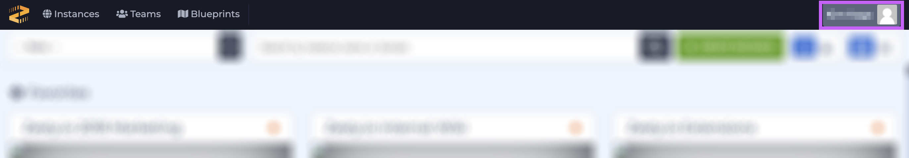

### My Account

Select _My Account_ from the user account menu dropdown.

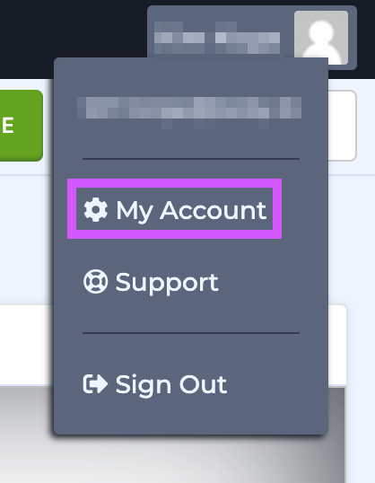

The user account interface settings interface is broken up into a grid of cards. Each card represents a setting or preference that the user can update.

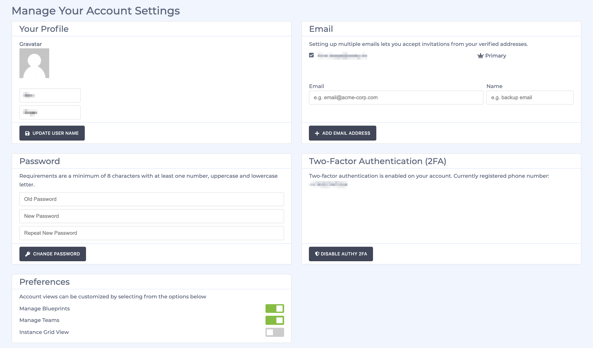

### Your Profile

Under the first card titled _Your Profile_ users can update their username.

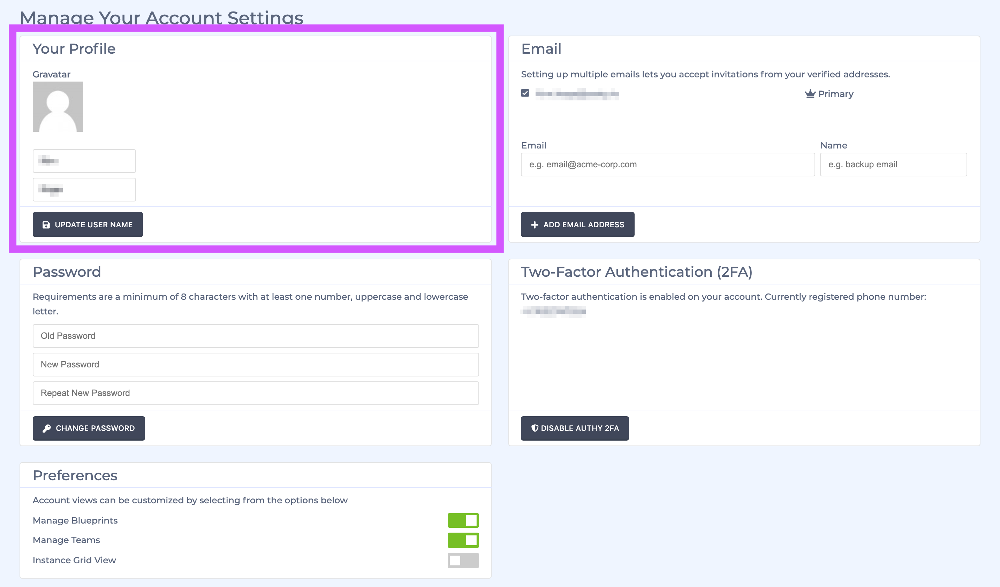

### Email

Moving left to right and top to bottom, Email is the next card in the Account Settings grid. Users can add another email address to their account.

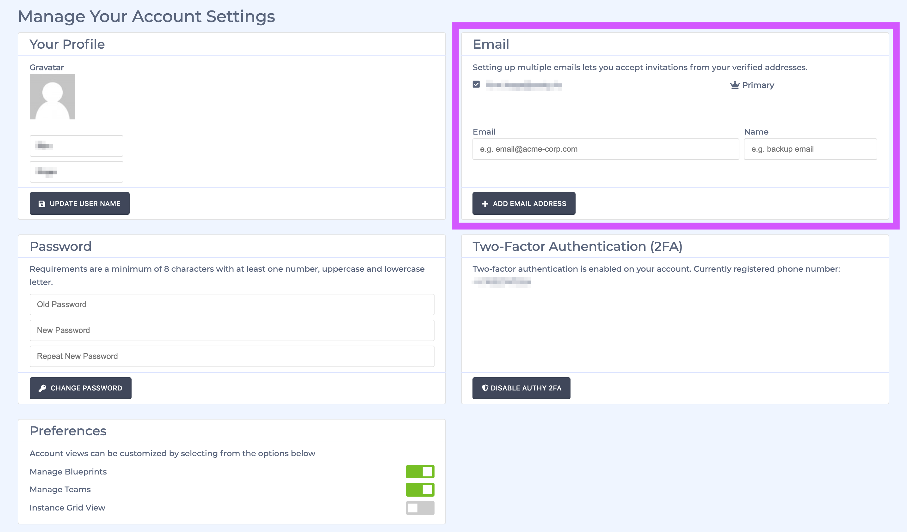

### Password

Password is the third card in the Account Settings grid. Fill out the fields to update your password.

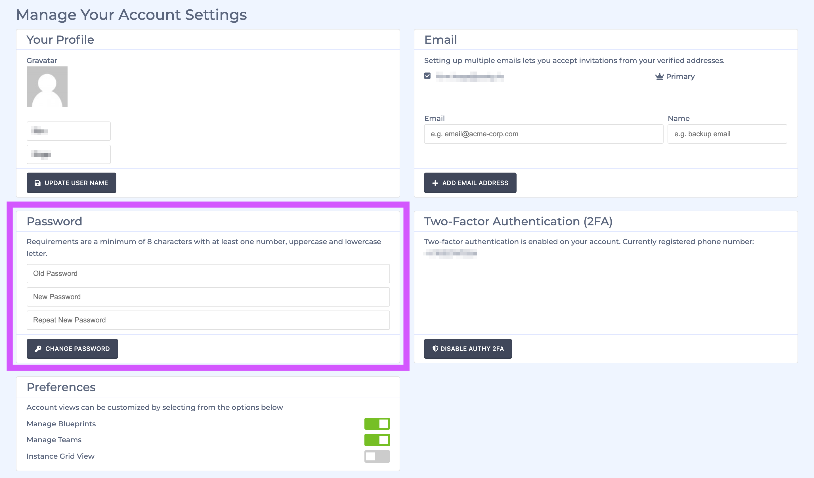

### Two-Factor Authentication \(2FA\)

Two-Factor Authentication \(2FA\) is the the fourth card in the Account Settings grid. Activate or deactivate 2FA here.

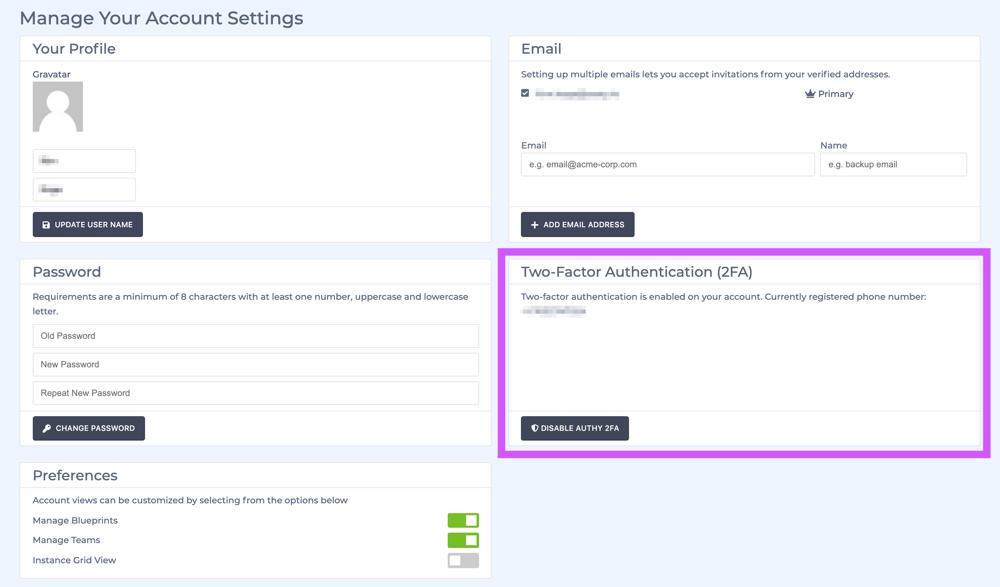

### Preferences

Preferences is the the fifth card in the Account Settings grid. Users can flip the toggles to set their preferences.

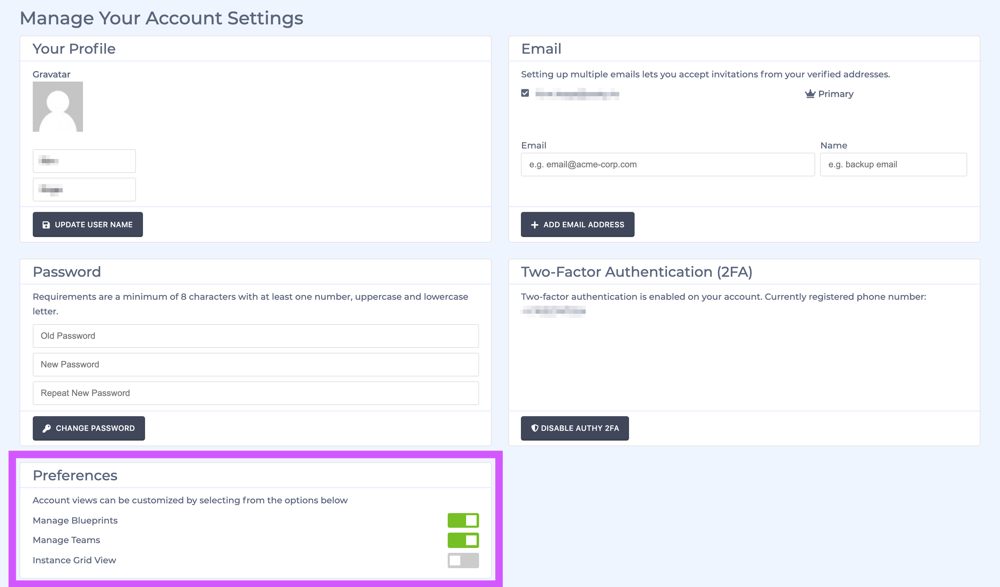

## Support Resources Tour

Select _Support_ from the user account menu dropdown.

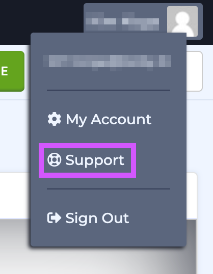

The support resources interface is broken up into a grid of cards. Each card represents a support option for users.

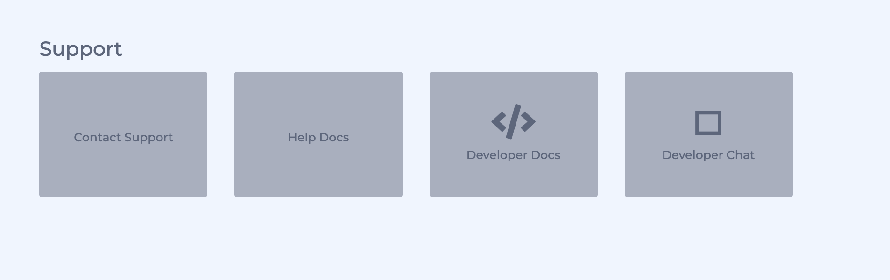

### Contact Support \(email\)

Contact Support is the first card. Users can send an email to support@zesty.io to request help with questions and issues.

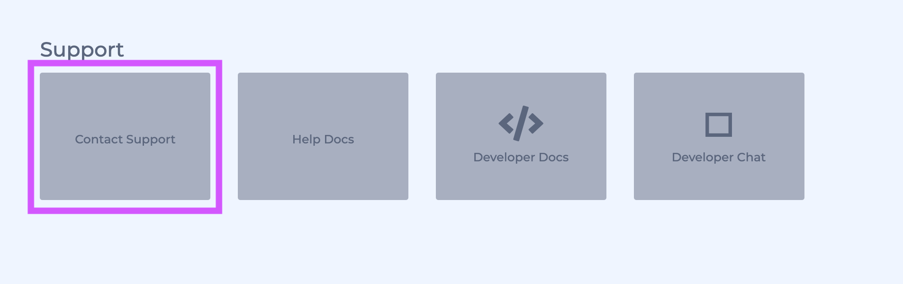

### Help Docs & Developer Docs

Help Docs and Developer Docs are the second and third cards. Both link to Zesty.org where both general and developer documentation are stored.

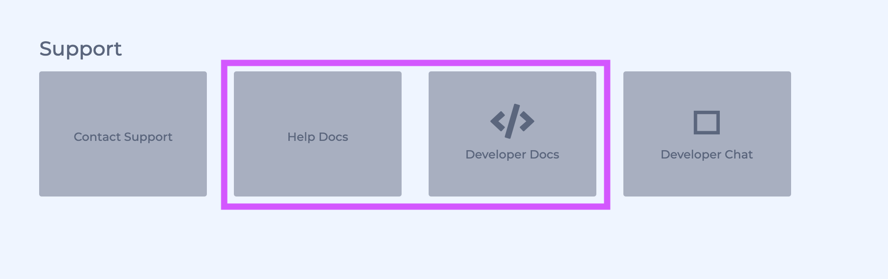

### Developer Chat

Developer Chat is are the fourth card. Join our Slack Zesty.io Developer Chat channel to chat with our community and support engineers.

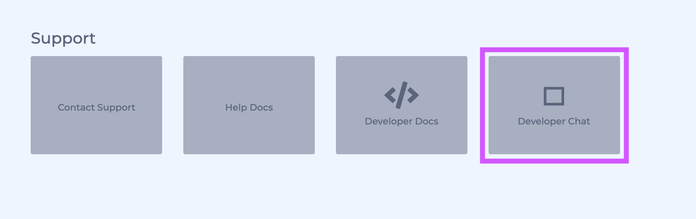

