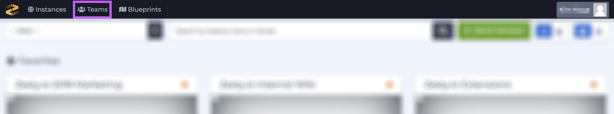
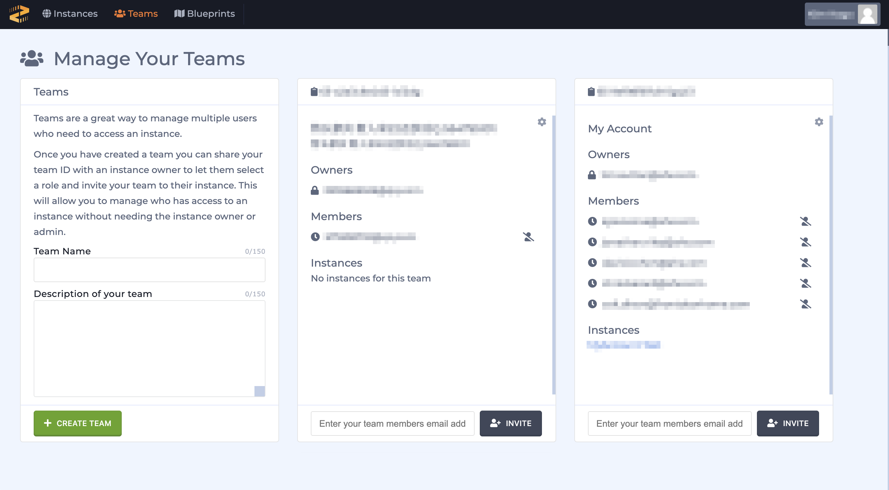
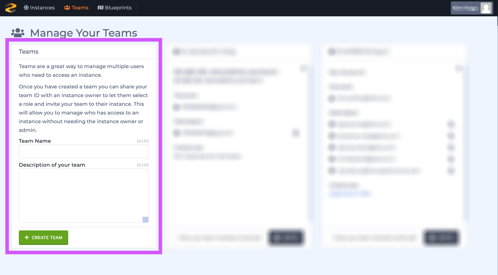
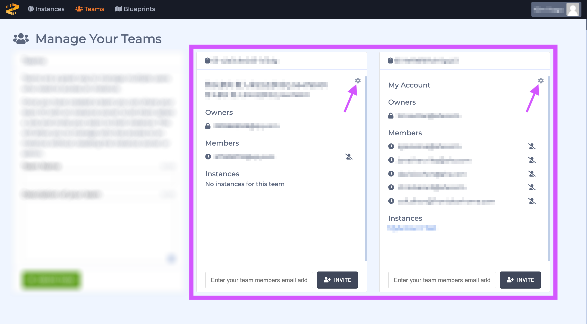
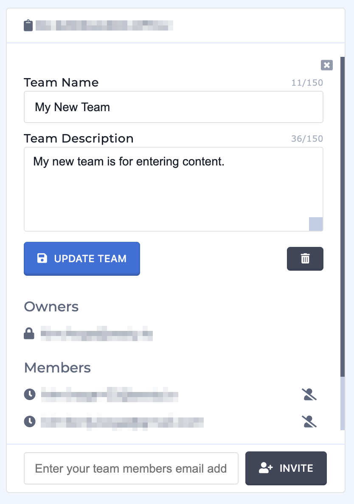

# Teams

### Overview

Teams allow users to create a team of users and set a single [role](https://zesty.org/content-instance/roles-and-permissions) for each team. This helps streamline the management of users, especially when dealing with large teams and multiple instances. 


Teams are created in the Teams interface and a team's role is managed in the [instance's settings drawer](https://zesty.org/glossary#instance-settings-drawer).


### Teams Interface Tour

#### Accessing the Teams Interface

Access the Teams interface though the black menu bar at the top of the Accounts interface. 

#### Teams Interface

Teams are shown in a grid similar to the way instances are displayed; the first card is for creating a new team, and the other cards represent your Blueprints. 

#### Creating a New Team

Create a new Team by filling out the Team Name and Description fields, and then clicking the green button on the first card in the grid.

#### Managing Existing Teams

The team's owner can add and remove users, update the teams's name and description, and delete the team. 

Access these team's settings by click the cog icon near the upper right-hand corner of the card.

From the team editing view users can update the Team's name and description, and remove users. After editing the team click the blue "Update Team" button to save your changes. 


The card does not have to be in editing mode in order to add a new team member. 


