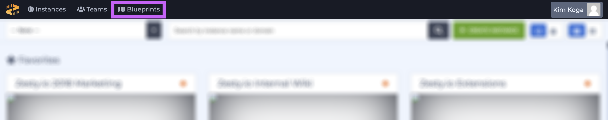
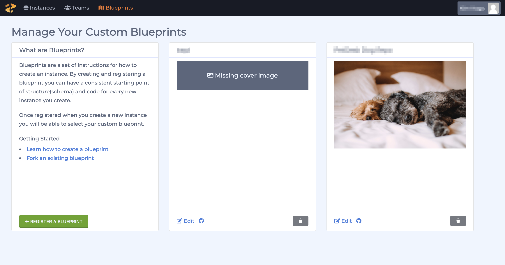
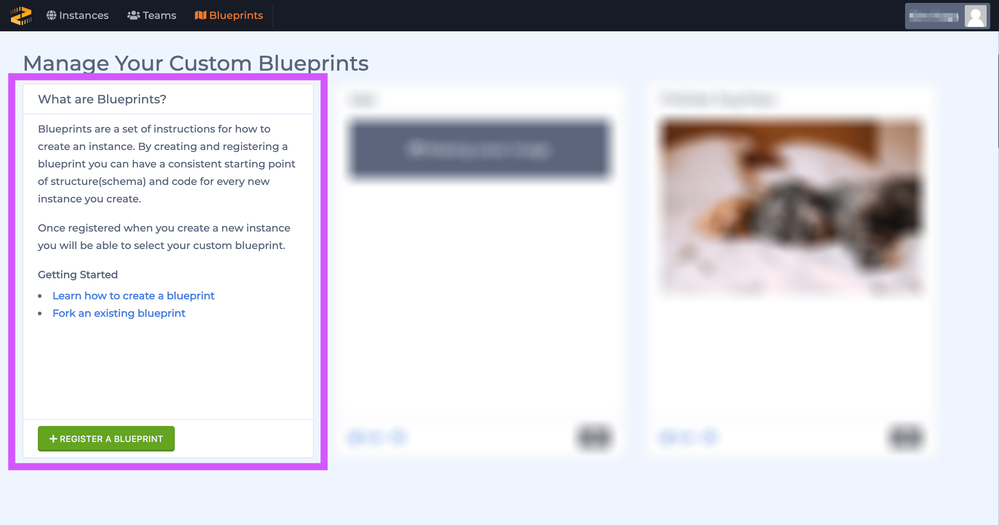
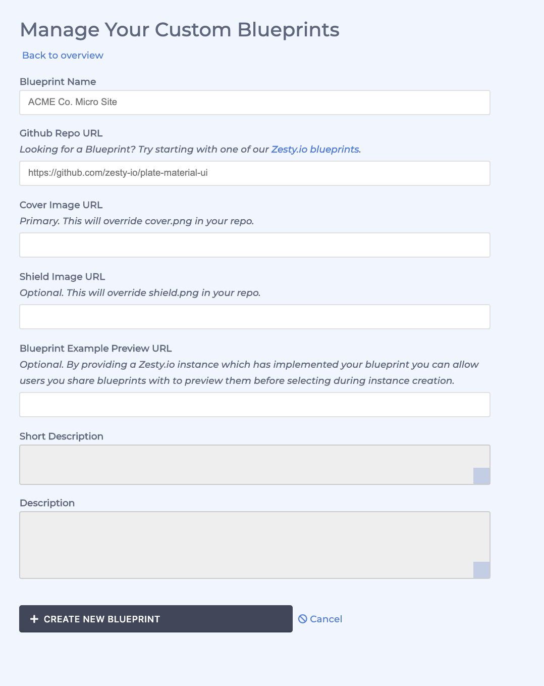
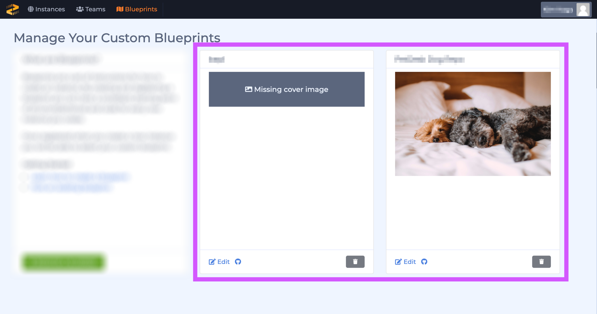
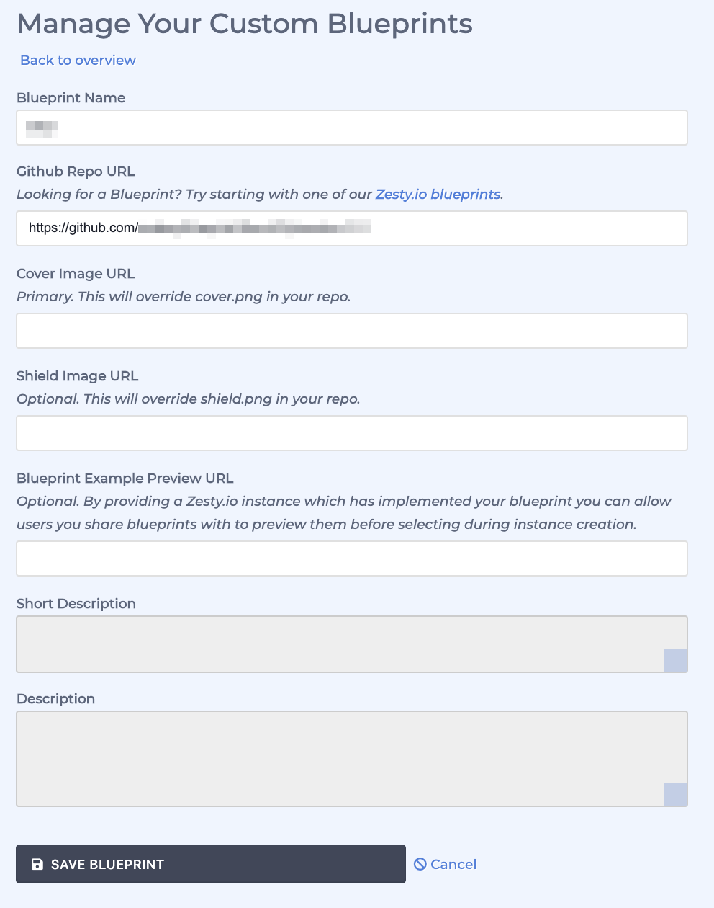

# Blueprints

### Overview

Blueprints consist of an XML plate, which serves as the basis for the Schema structure, as well as a styles, JavaScript, and view files, and sometimes sample content. 

Users can only manage Blueprints if developer settings are switched on via their account settings. 

We'll review the Blueprints interface below. 

### Blueprint Interface Tour

#### Accessing the Blueprint Interface 

Access the blueprint interface though the black menu bar at the top of the Accounts interface. 

#### Blueprints Interface

Blueprints are shown in a grid similar to the way instances are displayed; the first card is for registering a new Blueprint, and the other cards represent your Blueprints. 

#### Registering a New Blueprint

Register a new Blueprint by clicking the green button on the first card in the grid. 

Next, fill the form and click the dark gray button "+ Create New Blueprint" button to add a Blueprint.

#### Managing Existing Blueprint

Each card represents one of your Blueprints. From this interface users can edit their Blueprint, view it on GitHub, or delete it. 

#### Editing an Existing Blueprint

After clicking the Edit button in the lower left-hand corner of card you will be able to edit the Blueprint's form. After editing the Blueprint save your changes by clicking the dark gray "Save Blueprint" button.

