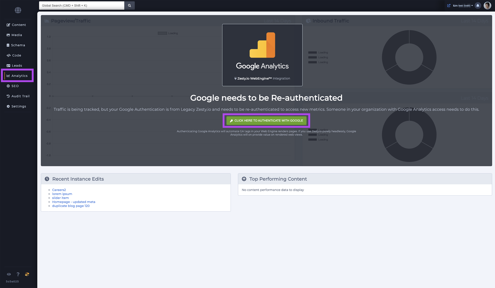

# Analytics

### Overview

The Analytics section allows users to view some Google Analytics \(GA\) in a dashboard in Zesty.io. If a user hasn't authenticated Zesty.io with Google they will be prompted to do so. Once authentication has been completed the some GA the interface will show some analytics and graphs. 

GA authentication is optional. It purpose is to simply display some useful information so a user can view the data directly in Zesty.io instead of having to login to another application to view them. 

**Note:** only users with owner, admin, and developer roles can set up analytics.



