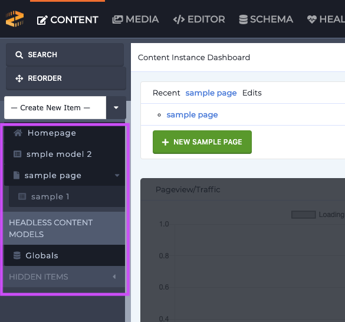

# Adding and Managing Content

### Accessing Content

To edit content in Zesty.io use the Content section in the Instance Interface for the instance that you are editing. The left hand column contains all of the pages, page groups, and data sets from the content structure that have been set up. You can also click the magnifying glass in the upper right hand corner of the left column, or type ctrl/cmd + shift + k to pull up a global search modal. As you start typing, results matching your input will begin to appear as selections to click into.

### Updating Content

Once you have opened up the entry you are looking for, you will see the fields available for editing the content for that entry. Make the changes to the corresponding field that need editing, then save as a draft. If you are editing a page or item in a page group, you can use the preview link to jump to the site and preview your changes. If you are editing a data set entry, navigate in the stage site or to the endpoint where the content is used and preview your changes. Once the changes are approved to go to the live site, use the publish or schedule options to control when your content is deployed.

### Adding New Entries From a Template

To add new pages click the "+ Add New Item" in the left column. A list of available pages and page groups will display. Click the type of page you are tying to add.

To add new entries to a page group or data set click on the set you are looking for and a table of all the entries will display. On top of the table on the left will be a green "+ Add New" button. Click that to create a new entry.

In either case a new page with blank fields for that type of page will open. Fill out the fields, or at least the required fields and create the page as a draft or published immediately.

