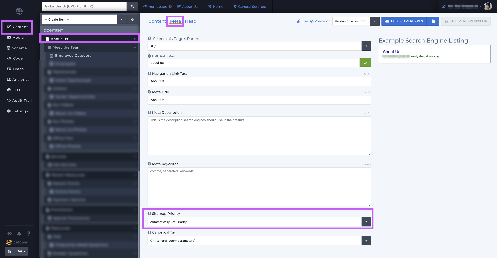
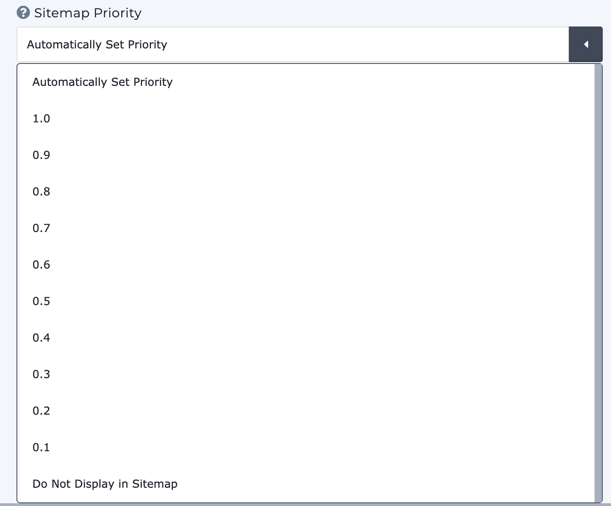

# Sitemap Priority

A sitemap is a file which lists all of your sites urls and their priorities. These are used to inform search engines what URLs on your site are available for crawling. This will not guarantee that a page is indexed by a crawler but provides hints to the crawler on how best to crawl your site.

Zesty.io automatically generates a `sitemap.xml` for every site and automatically sets url crawl priority. All sitemaps are located at `https://www.your-domain/sitemap.xml`.

Each single-page and multi-page item has its own sitemap priority which is located in the item's Meta tab. From the Content section, select your item, and then from the content editing view select Meta and the sitemap priority is the second to the last field on the page.

This dropdown will allow you to set the page's numerical priority, including an option to remove your page from the sitemap.

Google also provides great resources for those looking to [understand more about sitemaps](https://support.google.com/webmasters/answer/156184?hl=en&ref_topic=4581190).

