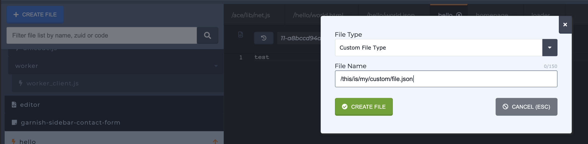

# Custom File Types / Endpoints

## Custom File Type/Endpoint 

Endpoints are _\(Mixed Extensions\)_ Parsley accessible file for creating endpoints or custom experiences. These files need to be named with a full path with an extension like `/my/file/path.json`. The file is accessible at `hash-dev.preview.zesty.io/my/file/path.json`. File types that can be used: css, html, json, js, xml, css, csv, tsv, xml, yaml, md, svg, txt, rss, ics, vcf, xhtml.

### Creating a custom file type from the Web IDE

Create a file name with a full path, starting with a forward slash, like `/this/is/my/custom/file.json`

### Some examples of file types that can be made

* Custom JSON files \([How to Guide](../../../guides/how-to-create-a-customizable-json-endpoint-for-content.md)\)
* SVG created off datasets \(e.g. dynamically rendering images of build locations\)
* Dataset exports \(custom CSV exports\)
* Contact information through VCARDS
* Exports to static site generator \(markdown and YAML\)
* Editable configuration files in YAML for cloud deployments
* Dynamic javascript around data
* Dynamic CSS styling around data
* Voice XML dialect for IVR \(interactive voice response\) e.g. Zesty.io Phone Number Response
* Dynamic calendar invite downloads \(ics\)
* Custom Realtime Really Simple Syndication Syndication Feeds \(rss\)
* Markdown template designs
* Dynamically build Javascript templates like Handlebars or Mustache
* Raw Text
* TVML For Apple TV

### Working with Wild Card Views to Resolve Dynamic URL paths

Zesty.io allows for you to capture custom URLs that are not registered to content items or a specific file path. For example, the URL path `/store/12345/my-product/` is capture by a file named `/store/*/*/index.parsley`

These files are created as custom file type, as seen here, and are identified by having an asterisk `*` as a path part between two forward slashes, and the name `index.parsley` at the end of the file path. [Please reference the file \(resource\) resolution loading order](../../web-engine/resource-resolution-order.md).

Wild Card Views files can be used to dynamically generate pages from data not located on Zesty.io by using identifiers passed into the url. We will describe two examples, product pages and referral pages. 

**Product Pages:** With product pages like `/store/12345/my-product/`\(represented as a custom file type named `/store/*/*/index.parsley` \) the identifier is the product id `12345` which is accessed with `{{request.pathPart(2)}}`and can be used to query another system like Oracle for product data. This is useful when thousands of products are store externally and do not need to be synchronized into a content instance.  

**Referral Pages**: A URL like `/referral/3e5h1/`\(represented as a custom file type named `/referral/*/index.parsley` where `3e5h1`is a unique identifier which can be accessed with `{{request.pathPart(2)}}` and can be used to present a printable coupon on page, or to make a request to an external system via javascript. 

##  Snippets 

Snippets are _\(html\)_ Parsley accessible file meant to abstract common use of code, or for organizing file build. Examples: slider, footer, header. These can be used inside of each loops as well.

