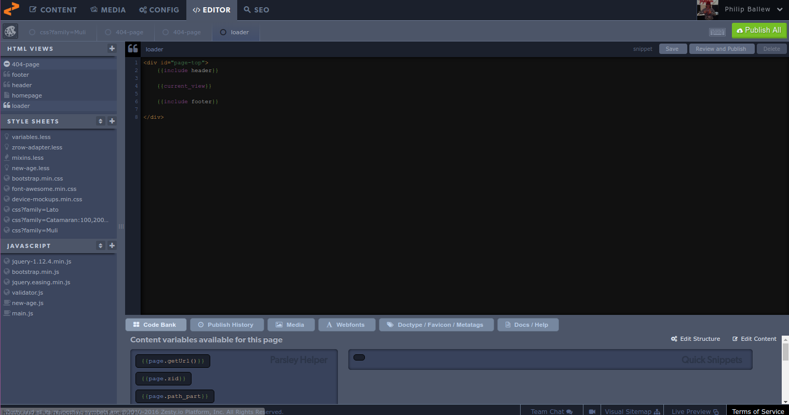

# Importing Code and Styles

If you want to move your website styles into Zesty.io, we recommend using a drag and drop feature.

Open the website you have selected and go ahead and save the website. In your Internet browser, you can do this via right clicking and selecting “Save Page As" in Mozilla Firefoz, or "Save as” in Google Chrome This will now open up a file browser window. Go ahead and choose where to save the page.

I’m going to go ahead and save it on my desktop, but you can do that anywhere.

Now go ahead and confirm everything has been saved. You will also see a file folder in the same directory with your html web page. There are important files in here as well so make sure to keep these. Now is the time to log into your Zesty.io account at [accounts.zesty.io](https://accounts.zesty.io) From here, go ahead and navigate to your web property you would like to import these files to.

From here you should select the editor tab as shown below:

Here is the fun part. You can drag and drop these files right into the boxes of code on the left side of your screen. First we will drop the HTML file that came out of your website right into the left-hand navigation under HTML Views.

It is important to know that Zesty.io only needs the content between the  tags of the HTML file. You can either delete the other non-relevant text in the Zesty.io editor, or in your own personal text editor before.

It is also important to connect this content you have just imported to your Zesty.io website. This can be done with one simple line of code to the page you just added. `{{include Homepage}}`

This will connect the file you just imported with the homepage.

### CSS

The next step is to import any of the CSS that was in your old website. If you look inside the folder you downloaded, you will see several files that have a .CSS extension on them. These are the files you need. You can import them one at a time by dropping them in the left-hand navigation under Stylesheets.

Go ahead and save everything, and make sure to publish your code. This can be done, by clicking the save button on each page you have imported, and finally the Publish button, both located in the upper right corner of the Zesty.io platform.

