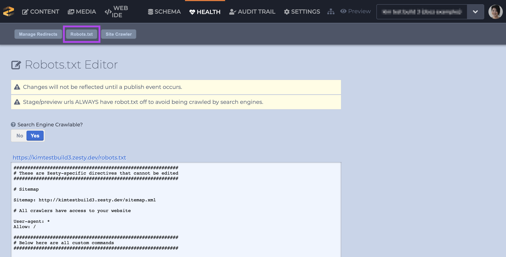

# Health

### Overview

In the Health Section users can manager redirects, robots.txt, and the site crawler. All of these tools can help you diagnose and correct the health of your instance. 

Access the Health section via the Manager UI's main navigation bar at the top of the screen. 


### Manage Redirects

The Health section home screen shows the redirect manager. Here we can create new redirects, view and delete existing redirects, and mass upload redirects through CSV or XML format.


When creating a new redirect, always start the old redirect with a forward slash, `/`, and include the entire path after the domain. Redirects are case sensitive, so `/old-path/` and `/Old-Path/` would need to be separate entries.

To mass upload from a CSV you can either do a single column, where you specify the old paths and manually select the new paths in the interface, or provide two columns, with the old paths on the left and the new paths on the right.

```text
/old-path/,/new-path/
/another-old-path/,/
```

To mass upload from XML, use the XML format required for sitemap.xml files provided to search engines. This format only reads old paths and requires selecting the new path to redirect to using the interface.

### robots.txt


Robots.txt is now located in the [Settings section](https://zesty.org/services/manager-ui/settings).


This section is where you can input custom robots.txt statements to allow or disallow crawlers access to pages. The control for the site-wide settings for allowing or disallowing crawl access is in the Settings section of the Schema section.



The robots.txt editor allows control over search engine crawling rules per site. To access this tool, please navigate to the Health section.

From here you can see the button labeled `Robots.txt`. Once clicked, the manager should open a new page with a text area allowing you to edit the file. Below the text area is a preview of what the final Robots.txt file will looks like.

### Site Crawler

As of 2020 The Site Crawler \(formerly Spice Crawler\) has been deprecated.  

