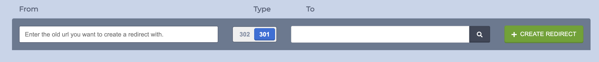
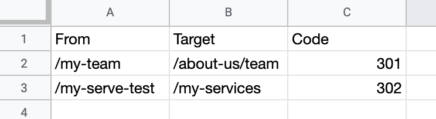
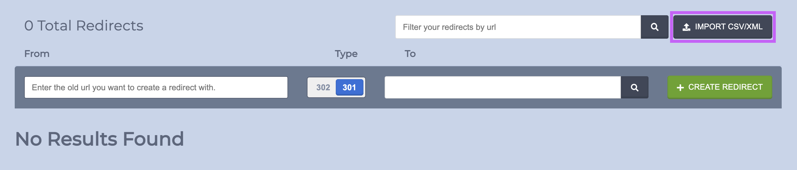

# Redirects

### Overview

Part of Zesty.io's Health section is a redirect manager. The redirect manager allows users to create and delete either 301 or 302 redirects, as well as to mass upload redirects without needing access to `.htaccess` files. All of your current redirects are visible upon navigating to your instance's Health section.

To navigate to the Health section select the Health/SEO icon in the main menu.

.png>)

The Health/SEO section will show all redirects if any have been created and allow you to upload a CSV of redirects.&#x20;


_We resolve published pages prior to redirects to prevent a redirect from mistakenly  overtaking actual published pages._ Therefore be sure to unpublish items that you're making redirects for to ensure your redirects perform as expected.


### 301 and 302 redirects

Zesty.io allows for the creation of 301 or 302 redirects. Learn more about 301 redirects [here](https://developer.mozilla.org/en-US/docs/Web/HTTP/Status/301) and 302 redirects [here](https://developer.mozilla.org/en-US/docs/Web/HTTP/Status/302).

Create a 301 or 302 redirects by following these steps:&#x20;

1\. Add a specific link in the left-hand "From" column. Do not include the domain. For example: `/team-members`&#x20;

2\. Choose whether you want a 301 or 302 redirect by toggling the switch between the columns.&#x20;

3\. Search for a link by typing the name of the page into the textbox. For example, if your page was called "About Us" then you'd stay by typing "about " and see what results are returned. Select the link that you'd like it to redirect **to** in the right-hand "To" column from the results.&#x20;

4\. Click the green "+ Redirect" button to create the redirect.

## Mass Redirect

To use our mass redirect tool you can import a CSV file or an XML file to create redirects.

### CSV

To create redirects with a CSV you need to have all of your "From" URLs in one column, your "Target" URLs in a second column, and Code (e.g. 301 or 302) in a third column.

Follow these steps to create a CSV of your redirects:

1. Create a CSV with 3 columns
2. Title your columns (from left to right)
   1. From
   2. Target
   3. Code&#x20;
3. Fill in your redirects with **relative path only**. Do not include your domain.

See the image below for an example of how your CSV should be formatted.

Once your sheet is properly formatted click the gray "Import CSV/XML" button and import your sheet.


When importing content into a date field use the format: MM/DD/YYYY or  MM/D/YY


### XML Sitemap

To mass upload from XML, use the XML format required for sitemap.xml files provided to search engines. This format only reads old paths and requires selecting the new path to redirect to using the interface.
