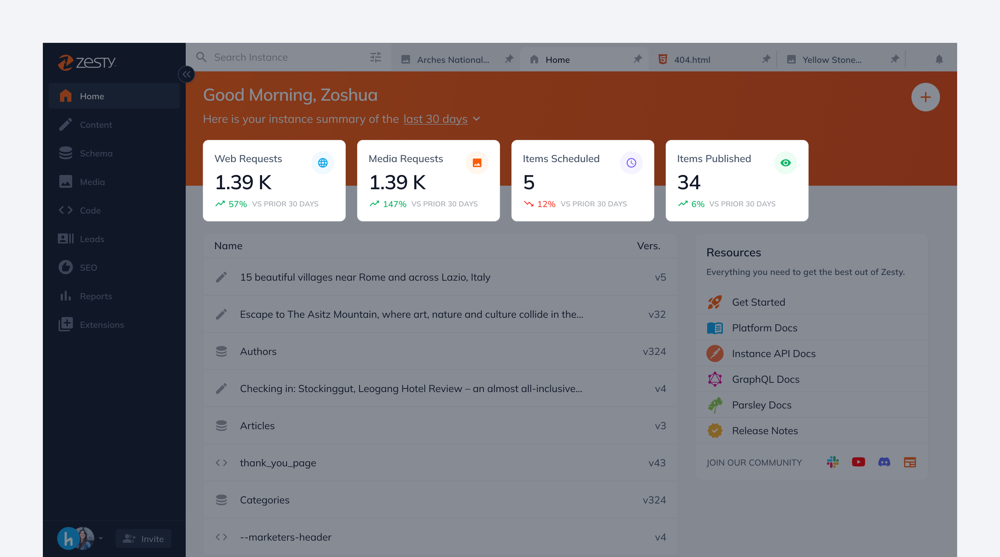

# Home Dashboard

<figure><figcaption></figcaption></figure>

## What is Home?&#x20;

Home in Zesty is the best way to get a high level view of everything happening in your instance. &#x20;

**From here you can:**&#x20;

* View key performance metrics which enable you to monitor the health of your instance
* Open recently worked on content items, code files, and models
* Create new content items, code files, and models and upload new media files
* Jump to resources such as our product docs, release notes, and community channels

## How to get started with Home?&#x20;

We recommend you get started by learning more about the home interface.&#x20;

### View the High Level Metrics for your instance

Here you can view key performance metrics such as the total web requests, media requests, items scheduled, and items published and see how they have changed for the last 30 days. These will help you make more informed business decisions and also help ensure you keep your team aligned with your business goals.&#x20;

<figure><figcaption></figcaption></figure>

### Quickly Create New Content Items, Code Files, Models, and Upload Files

Want to start working on something new in your Zesty instance? Simply click on the plus button in the top right hand corner and choose from the 4 options available.

<figure><figcaption></figcaption></figure>

### Open Recently Worked on Content Items, Code Files, and Models

Below the cards are a list of your instance's most recently worked on content items, code files, or models. To open them, simply hover and click on the item you want to view.

<figure><figcaption></figcaption></figure>

### Learn Zesty using our Resources

If you're actively working on building or growing your instance the resources card in the right can be extremely useful for you. From the Resources Card you can access our&#x20;

* Documentation where you can learn about getting started, our platform, and APIs
* Release Notes to learn about most recent releases
* Community Channels on Slack, Youtube, and Discord where you can ask questions and get support from other people building with Zesty

<figure><figcaption></figcaption></figure>
