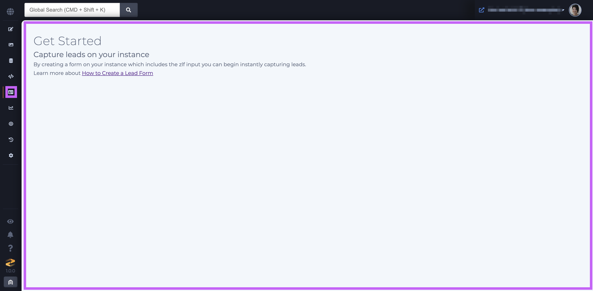
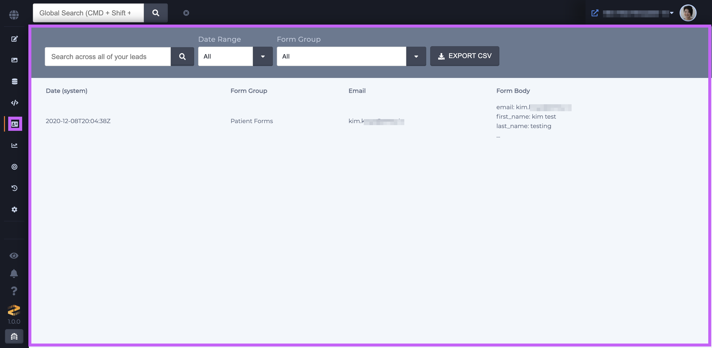
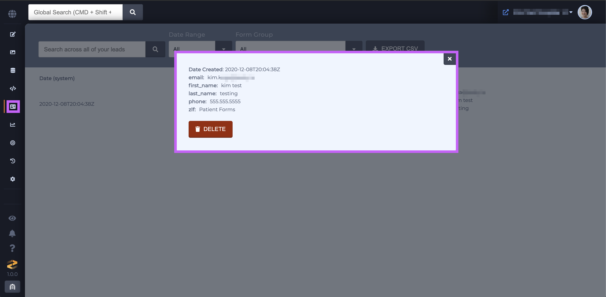
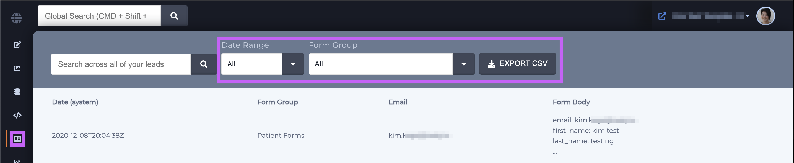
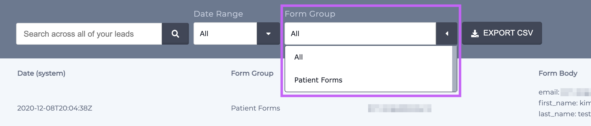
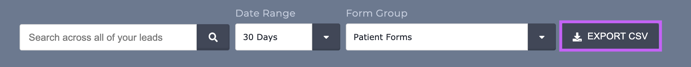

# Leads

### Overview

If a form submission is posted to a Zesty.io hosted website with an input value for `zlf`, Zesty.io will automatically store all the submitted data. The Leads section is where that stored data can be interacted with.


The Leads section will be automatically display once a lead is stored with your Zesty.io instance.




### Navigating the Leads Section

Leads are shown in a paginated table that shows the date, email, first name, last name, and form group for the captured submissions. 


Please note that while all of your lead form's data is not shown in the table, the CSV export will show all the form fields' data. 




Each row in the table is clickable and clicking on a row will show a snippet of the leads detail.



### Lead Export

Leads can be exported using the box in the upper right-hand corner.



Options for lead export include date range:


Another option is form group. The form group's name comes from the [`zlf` value](https://zesty.org/guides/how-to-create-a-lead-form#zesty-io-lead-form) which is set when the form created in the view.



Once your options have been set click the green Download CSV button to get your CSV.



### How to Connect forms to ZLF

To configure a form to use Zesty.io's leads table, three items need to be true. First, the form needs to be using the `POST` method. Second, the form action needs to be to a relative path. Third, the form needs to include an input with a name attribute of `zlf` and a non-empty `value`.

Here is an example:

```text
<form method="post" action="/thank-you/" >
          .........
         <input type="hidden" name="zlf" value="Contact Page Form" />
          .........
</from>
```

