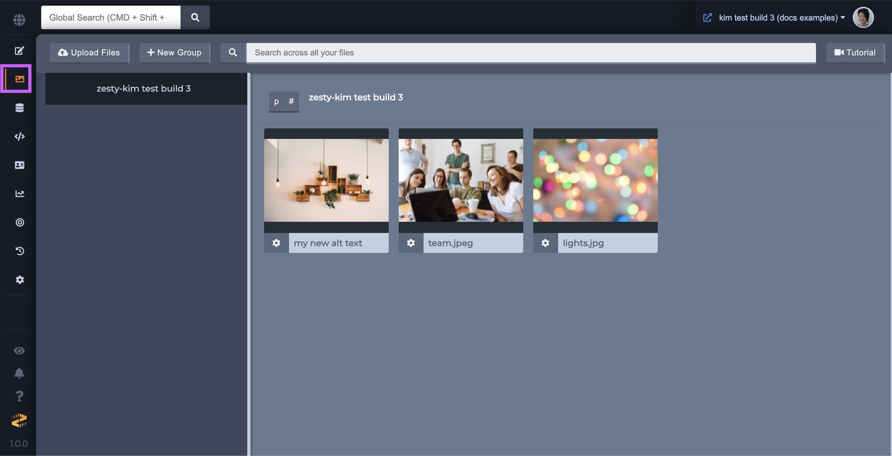
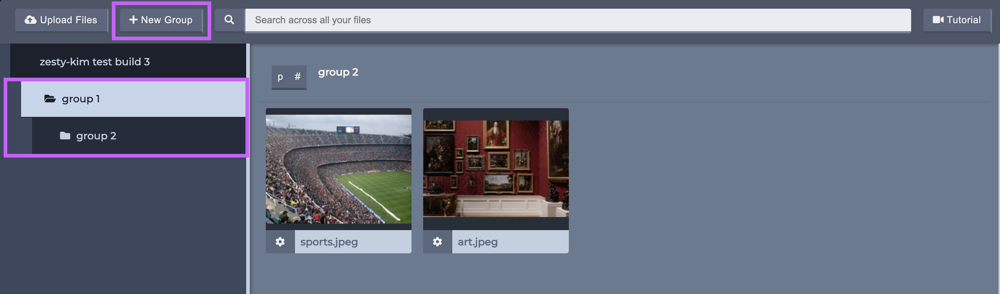

# Media

### Overview

The Media tab is where all of an instance's media is organized. All types of files can be uploaded, including SVG, PDF, MOV, Mp4, GIF, JPEG, PDF, and more.

### Groups

Media can be organized into groups, groups can be nested, and media can be drag-and-dropped between groups. These groups are only visual representations used in the interface and do not affect the path of the media.  
To create a new group click the **+ New Group** button, which will cause a modal will pop up allowing you to name your group. Once you've named your group click the **Create Group** button in the modal and you're done.

### EcoBins

Instances can have EcoBins which allow media to be shared across instances. Contact support@zesty.io if you're interested in an EcoBin to share media across your instances.

