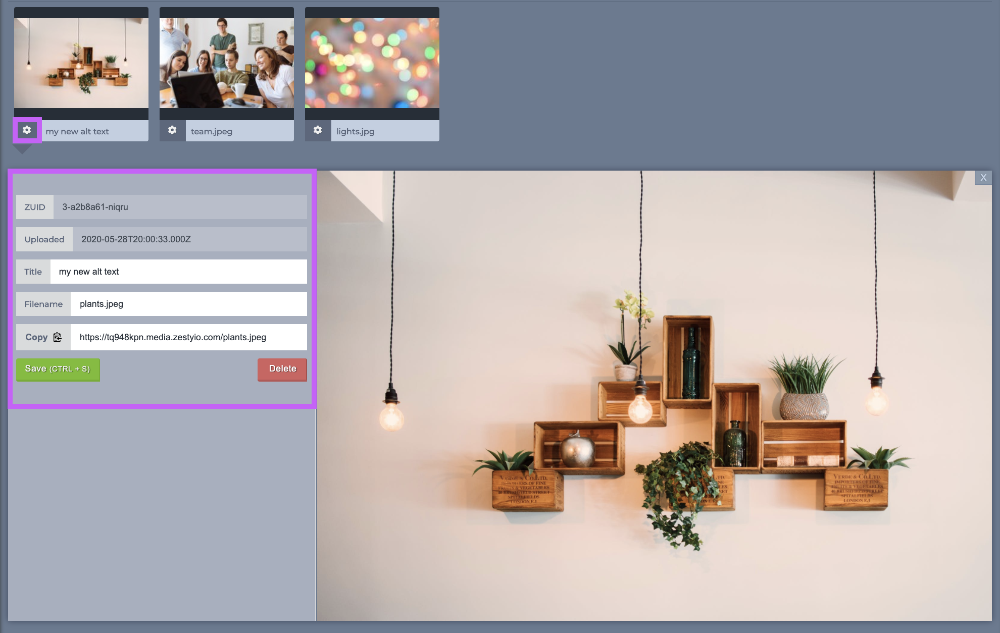
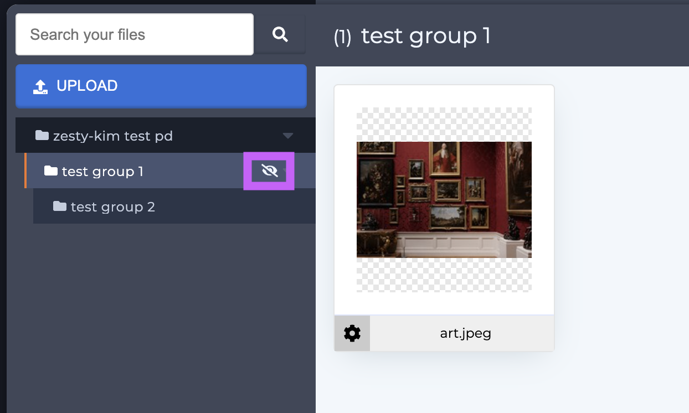

# Media

### Overview

The Media tab is where all of an instance's media is organized. All types of files can be uploaded, including SVG, PDF, MOV, Mp4, GIF, JPEG, PDF, and more.

### Media File Information

Media file information such as the name, file name, ZUID, and more is accessed by clicking the cog icon in the lower left-hand corner of the thumbnail frame. 

### Groups

Media can be organized into groups, groups can be nested. These groups are only visual representations used in the interface and do not affect the path of the media.  
To create a new group click the **+ New Group** button, which will cause a modal will pop up allowing you to name your group. Once you've named your group click the **Create Group** button in the modal and you're done.

#### **Customizing collapsed/expanded Groups**

When an instance has a large amount of assets it can be difficult to find the group that you're looking for; to help with this the Media section will remember which folders are collapsed/expanded so when you navigate away and back you can pick up where you left off.  

#### Hiding Groups

Hiding groups can further help a user navigate groups, especially with a large number of assets. To hide group, hover over its name and an eye icon will appear. Click the eye icon to hide the group. 

Once groups have been hidden they can be viewed going to the Hidden Items section which is located at the bottom of the sidebar underneath all of the groups.

### EcoBins

Instances can have EcoBins which allow media to be shared across instances. Contact support@zesty.io if you're interested in an EcoBin to share media across your instances.

