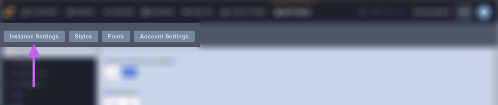

# Instance Settings

### Introduction

Instance settings are developer-oriented settings that help customize an instance's backend functionality. The most commonly edited configurations are Google Analytics, contact form options, and HTTPS settings. 

Each category contains a list of settings. Categories are located in the left-hand sidebar of the window \(image below\). In the list below you'll find a list of which settings are nested under which category along with descriptions from the UI.

### **General**

* **Search Engine Crawlable:** Search engines will have permission to index each page of your site allowing for greater visibility
* **HTTPS On:** If your site has an SSL certificate then contact support@zesty.io about secure hosting
* **Always redirect to HTTPS:** This will redirect any http requests to https \(if https is on\).
* **Always prepend WWW to my domain**
* **Show site name in meta title:** Appends your site name, located in Global dataset, to the title tag.

### **Developer** 

* **Use Parsley Debugger:** Option to how and when the debugger should be presented 
* **Show Zesty Tips:** Choose to turns Zesty.io Tips on of off
* **Access to Instant JSON API for content**
* **Allow cross domain access to Instant JSON API:** Toggle CORS Headers
* **Automatically include JavaScript in head**
* **Custom View Endpoints CORS Allow Any Origin**

### **Contact form**

* **Sending Email:** This email address will be used to send an outbound email. We will verify this email, and then register it with Amazon SES \(our mailing service provider\). This will whitelist your email, helping you to avoid the junk folder.
* **Email Recipients:** This can be a single email address or comma separated email addresses. The email\(s\) in this area will receive form information upon submit.
* **Reply Email:** When the form is complete, a notification email is sent to the person who filled out the form. When they hit reply on that email, the email entered here is who they reply to.
* **Form Honey Pot:** If this value is set, all posted forms will look for an input whose name matches the honeypot setting value. If forms are posted without an input whose name matches the honeypot setting value, they will not succeed. If a form is posted containing an input whose name matches the honeypot setting value, and this input has a value, the post will fail. It needs to be submitted with no value to succeed. Setting a honeypot value affects ALL FORMS IMMEDIATELY.

### **Verification** 

* Keybase Filename
* Keybase Value

### **SEO** 

* Content Set ID override for /feed.xml
* Enable Canonical Tags

### **I18n**

* **Default Language Page:** When you have multiple languages, this is the starting page url PATH. Empty is none. This setting creates a meta tag in every page head.

### **Tag Managers**

* **Google Tag Manager ID:** Typically in the format: GTM-XXXXXXX. This will auto inject scripts into the head and body for you on the live production website.

### **Analytics**

* **Google Analytics ID:** It is a unique code that Google Analytics gives you to track your website hits. This is required for Zesty to track hits to your website.\*\|\*What is an Urchin ID?
* **Google Profile ID:** The main account created with google analytics is tied to a unique profile ID. This is necessary for Zesty to pull data and show your analytics.\*\|\*Google Profile ID
* **Use Google Universal Code:** The new version of Googles tracking code.\*\|\*Google Universal Code
* **Display Advertising Support:** If you turn on Display Advertising, you need to enable Re-marketing with Google Analytics or Google Display Network \(GDN\) Impression Reporting. With this setting on the Analytics tracking code is updated. Once you have made that change, Google Analytics collects the information it normally does, as well as the DoubleClick cookie when that cookie is present.
* **Google Auto Linker:** When tracking sessions across multiple domains, the Client-ID value has to be transferred from one domain to the other. To do this, the Analytics tracking code has linking features that allow the source domain to place the Client-ID in the URL parameters of a link, where the destination domain can access it. Add your secondary domain or domains here as a comma separated list.

### Security

* **Header: X-Frame-Options**: Learn more at [https://developer.mozilla.org/enUS/docs/Web/HTTP/Headers/X-Frame-Options](https://developer.mozilla.org/enUS/docs/Web/HTTP/Headers/X-Frame-Options)
* **Strict-Transport-Security:** Learn more at [https://developer.mozilla.org/en-US/docs/Web/HTTP/Headers/Strict-Transport-Security](https://developer.mozilla.org/en-US/docs/Web/HTTP/Headers/Strict-Transport-Security)
* **Content-Security-Policy:** Learn more at [https://developer.mozilla.org/en-US/docs/Web/HTTP/CSP](https://developer.mozilla.org/en-US/docs/Web/HTTP/CSP)
* **X-Content-Type-Options:** Learn more at [https://developer.mozilla.org/en-US/docs/Web/HTTP/Headers/X-Content-Type-Options](https://developer.mozilla.org/en-US/docs/Web/HTTP/Headers/X-Content-Type-Options)
* **Referrer-Policy:** Learn more at [https://developer.mozilla.org/en-US/docs/Web/HTTP/Headers/Referrer-Policy](https://developer.mozilla.org/en-US/docs/Web/HTTP/Headers/Referrer-Policy)
* **Feature-Policy:** Learn more at [https://developer.mozilla.org/en-US/docs/Web/HTTP/Headers/Feature-Policy](https://developer.mozilla.org/en-US/docs/Web/HTTP/Headers/Feature-Policy)

