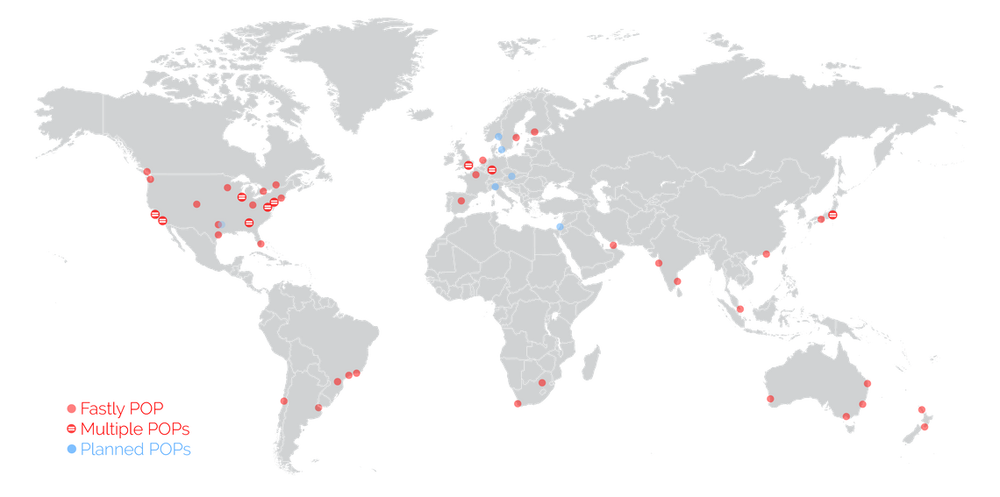

# Micro DAM \(Media Storage\)

### What is a Micro DAM?

A Micro DAM \(digital asset manager\) is a Zesty.io service for managing files that are served publicly.  Designed as an abstract file system, the Micro DAM allows file organization that mimics an operating system directory structure. We brand it a Micro DAM because it does not have the same features as a fully featured enterprise DAM. For example, it does not handle digital right management \(DRM\), and assumes that every file added to it will be accessed publicly.

### What type of Files can be Stored on the Micro DAM?

Many file types may be uploaded to a Micro DAM, examples include Images \(PNG, JPG, GIF\), PDFs, Video \(MP4, OGG\), Fonts \(OTF, WOFF, TTF\), SVGs, YAML, Markdown, Javascript, CSS, etc..

### File Life Cycle

Once files are uploaded to the Micro DAM \(through the content manager or directly through the API\), they are copied to cloud storage on Google Cloud Platform. From there they are propagated to the multiple edge pop points across the World. Files live on the Micro DAM until they are deleted from the Micro DAM through the API or the media section of the content manager.

#### File Delivery & Content Delivery Network \(CDN\) Details

Files load to the client device \(mobile phone, desktop, game console etc.\) from the closest point-of-presence \(POP\) server they are located on. If the file is not located on a POP server, the POP server makes a request to Zesty.io \(the origin\) for the file. At that point Zesty.io transfers the file from Cloud Storage to the POP server, any request to that file will be loaded from the POP server there after. The file will remain "cached" on the POP server for a 24 hour. This whole cycle ensure for fast delivery while delivering fresh files.


#### POPs are high-density servers with 24 TB of SSDs, 768 GB of RAM, and 4 x 25 Gigabit Ethernet. Delivery is sub-millisecond Time to First Byte \(TTFB\) on the 99th%.\*


#### This map shows all the Point of Presence \(POP\) servers across the World. 

