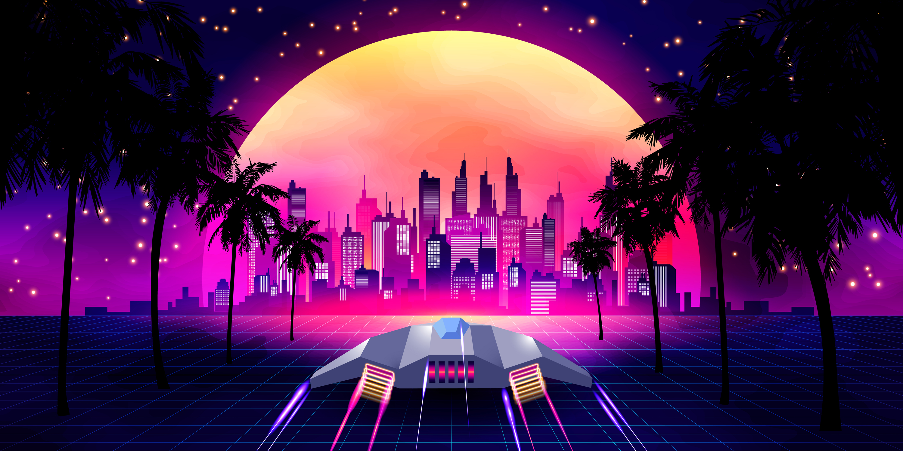

# On-The-Fly Media Optimization and Dynamic Image Manipulation

### Auto Image Optimization - Default Output

Zesty.io automatically transforms images as the content-type "webp", which is a format made to  optimized image download speed and rendering speed, developed by Google.

> WebP is a modern **image format** that provides superior **lossless and lossy** compression for images on the web. Using WebP, webmasters and web developers can create smaller, richer images that make the web faster. - _Read the full Google launch article_ [_https://developers.google.com/speed/webp_](https://developers.google.com/speed/webp)\_\_

 When optimization happens, Zesty.io does a few things to the file:

* All metadata \(for example, EXIF, XMP, or ICC\) will is removed.
* Any [ICC profile](https://en.wikipedia.org/wiki/ICC_profile) on the image is applied directly to the image to ensure color output is correct. If the image doesn't have an ICC profile, a default profile is added.
* If the source image contains orientation metadata, this orientation will be applied directly to the image data and metadata will be removed.
* Images are served with their original name and extension, but will still output as `content-type` "webp" 

### Image Manipulation Options

All image may be manipulated on-the-fly by passing query parameter to the end of the image URL. See the example below

| Query Param | Example |
| :--- | :--- |
| **none** | [https://9skdl6.media.zestyio.com/Arcade-Space-Ship-Example.jpg](%20https://9skdl6.media.zestyio.com/Arcade-Space-Ship-Example.jpg) |
| **?width=** | [https://9skdl6.media.zestyio.com/Arcade-Space-Ship-Example.jpg?width=300](https://9skdl6.media.zestyio.com/Arcade-Space-Ship-Example.jpg?width=300) |
| **?orient=** | \*\*\*\*[https://9skdl6.media.zestyio.com/Arcade-Space-Ship-Example.jpg?orient=v](https://9skdl6.media.zestyio.com/Arcade-Space-Ship-Example.jpg?orient=v) |
| **?bg-color=** | [https://9skdl6.media.zestyio.com/parsley-logo-brackets.png?bg-color=006699](https://9skdl6.media.zestyio.com/parsley-logo-brackets.png?bg-color=006699) |



We recognize the following parameters in the query string of the image request:

| Parameter | Description |
| :--- | :--- |
| [`auto`](on-the-fly-media-optimization-and-dynamic-image-manipulation.md#auto)\`\` | Enable optimization features automatically. |
| [`bg-color`](on-the-fly-media-optimization-and-dynamic-image-manipulation.md#background-color-bg-color) | Set the background color of an image. |
| [`blur`](on-the-fly-media-optimization-and-dynamic-image-manipulation.md#gaussian-blur-blur) | Set the blurriness of the output image. |
| [`brightness`](on-the-fly-media-optimization-and-dynamic-image-manipulation.md#brightness-brightness) | Set the brightness of the output image. |
| [`canvas`](on-the-fly-media-optimization-and-dynamic-image-manipulation.md#canvas) | Increase the size of the canvas around an image. |
| [`contrast`](on-the-fly-media-optimization-and-dynamic-image-manipulation.md#contrast-image-jpg-contrast) | Set the contrast of the output image. |
| [`crop`](https://developer.fastly.com/reference/io/crop) | Crop an image by removing pixels from an image based on a ratio. Great for thumbnails. |
| [`dpr`](on-the-fly-media-optimization-and-dynamic-image-manipulation.md#device-pixel-ratio-dpr-image-jpg-dpr) | Device Pixel Ratio - Serve correctly sized images for devices that expose a device pixel ratio. |
| [`fit`](on-the-fly-media-optimization-and-dynamic-image-manipulation.md#fit-image-jpg-fit-cover-and-height-200-and-width-200) | Set how the image will fit within the width and height provided. |
| [`height`](on-the-fly-media-optimization-and-dynamic-image-manipulation.md#height-images-jpg-height) | Resize the height of the image. |
| [`optimize`](on-the-fly-media-optimization-and-dynamic-image-manipulation.md#image-optimize-image-jpg-optimize) | Automatically apply optimal quality compression. |
| [`orient`](on-the-fly-media-optimization-and-dynamic-image-manipulation.md#orientation-image-jpg-orient) | Change the cardinal orientation of the image. |
| [`pad`](https://developer.fastly.com/reference/io/pad) | Add pixels to the edge of an image. |
| [`precrop`](https://developer.fastly.com/reference/io/precrop) | Remove pixels from an image before any other transformations occur. |
| [`quality`](https://developer.fastly.com/reference/io/quality) | Optimize the image to the given compression level for lossy file formatted images. |
| [`resize-filter`](https://developer.fastly.com/reference/io/resize-filter) | Specify the resize filter used when resizing images. |
| [`saturation`](https://developer.fastly.com/reference/io/saturation) | Set the saturation of the output image. |
| [`sharpen`](https://developer.fastly.com/reference/io/sharpen) | Set the sharpness of the output image. |
| [`trim`](https://developer.fastly.com/reference/io/trim) | Remove pixels from the edge of an image. |
| [`width`](https://developer.fastly.com/reference/io/width) | Resize the width of the image. |

### Image Manipulation Processing order

Manipulation query parameters can be specified in any order, but they are processed in this order:

| Order | Query Call |
| :--- | :--- |
| 1 | `trim` |
| 2 | `crop` |
| 3 | `orient` |
| 4 | `width`     `height`    `dpr`     `fit`     `resize-filter`      |
| 5 | `pad`     `canvas`     `bg-color` |
| 6 | `brightness`     `contrast`     `saturation` |
| 7 | `sharpen` |
| 8 | `blur` |
| 9 | `format`    `auto`    `optimize`    `quality`    `profile`    `level` |

## Zesty.io OTF DAM: On-The-Fly Image Options API

### Auto Optimize

Enables optimizations based on [content negotiation](https://developer.mozilla.org/en-US/docs/Web/HTTP/Content_negotiation). Although the WebP format produces images at a higher compression ratio with a lower loss of quality, it is not supported in all browsers.



Auto Optimize:   /image.jpg?auto=



Enables optimizations based on content negotiation. Although the WebP format produces images at a higher compression ratio with a lower loss of quality, it is not supported in all browsers.  
  
`?auto=webp` _Deliver lossless \(because input image is lossless\) WebP where client support is available, otherwise deliver a PNG  
`?format=pjpg&auto=webp`Deliver lossy \(because format=pjpg is lossy\) WebP where client support is available, otherwise deliver a progressive JPEG  
`?format=png&auto=webp`	Deliver lossless \(because format=png is lossless\) WebP where client support is available, otherwise deliver a PNG_






webp is the only option, see notes above










```
https://9skdl6.media.zestyio.com/Arcade-Space-Ship-Example.jpg?format=pjpg&auto=webp
```








Background Color:   /image.jpg?bg-color=



Change the background color of a transparent image. Tip: you can make background transparent using a decimal value on the end like `125,80,200,0.5`






Hex RBG: `690167`Decimal: `105,1,103,0.5`










```
https://9skdl6.media.zestyio.com/parsley-logo-brackets.png?bg-color=006699
```








Gaussian Blur:   /image.jpg?blur=



Gaussian blur your image.






0.5 to 1000










```
https://9skdl6.media.zestyio.com/Arcade-Space-Ship-Example.jpg?blur=20
```








Brightness:  /image.jpg?brightness=



Adjusts the "brightness" of an image. This effect adds perceived light to an image.






0 unchanged \|\| -100 black \|\| 100 white










```
https://9skdl6.media.zestyio.com/Arcade-Space-Ship-Example.jpg?brightness=20
```






## Canvas

Set the size of the canvas around the image without changing the size of the image itself. This can be used for advanced cropping control. 


This parameter takes multiple values which can get complicated, so we included example along the way. The first two represent the desired width and height, either as measurements of pixels, separated with a comma, or as a ratio, separated with a colon. The remaining parameters allow the placement of the image within the canvas to be adjusted. On each dimension, placement can be made either with a position coordinate \(`x` or `y`, which are relative to the top left of the newly-enlarged canvas\) or as a percentage offset from the center of the image using `offset-x` and `offset-y`. 


These can be mixed and matched, but only one method can be used for each dimension \(i.e., `x` can be combined with `offset-y` but `x` cannot be combined with `offset-x`\).


The remaining parameters determine the position of the cropped region.

Offset positioning acts to distribute the remaining space according to the specified offset proportions. For example, `offset-y10` would place the image so that 10% of the leftover space is above the image and 90% below it.

1. `x` and `y` can be set as a value in pixels \(e.g., `40` is 40 pixels\) or as a percentage suffixed with `p` \(e.g., `50p` is 50%\).
2. When `x` and `y` are percentages, they are calculated as percentages of the _image_ size, not the canvas size.
3. `offset-x` and `offset-y` are always interpreted as percentages of the canvas size \(e.g., `25` is 25%\).
4. If no `x`, `y`, `offset-x`, or `offset-y` parameters are supplied, the image is positioned in the center of the canvas.
5. The background color of the canvas will default to transparency for image output formats that support transparency and white for formats that don't. This behavior can be changed by adding the [`bg-color`](https://developer.fastly.com/reference/io/bg-color) parameter.
6. When using `canvas` and [`pad`](https://developer.fastly.com/reference/io/pad) at the same time, [`pad`](https://developer.fastly.com/reference/io/pad) will be ignored.
7. Any fractional pixel measurements will be rounded to the nearest whole pixel.



Canvas Control: /image.jpg?canvas=



Allows the user to precisely crop an image by specific positions.






See above documentation










```

```







Contrast: /image.jpg?contrast=



Change the image contrast, the value can be anything between -100 and 100, negative numbers start to wash out the image, positive number increase the vibrancy of the images colors.






-100 to 100










```
https://9skdl6.media.zestyio.com/Arcade-Space-Ship-Example.jpg?contrast=100
```








Crop: /image.jpg?crop=



Crop an image evenly from all sides by passing in a ratio 1:1 is a perfect square, 16:9 is letter box, 10:1 is a slim rectangle etc. Great for making thumbnails by passing in a width and a crop, `?crop=1:1&width=50` makes a tiny square, for example.






1:1 \|\| 10:1 \|\| 16:9










```
https://9skdl6.media.zestyio.com/Arcade-Space-Ship-Example.jpg?crop=1:1&width=400
```








Device Pixel Ratio \(dpr\):   /image.jpg?dpr= 



For optimizing delivery of images to devices with high pixel ratios. The iPhone XS, for example, has a resolution of 375x812 pixels, but its device to pixel ration is 3, so it renders 1125x2436. A developer can access this value from JavaScript by calling `window.devicePixelRatio`  
  
DPR will increase the delivered size by a multiple 1-10 to accommodate for the device Pixel Ratio. Use with JavaScript dynamically when rendering a view and you know the clients Device Pixel Ratio. 






1-10










```

```








Fit: /image.jpg?fit=cover&height=200&width=200



The fit parameter controls how the image will be constrained within the provided size \(width and height\) values, in order to maintain proportions that fit within the confines of the width and height.  
  
Note: width and height must be pass with fit to work properly   
  
`bounds`  fit entirely within the specified region, making one dimension smaller if needed.  
  
`cover` cover the specified region, making one dimension larger if needed.  
  
`crop`  Resize and crop the image centrally to exactly fit the specified region.






bounds \|\| cover \|\| crop



width in pixels



height in pixels










```

```








Height:   /images.jpg?height=



Control the height of the image, the width, if not provided, will adapt to match the original ratio of the image.






A height in pixels










```
https://9skdl6.media.zestyio.com/Arcade-Space-Ship-Example.jpg?height=100
```








Image Optimize   /image.jpg?optimize=



Difference and output are minimal for most images that use this param, to be more aggressive in sizing, use the QUALITY param.   
  
`log`        Output image quality will be similar to the input image quality.  
`medium`  More optimization is allowed. Visual quality of the input is preserved.  
`high`	  Minor visual artifacts may be visible. This produces the smallest file.  


















```

```







Orientation:    /image.jpg?orient=



Rotate the image on 90 degree angles  
`r`	   Orient the image right.  
`l`	   Orient the image left.  
`h`	   Flip the image horizontally.  
`v`	   Flip the image vertically.  
`hv`   Flip the image both horizontally and vertically \(also `vh`\).  
`rv`   Flip the image horizontally, then orient the image left \(also `rv` or `vr`\).  
`vl`   Flip the image horizontally, then orient the image right \(also `lv`or `vl`\).






see above docs for options










```
https://9skdl6.media.zestyio.com/Arcade-Space-Ship-Example.jpg?orient=l
```






#### About Zesty.io On-The-Fly Media Technology

Zesty.io leverages Fastly's Image Optimization technology layered on top of the Zesty.io DAM Media Manager. Features documented here relate to what is supported through Zesty.io WebEngine and Media services.

