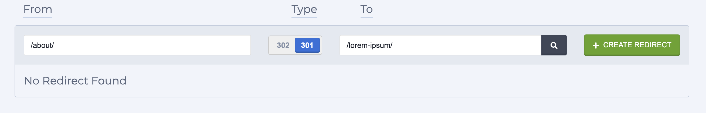

# 30X Redirects

## How Do Redirects work on Zesty.io Web Engine?

Redirects are created and managed inside the Content Manager. In the Manager's  SEO section, you can add and maintain 301 and 302 redirects.

Rediects are especially helpful when you've changed the URL of a page or resource. When URLs are changed users might still have links to those old URLs. When accessed those old URLs will 404 if a redirect is not in place. When a redirect has been created the browser will automatically send the user to the new page (instead of terminating at the 404 page).

New redirects are created in the Manager's `/seo` section. First in the From field enter the relative path that you want to redirect from, then select the redirect type: 301 (permanent move) or 302 (temporary move), lastly select the target or To URL from the dropdown. Once your fields are filled out click the green Create Redirect button.



### Redirect Formats

| Type                    | Example: Old Path => New Path                 |
| ----------------------- | --------------------------------------------- |
| Path                    | `/this/` => `/that/`                          |
| Path _(with wildcards)_ | `/old/path/*/*/` => `/new/$1/$2/path`         |
| Page (zuid)             | `/old-about/` => `7-xyz-x1y2z3`               |
| External                | `/redirect-away/` => `https://www.google.com` |


_All redirects will pass query parameters. For example_: _ `/this/?hello=world` will becomes `/that/?hello-world`_


### Path Redirects

A basic path redirect is a statically typed path to another statically typed path. For example:


```elixir
/old/path/
```



```erlang
/my/new/path/?a=1&b=2
```


Any request to `/old/path/` will redirect to `/my/new/path/?a=1&b=2`

**API Documentation for path redirects:**\
****[https://instances-api.zesty.org/#38bf3fb8-44b1-4b22-a743-376c42fda624](https://instances-api.zesty.org/#38bf3fb8-44b1-4b22-a743-376c42fda624)

### Path Redirects with Wildcards

A path redirect with wildcards is a statically typed path with an asterisk(s) which can catch any path and pass it forward into a new dynamically built path. For Example:


```elixir
/old/*/*/
```



```erlang
/new/$1/$2/
```


**Example Redirect Results Table**

| Incoming Request Path  | Redirect Path          |
| ---------------------- | ---------------------- |
| `/old/foo/bar/`        | `/new/foo/bar/`        |
| `/old/apples/oranges/` | `/new/apples/oranges/` |

Another path building example with Wildcard Paths


```erlang
/old/*/*/
```



```erlang
/$1-$2/
```


**Example Results Table**

| Incoming Request Path | Redirect Path |
| --------------------- | ------------- |
| /old/hello/world/     | /hello-world/ |
| /old/foo/bar/         | /foo-bar/     |

**Other ideas for redirects**

| **Path Examples** | Target Examples |
| ----------------- | --------------- |
| /old/\*/\*/       | /search/?q=$2   |
| /\*/\*/\*/        | /$2-$1-$3/      |

**API Documentation for wild card path redirects:** \
[https://instances-api.zesty.org/#4e35194e-ce30-43a0-bfe2-91bc76e5a627](https://instances-api.zesty.org/#4e35194e-ce30-43a0-bfe2-91bc76e5a627)

### Page Redirects

Page redirects take in a static string string for the path like `/my/old/path` and a content ZUID as the target. The static path will always redirect to whatever the content ZUIDs current path is, even if the content ZUID referenced has its path change through version, the redirect will always follow it.

**API documentation for page redirects:** \
[https://instances-api.zesty.org/#9dbf6a75-cb3e-4292-850b-1e78979bd035](https://instances-api.zesty.org/#9dbf6a75-cb3e-4292-850b-1e78979bd035)

### External Redirects

Page redirects take in a static string string for the path like `/my/old/path` and a content ZUID as the target. The static path will always redirect to whatever the content ZUIDs current path is, even if the content ZUID referenced has its path change through version, the redirect will always follow it.

**API Docs for External Redirect:** \
[https://instances-api.zesty.org/#0e1a4940-3d7f-4e59-bd3d-9b06be44d9a3](https://instances-api.zesty.org/#0e1a4940-3d7f-4e59-bd3d-9b06be44d9a3)

### Redirects API Documentation

See how to create the 4 types of redirect from our REST documentation  [https://instances-api.zesty.org/#1fdabbe3-e977-4ea5-8a4b-81ce29598263](https://instances-api.zesty.org/#1fdabbe3-e977-4ea5-8a4b-81ce29598263)&#x20;
