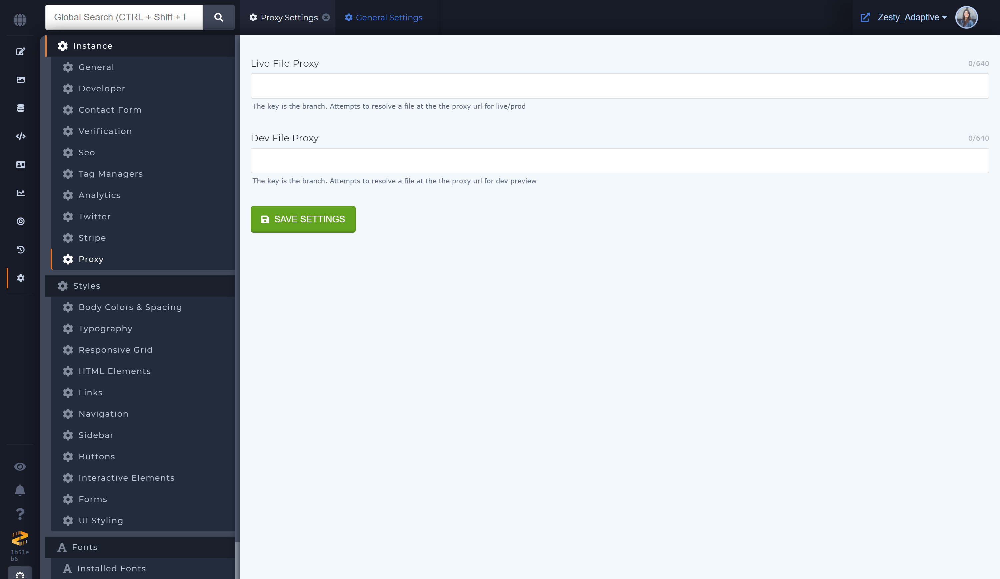
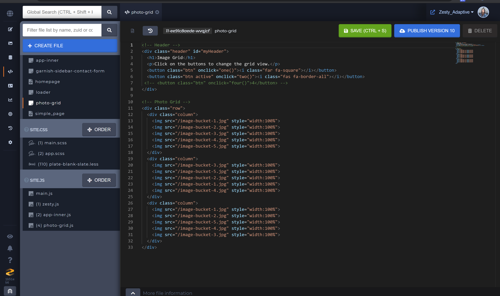
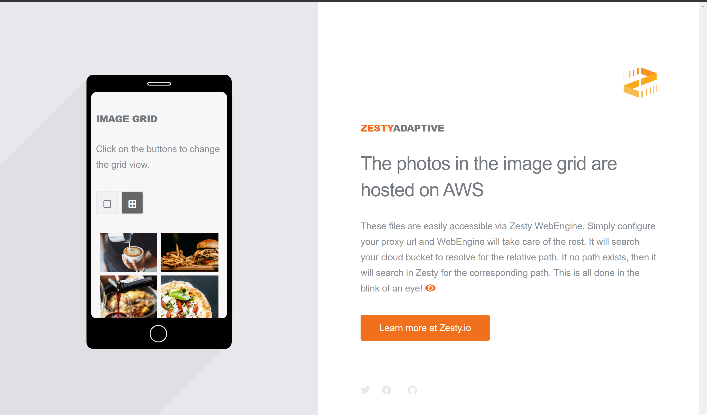

# Adaptive Rendering

### Integrating external files and sources with Zesty

Adaptive Rendering allows you to implement your external cloud bucket with Zesty. You can seamlessly integrate your external files via Zesty's proxy setting which will direct WebEngine to initially search through your cloud bucket and finally search through Zesty's resources to match the path part of a linked source. All external files are served via proxy so you will see a clean url structure with all your bucket files.

### Integrating an external cloud bucket with a Zesty Instance

Go to instance settings in Manager UI. Look for the Proxy subsection and find the two text fields where the file proxy url structure will be added. Notice that two fields are provided: one for production and one for development. If the same proxy url structure is used for both development and production, add the same url to both fields.


If you do not see these settings options, please contact Zesty support to have the Proxy subsection added to the instance settings.


### Referencing proxy files

To call your external bucket resources, simply use their path part in your WebIDE code files. WebEngine will use the configured proxy url to concatenate the path parts with the cloud bucket url. If no resources are found in the bucket, WebEngine will move on to resolve with the instance's with the instance's domain in production or preview url in development. If there are no matching resources with the instance, the resource with 404.

### View proxy files rendered with content

Whether it's in dev/preview or in live/production environments, see external resources from the configured cloud bucket render seamlessly with Zesty files.

