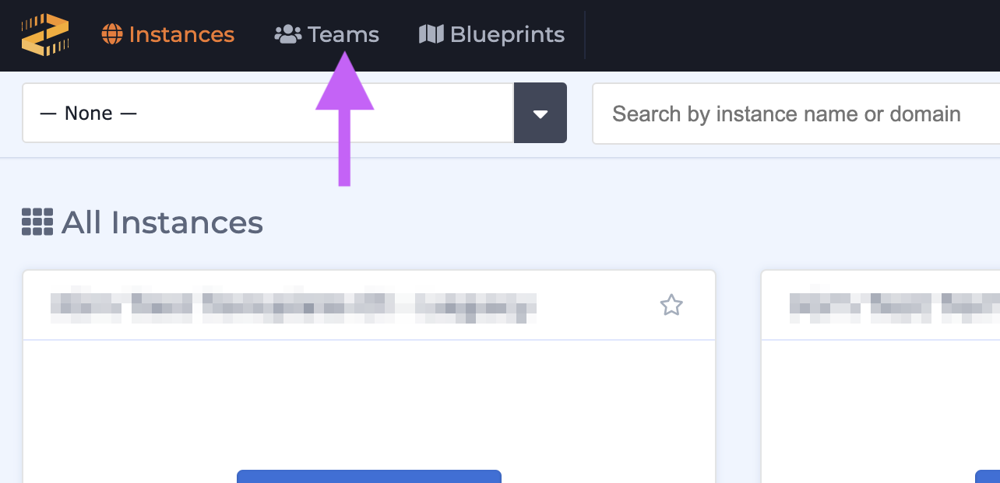
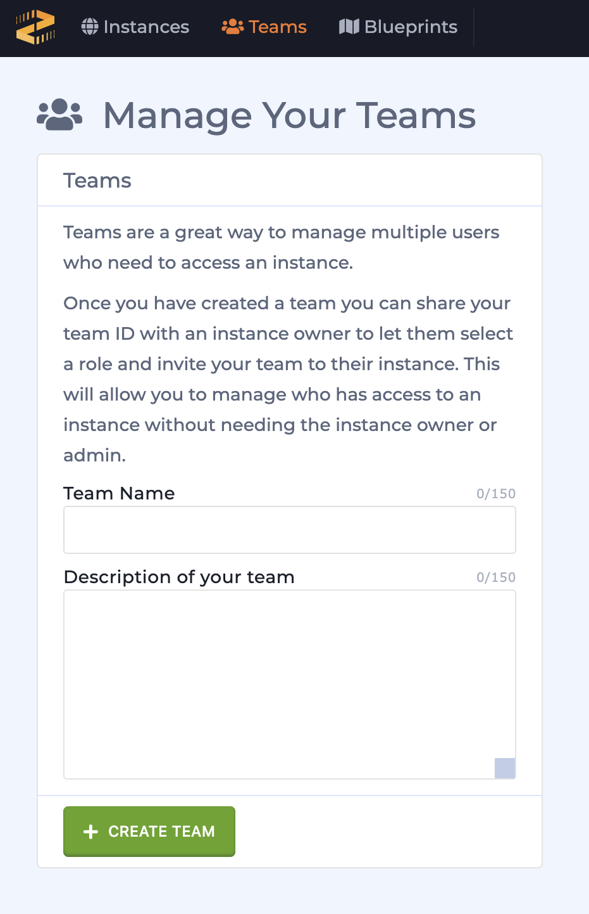
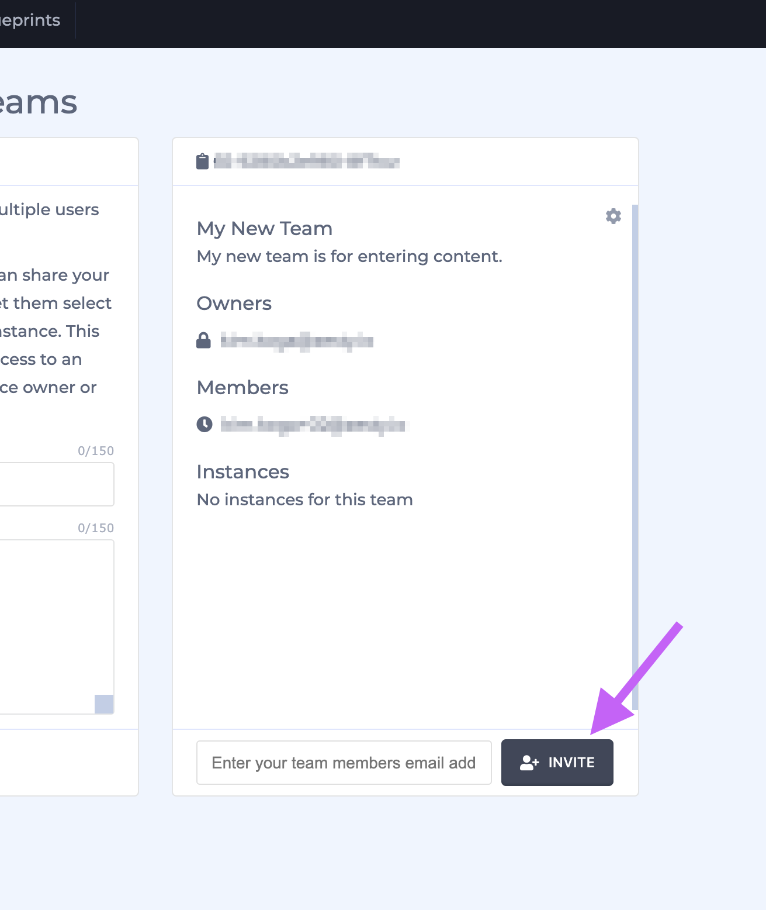
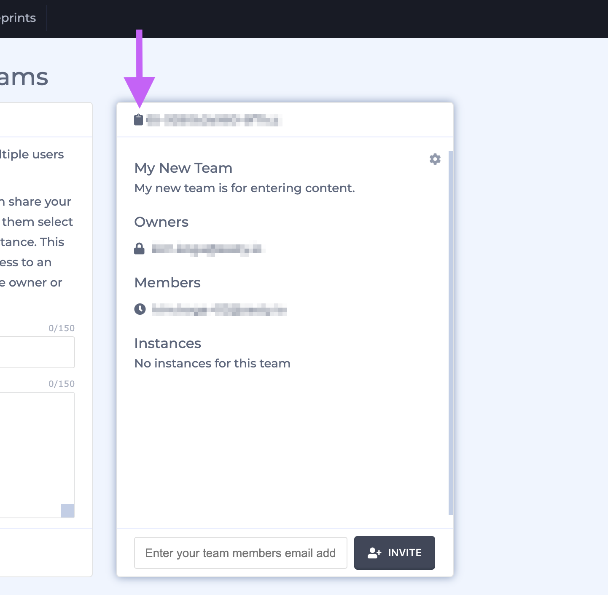
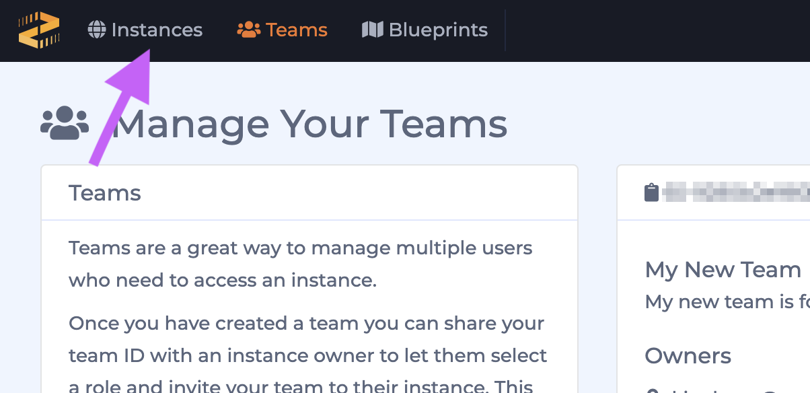
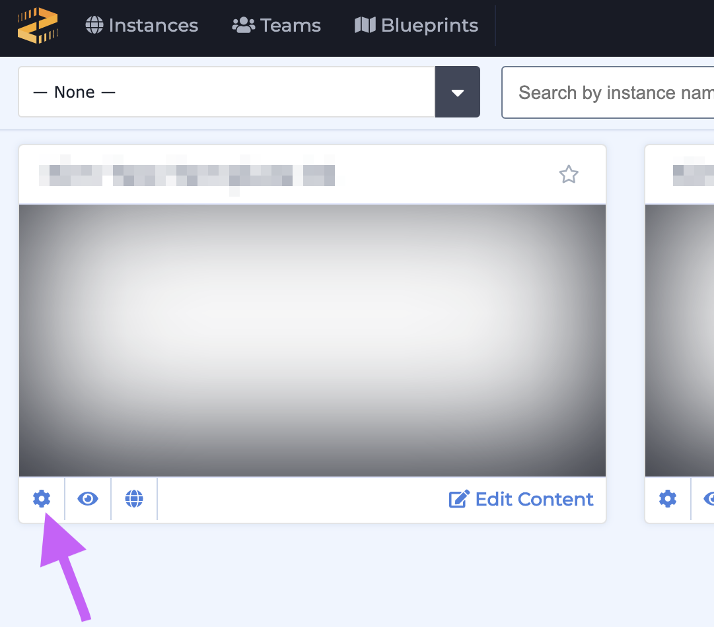
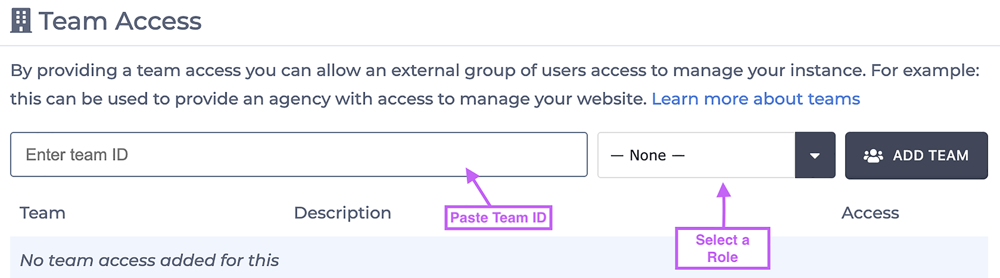

# Adding a Team

### Create a Team

Follow these steps to add a team to your instance.

1. Login to Zesty.io and click on the Teams icon in the accounts navigation bar.  
2. Fill out the Teams form with a team name and description, and click the green **+ Create Team** button.                                    
3. Add Team members by entering in the email addresses of your teammates in the text box and click the gray **+ Invite** button to invite them to your team.  


If an invited user is not yet a Zesty.io user, they will need to create an account before they can accept your Team invite.


Congratulations! You created your first team. Now let's add it to your instance.

### Add a Team to Your Instance

1. Navigate to you Teams via the link in the accounts navigation bar.  
2. Copy your team's ID by click the clipboard icon.   
3. Navigate back to your instances by click Instances the accounts navigation bar.                                                            
4. Locate the instance that you want to add your team to and click the settings cog to access your instance's settings.  
5. Scroll down in the instance's settings drawer until you see the Team Access section. Paste your team's ID text box with \(Mac: CMD+v  PC: CTRL+v\), select your team's [role](../../../content-instance/roles-and-permissions.md), and then click the gray **Add Team** button.                                 

Congratulations! You just added a team to your instance. 

