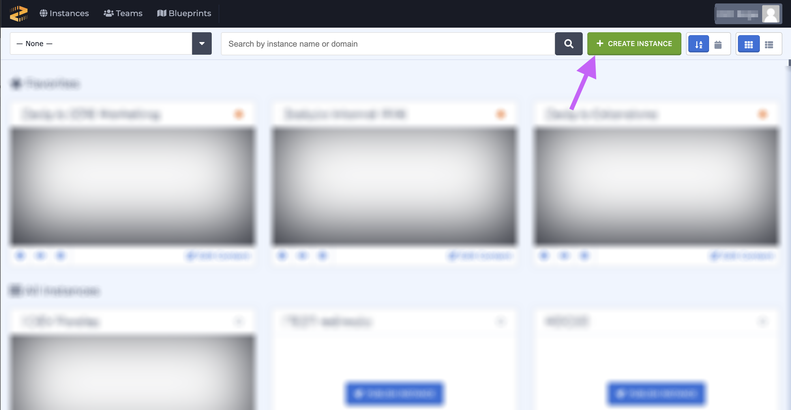
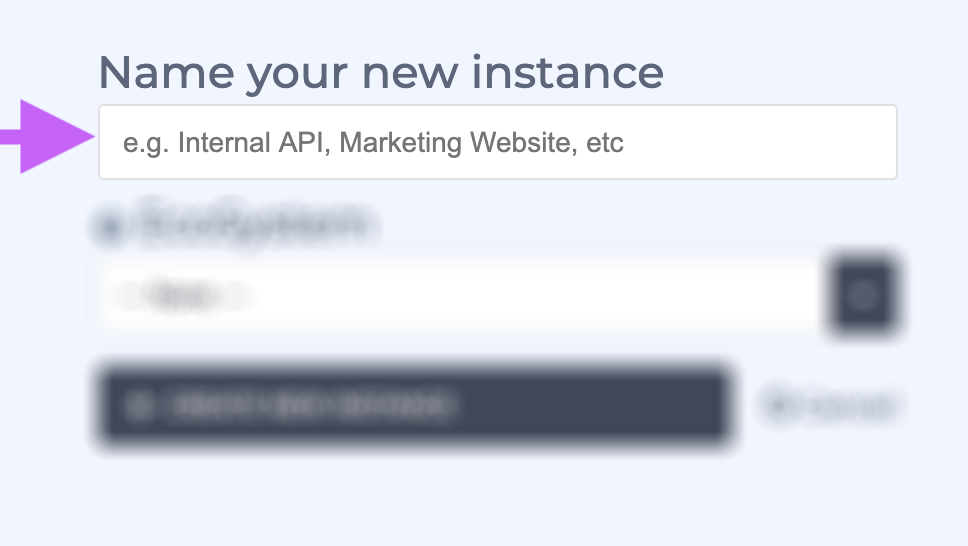
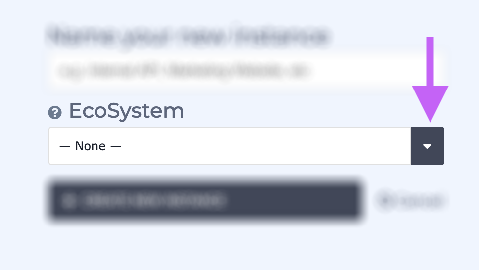
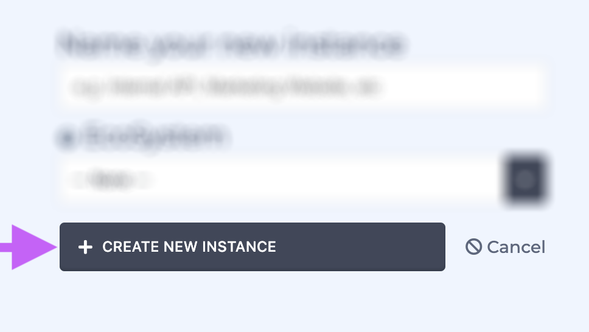

# Adding Instances to EcoSystems

### Overview

Users might have a use case for creating a group of interrelated instances. We call those interrelated instances an EcoSystem. When EcoSystems are created in Zesty.io they can share a media bin between all of the instances in the EcoSystem. The shared media bin allows assets to be shared so they won't need to be uploaded to every new instance in the EcoSystem. 

### Steps to Adding Instances to EcoSystems

New instances can be added to an EcoSystem when they are being named. Follow the steps below to create a new instance and it to an EcoSystem in the process.

1. Click the green  '+ Create Instance' button from the all-instances view.

2. Click in the text box and give you instance a name.

3. Click the arrow to reveal the dropdown and select which instance you'd like to share your media bin with \(ie create an EcoSystem with\).

4. Click the gray '+ Create New Instance' button. 

5. Complete the instance creation flow beginning with selecting a blueprint. If you're unfamiliar with the process follow [this](https://zesty.org/services/web-engine/guides/how-to-create-a-new-instance#step-2-select-a-blueprint) guide. 

