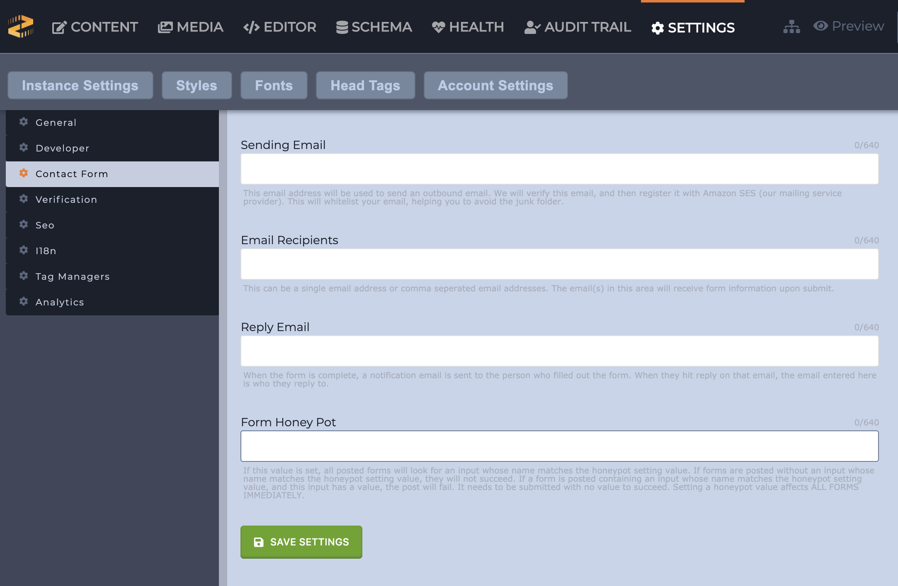

# How to Create a Lead Form

This guide walks through creating a lead capture form which will store the data entered in the form to Zesty and send an email to the website marketing manager.

### Zesty.io Lead Form

Start by creating a standard [HTML form](https://developer.mozilla.org/en-US/docs/Web/HTML/Element/form). Note the two hidden fields at the top of the form; `zcf` and `zlf`.

Please note: input names that are prepended with and underscore will not be emailed, however they will be captured in the Leads tab. Example: `<input name="_sendcopy">`



[Parsley](http://developer.zesty.io/parsley-templating/) is used to reference the `{{ page.title }}` this way we uniquely name the form and can identify it in the leads table.

#### ZCF: Zesty Contact Form

The `zcf` input instructs Zesty.io to send an email to the recipient configured in _Settings_ &gt; _Instance Settings_ &gt; _Contact Form_ as shown in the picture below. A common use case for this would be having a contact form that is submitted to your company email, the recipient.

#### Email Override: Setting a specific form to notify a different email than the one in settings.

To override the email a form submission sends two a hidden input field in the form html with the name "email\_override" and the value of the email you want to set.

`input type="hidden" name="email_override" value="name@domain.com"`

#### ZLF: Zesty Leads Form

The `zlf` input instructs Zesty to record the form submission. Then you can view your leads from the _Lead_ tab inside the Zesty Site Manager. The Leads tab will not be visible until you have captured a lead submission. The value provided in the input is simply for organizing and identifying your forms.

This feature is a great alternative to a full CRM solution when you first get started capturing web generated leads.

As more people fill out the form this table will grow. By default `email`, `first_name`, and `last_name` input names will be displayed. Every other field will be stored and shown to you on the individual lead view.

### Salesforce: Web to Lead

A quick way to begin capturing leads in Salesforce is with their [Web-to-lead](https://help.salesforce.com/HTViewHelpDoc?id=customize_leadcapture.htm) feature. You will need to alter your web forms so the input names match the Salesforce field names. This is how Salesforce is able to match up the form input data.

When usin gSalesforce Web-to-lead you will be posting directly to a Salesforce endpoint; `https://www.salesforce.com/servlet/servlet.WebToLead?encoding=UTF-8`. This means you will by pass Zesty's lead capture feature. One way to send a lead to both Salesforce and Zesty is by using AJAX upon the form submit to post the data to another endpoint.

Salesforce requires to hidden inputs.

`<input type=hidden name="oid" value="XXXXXXXXXXX">` `<input type=hidden name="retURL" value="https://zesty.io/example/thank-you/">`

* `oid`: Organization id, which is specific to your Salesforce account. 
* `retURL`: As the name implies a url which the user submitting the form will be redirected to after submission. 

