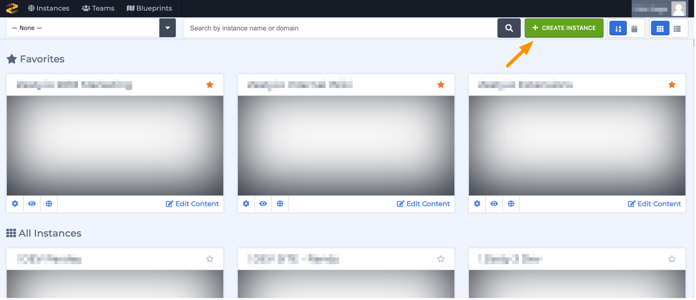

# How to Create a New Instance

### Step 1: Create the Instance

From the Accounts Manager interface, click the green "+ Create New Instance" button on the top left card and name your new instance.

### Step 2: Select a Blueprint

A blueprint is your instance's base which can contain pre-built CSS, HTML, and JavaScript \(commonly referred to as framework\) as well as Pages, and Entry sets. Zesty.io provides a few options for blueprints with popular frameworks with preset pages and entry sets to help you get started. You can also create your own blueprint via GitHub. If you don't want any preset options, you can select blank slate.

### Step 3: Access and Roles

Create users who can access your new instance and set their roles or access limitations. These settings can be updated at any time by clicking the cog icon on your instance in the Account Manager. Click Close on the top right of the panel to go back to the Account Manager.  

### Conclusion

Congrats! You have now created a new instance with powerful content capabilities! All of your instances will be displayed on the Account Manager interface in alphabetical order. You can quickly look up a specific instance with the search bar at the top of the Account Manager interface. Click on the "Open Manger" link to begin working on your instance in Zesty.io.

