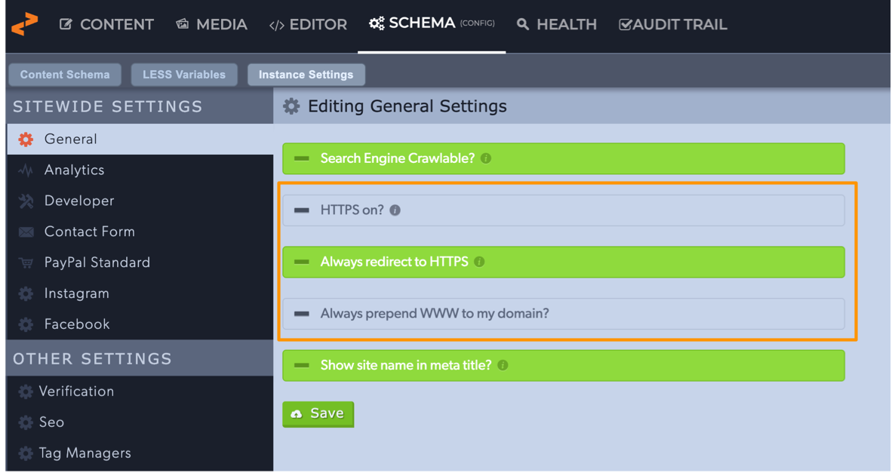
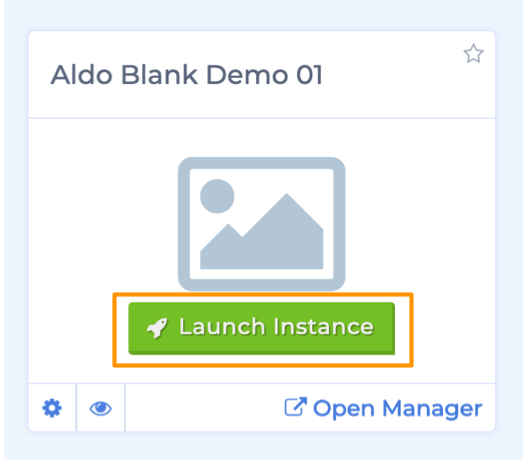
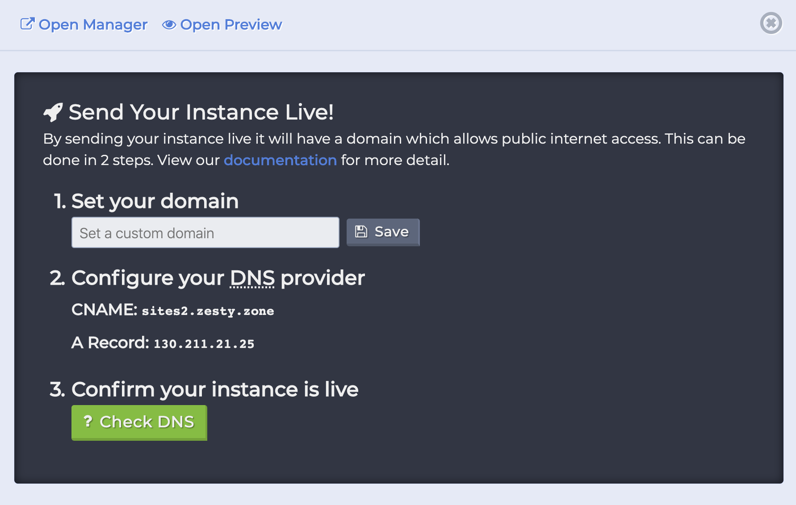
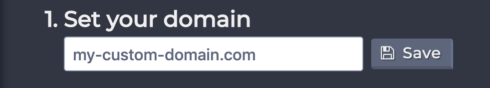
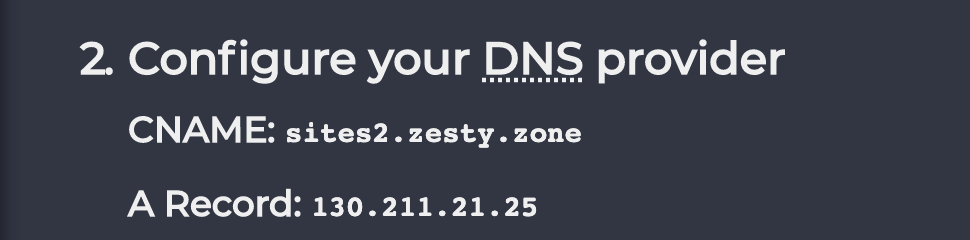

# How to Launch an Instance

### Overview

There are 4 steps to making your site accessible to the public.

1. Configure your HTTPS and WWW settings
2. Set a custom domain
3. Configure your DNS
4. Confirm that your domain is live

### **Before you begin** 

Before beginning the process to send your site live ensure that all content and code that you want to be made available to the public are published and listed accordingly.

###  1. Configure HTTPS & WWW Settings

If necessary configure your HTTPS and WWW settings before launching your site. Disregard this step if your site will not be using HTTPS or plan to force prepending your domain with WWW you can move on to step 2, otherwise continue reading for instructions on accessing these settings.

Open the Content Manager interface and navigate to the Schema section and then the Instance Settings subsection. Under General you'll find your HTTPS and WWW site settings. 

Above you can see these settings outlined in orange. The tooltips will help you navigate this area and give you information about the setting. 

If you want to always redirect to HTTPS then the HTTPS on? setting must be turned on. To turn this setting on click the "HTTPS on?" button and it will turn green. 

If you'd like to force prepending your domain with WWW then click the "Always prepend WWW to my domain?" button.

Save your settings before starting the next step.

### 2. Choose An Instance to Launch

In the Accounts Manager interface locate the instance that you would like to send live and then click that instance's green "Launch Instance" button. 

After you click the "Launch Instance" button the instance's setting drawer will open and prompt you to set the domain name and configure your DNS settings. 

### 2. Set a Custom Domain Name

Enter your custom domain name in the textbox and click Save.

### 3. Configure you Domain's DNS Settings

Configure your domain's DNS settings by following the instructions in the settings drawer. 

**Please note** that domain registrars are not one-size-fits-all so all instructions may not be applicable. See the **Common DNS Registrars** section below for more information.

There are three values you will need to set, the record type, host, and value. 

#### Sending Apex domains live \(e.g. https://mydomain.com\)

To connect an apex domain to Zesty.io you need to set 4 `A Records`

* A Record Name: `@` Value: `151.101.1.161`
* A Record Name: `@` Value: `151.101.65.161`
* A Record Name: `@` Value: `151.101.129.161`
* A Record Name: `@` Value: `151.101.193.161`

If you can only set one A Record, then use `151.101.1.161`

#### Sending Subdomain Live \(e.g. https://www.mydomain.com or https://blog.mydomain.com\)

To connected a subdomain to Zesty.io you need to set a single `CNAME Record`

* CNAME Record Name: `www` Value: `zesty.map.fastly.net`

The Record name: `www` in that example is swapped out with any subdomain like `blog` or `shop` to get `shop.mydomain.com`, or even `blog.shop` to get `blog.shop.mydomain.com`

#### Verify your instance is live

To confirm that your instance is live click the green "? Check DNS" button. You'll see a notification in the bottom left-hand corner of the screen letting you know if your DNS has been verified.

#### Common DNS Registrars

Since there are many places to purchase domains it's difficult to define all-inclusive instructions to setting up a DNS record. Below you'll find some common DNS registrars and their setup instructions.

**NameCheap**

* [Setting a CNAME record for www](https://www.namecheap.com/support/knowledgebase/article.aspx/9646/10/how-can-i-set-up-a-cname-record-for-my-domain)
* [Redirecting example.com to www.example.com](https://www.namecheap.com/support/knowledgebase/article.aspx/385/77/how-do-i-set-up-a-url-redirect-for-a-domain)

**GoDaddy**

* [GoDaddy Managing DNS](https://support.godaddy.com/help/article/680/managing-dns-for-your-domain-names)

