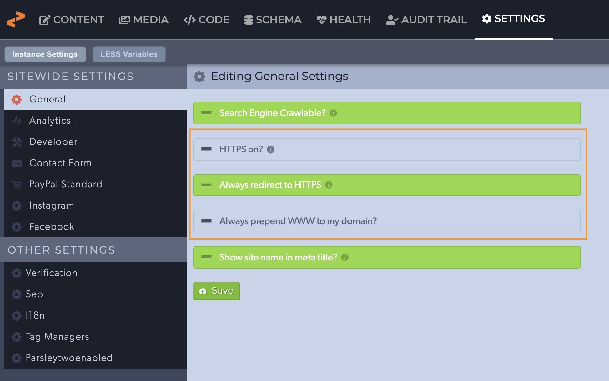
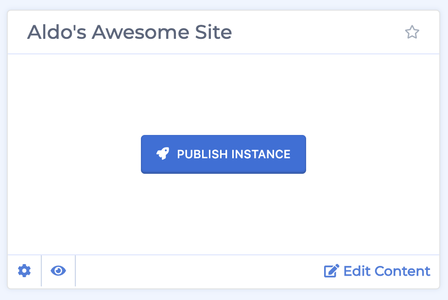
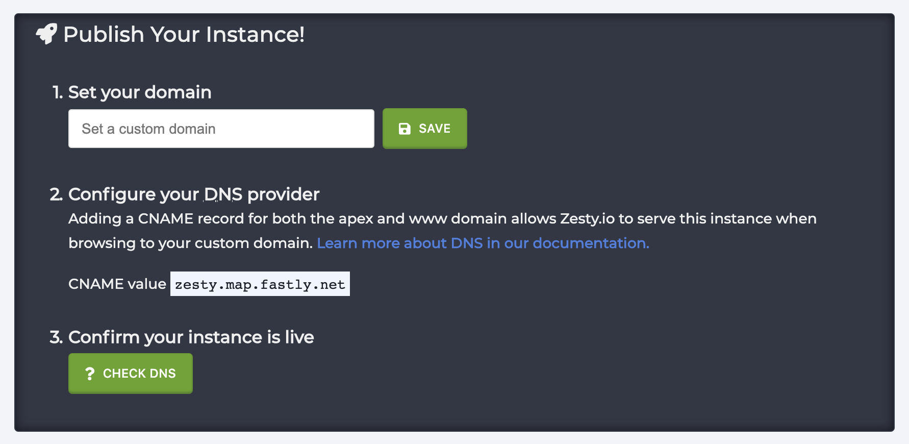
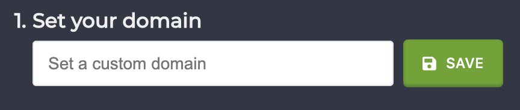

# How to Launch an Instance

### Overview

There are 4 steps to making your site accessible to the public.

1. Configure your HTTPS and WWW settings.
2. Set a custom domain.
3. Configure your DNS.
4. Confirm your domain is live.

### **Before you begin** 

Before beginning the process to send your site live ensure that all content and code that you want to be made available to the public are published and listed accordingly.

###  Configure HTTPS & WWW Settings

If necessary configure your HTTPS and WWW settings before launching your site. Jump to [step 1](https://zesty.org/services/web-engine/guides/how-to-launch-an-instance#1-launch-instance) if your site will not be using HTTPS or force prepending your domain with WWW, otherwise continue reading for instructions on accessing these settings.

Open the Content Manager interface and navigate to the Settings section. Under General you'll find your HTTPS and WWW site settings. 

Above you can see these settings outlined in orange. The tooltips will help you navigate this area and give you information about each setting. 

If you want to always redirect to HTTPS then the "HTTPS on?" setting must be turned on. To turn this setting on click the "HTTPS on?" button and it will turn green. 

If you'd like to force prepending your domain with WWW then click the "Always prepend WWW to my domain?" button.

Save your settings before starting the next step.

### 1. Launch Instance

If you haven't already done so, locate the instance that you want to launch in the Accounts Manager interface and then click that instance's "Publish Instance" button. 

After you click the "Publish Instance" button the instance's setting drawer will open and prompt you to set the domain name and configure your DNS settings. 

### 2. Set a Custom Domain Name

Enter your custom domain name in the textbox and click Save.

### 3. Configure you DNS Settings

Configure your domain's DNS settings by following the instructions in the settings drawer. 


**Please note** that domain registrars are not one-size-fits-all so each step may not be applicable. See the [**Common DNS Registrars**](https://zesty.org/services/web-engine/guides/how-to-launch-an-instance#common-dns-registrars) section below for more information.


There will be 2 records to set up: an apex record \(e.g. example.com\) and a WWW record \(e.g. www.example.com\). Three values are required to set these records: record type, host \(or name\), and value. 

#### Apex Record

Create or set an existing apex record with the following values: 

1. Record type: `A`
2. Host: `@`
3. Values (*Create a separate A record for each of these IP addresses*):
   1.  `151.101.1.161`
   2.  `151.101.65.161`
   3.  `151.101.129.161`
   4.  `151.101.193.161`

#### WWW Record
Create or set an existing WWW record with the following values:

1. Record type: `CNAME`
2. host: `WWW`
3. value: `zesty.map.fastly.net`

[*Why can't I use a CNAME for my apex record?*](https://www.isc.org/blogs/cname-at-the-apex-of-a-zone/)

### 4. Verify your instance is live

To confirm that your instance is live click the green "? Check DNS" button. You'll see a notification in the bottom left-hand corner of the screen letting you know if your DNS has been verified.

### **Common DNS Registrars**

Since there are many places to purchase domains it's difficult to create all-inclusive instructions to setting up a DNS record. Below you'll find some common DNS registrars and their setup instructions.



* [Setting a CNAME record for www](https://www.namecheap.com/support/knowledgebase/article.aspx/9646/10/how-can-i-set-up-a-cname-record-for-my-domain)
* [Redirecting example.com to www.example.com](https://www.namecheap.com/support/knowledgebase/article.aspx/385/77/how-do-i-set-up-a-url-redirect-for-a-domain)



* [GoDaddy Managing DNS](https://support.godaddy.com/help/article/680/managing-dns-for-your-domain-names)



* [Manage DNS settings](https://www.domain.com/help/article/dns-management-how-to-update-dns-records)
* [Updating CNAME records](https://www.domain.com/help/article/dns-management-how-to-update-cname-aliases)



* [DNS management](https://my.bluehost.com/hosting/help/559)
* [Creating and understanding CNAMEs](https://my.bluehost.com/hosting/help/cname)



* [DNS management](https://www.hostgator.com/help/article/manage-dns-zones)



