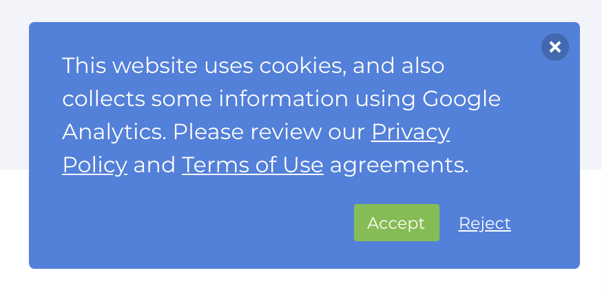

# Setting up Google Analytics for GDPR

### Step 1: Prepare Javascript to Check Cookies

Javascript can access cookies, use this handy method to check a cookie value. You'll want to load this function up first. This is vanilla Javascript, no framework needed.

```javascript
//session cookie to store privacy pop up response 
function get_cookie(Name) { 
    var search = Name + "=" var returnvalue = ""; 
    if (document.cookie.length > 0) { 
        offset = document.cookie.indexOf(search) 
        // if cookie exists 
        if (offset != -1) { 
            offset += search.length // set index of beginning of value 
            end = document.cookie.indexOf(";", offset); // set index of end of cookie value 
            if (end == -1) end = document.cookie.length; 
            returnvalue=unescape(document.cookie.substring(offset, end)) 
        } 
    } 
    return returnvalue; 
}
```

### Step 2: Remove the GA \(analytics\) and GTM \(tag manager\) auto loading

Remove all the GA and GTM script tags stuff from the `loader` view file in the editor and save it. If you are using Zesty.io GA auto loader, you need to delete the setting. You can delete the GA settings in config &gt; settings &gt; analytics.

### Step 3: Create CSS/HTML popup for unrecognized visits.

In your theme, create a page or panel with language about the cookies and some toggle buttons. You will check a cookie using the `get_cookie` function to load or not load this.



### Step 4: Connect buttons to set a preference cookie 

 Setup on clicks to the buttons that set cookie up for the users preference. 

```javascript
//create performance turn on flag cookie 
function perftoggle_on(turnon){ 
    //set expiration date 
    date = new Date(); 
    date.setTime(date.getTime()+(10000*24*60*60*1000)); 
    expiration = "; expires="+date.toGMTString(); 
    //set the cookie 
    document.cookie="performance_on="+turnon+expiration; 
    console.log(document.cookie); 
}
```

\`\`

