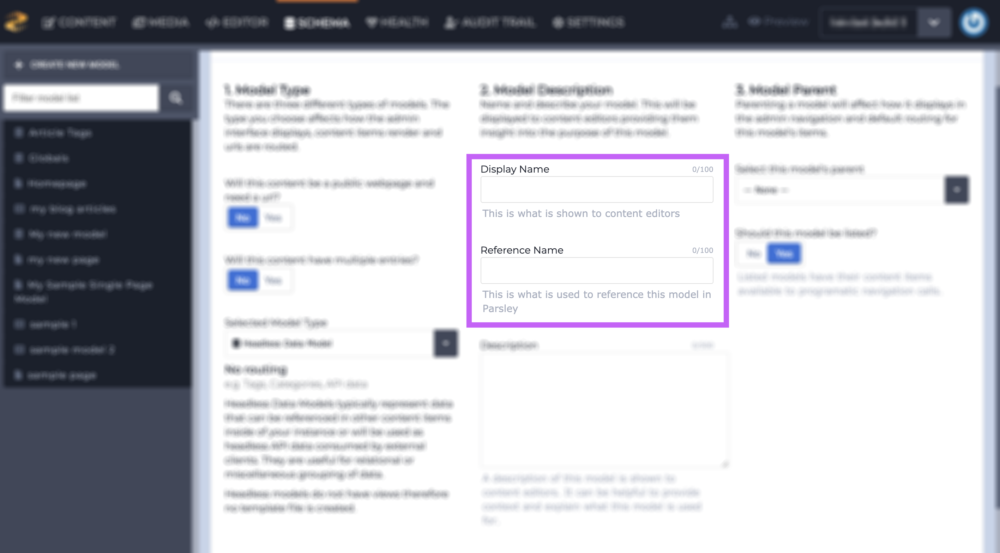
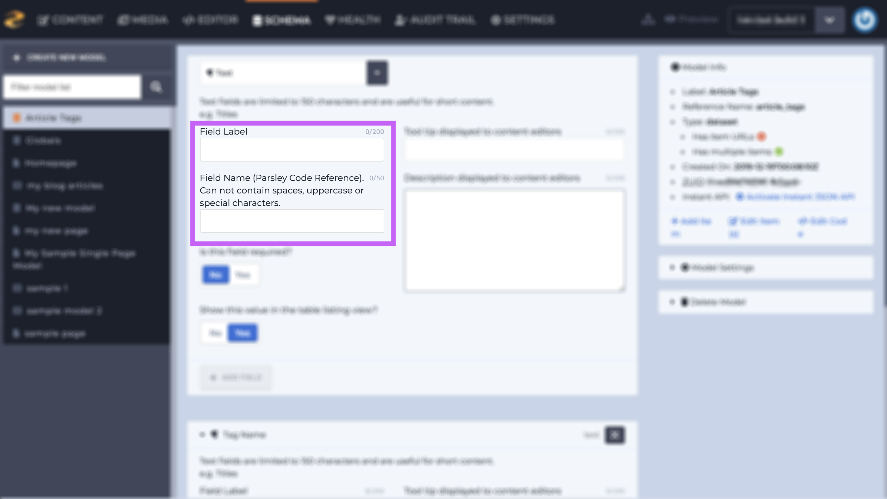
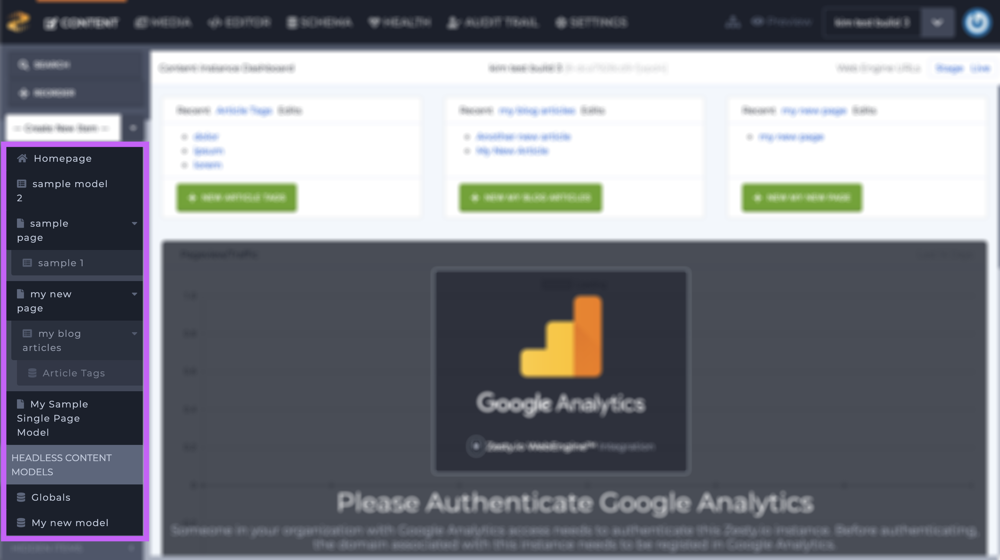
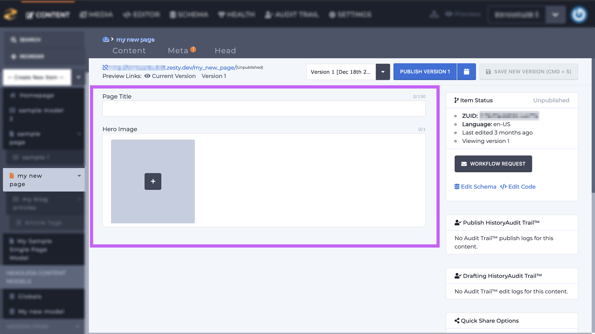
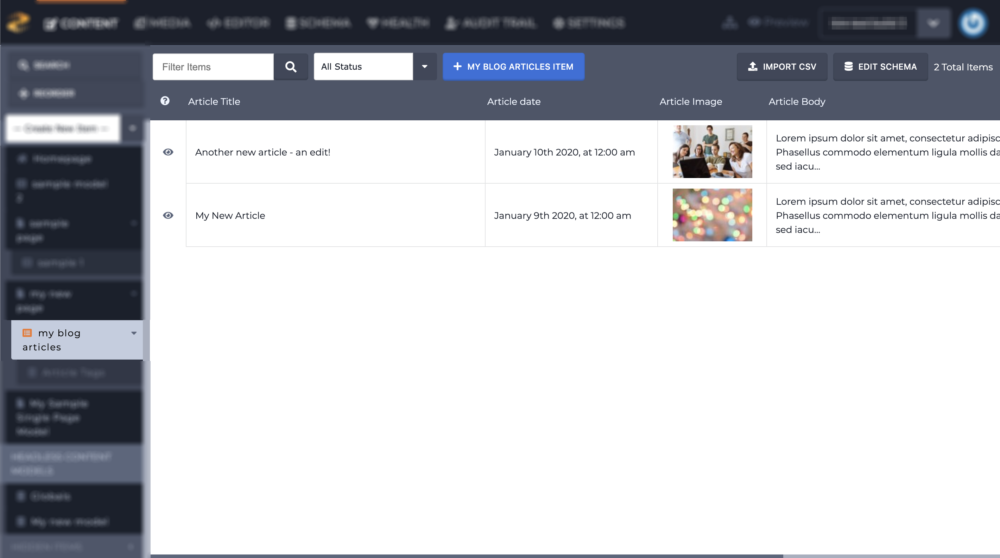
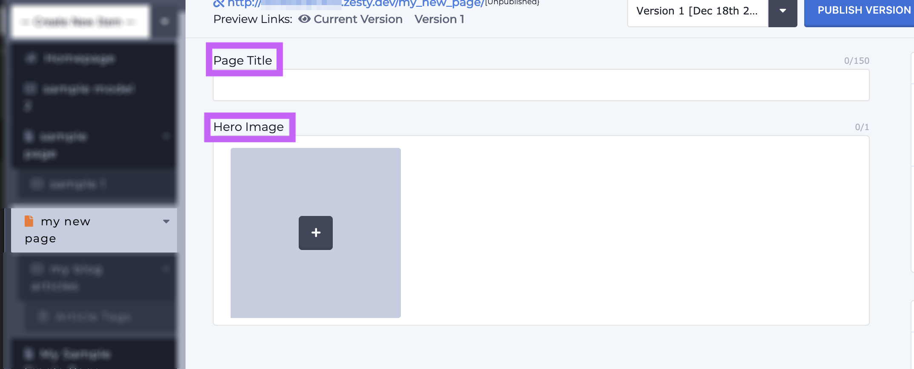
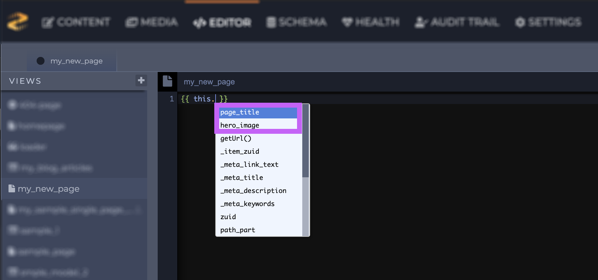

# The Connection Between Schema, Content, and Code

### Overview

Schema \(content models and fields\), Content, and Code are all connected to one another through names, labels, and reference names; however unless a user sees all those items at once it can be difficult to put it all together. First of all we'll go through the relevant details for each section and then we'll put it all together.

### Schema

The Schema section is where we create content models and add fields to those content models. 

Each content model has 2 names: 

* Display Name
* Reference Name

One of these names is used to identify that item in Content section and the other name is used to identify that item in the Code section \(which we'll cover in the Putting it all Together section below\).

After a content model is created the next step is to add fields to those content models. 

Each field has 2 names: 

* Field Label
* Field Name

One of these is used to identify a field in the Content section, and the other is used to identify that field in the Code section.

### Content

The Content section is where users can enter their content. Content models' Display Names are listed in the left-hand navigation \(outlined in purple below\). 

When a content model is selected from the left-hand navigation sidebar, the main portion of the screen will show that model's fields. 

If the selected model is a [headless set](https://zesty.org/services/manager-ui/schema/content-models#headless) or [multi-page set](https://zesty.org/services/web-engine/guides/content-entry-drafts-and-publishing#multi-page-sets) then the [table-listing view](https://zesty.org/services/manager-ui/content#table-listing-view) will show in the main portion of the screen and when an item is selected from the table-listing view, the main portion of the screen will show the content editing view. 

Each field's name is shown above it. The name that is shown is that field's Field Label which was assigned when the field was create in the Schema section.

### Code \(Editor\)

We need to know which content model\(s\) and/or field\(s\) you want to code in before you get started. Sometimes it's easy to identify the items that you need, especially if they were named based on their function \(e.g., a blog page named Blog, or blog tag set named Blog Tags\).

When we're referencing a field on a page then we need to use Parsley to call that field within its proper scope using `{{ this. }}`.  `this` provides the scope and once the user types a `.` or period, Zesty.io will populate a list of available fields and calls for that content model. Fields will be identified by their Field Name which was assigned when the field was added in the Schema section. In the image below I have outlined the available fields for this page in purple.

When accessing items in a multi-page set or headless set it is often necessary to use a [Parsley each loop](https://zesty.org/services/web-engine/introduction-to-parsley/each-loop-deep-dive). Each loops allow users to iterate through a multi-page and headless content model's items. When using an each loop you need to know the name of the content model that you want to loop through. A content model's name is defined by its Reference Name which was assigned when the multi-page and headless content model was created. In the each loop below the content model's Reference Name is underlined in purple.

In order to access a content model's fields in an each loop use the variable defined in the each loop declaration - in this example the variable is `sample`- followed by a `.` or period and Zesty.io will list the available fields and calls for the scope of the variable. 

### Putting it all Together

Now that we have laid out the pertinent details of each section and explained, in a limited way as to how these sections are connected by their names and labels, let's put all the pieces together. 

It all starts with Schema. When content models are created they are assigned a **Display Name** and a **Reference Name**. And when fields are added to those content models, they're assigned a **Field Label** and a **Field Name**. 


**Content Models** have a:  
- Display Name  
- Reference Name  
  
**Fields** have a:   
- Field Label  
- Field Name


After content models are created the next step is to add content. In the Content section content models are identified by their **Display Name**. A content model's fields are identified by their **Field Label**.

After entering content it's time to code. In the Code section content models are identified by their **Reference Name** and fields are identified by their **Field Name**.

Below is a visual representation of how all these pieces work together. Click to view a larger image.

