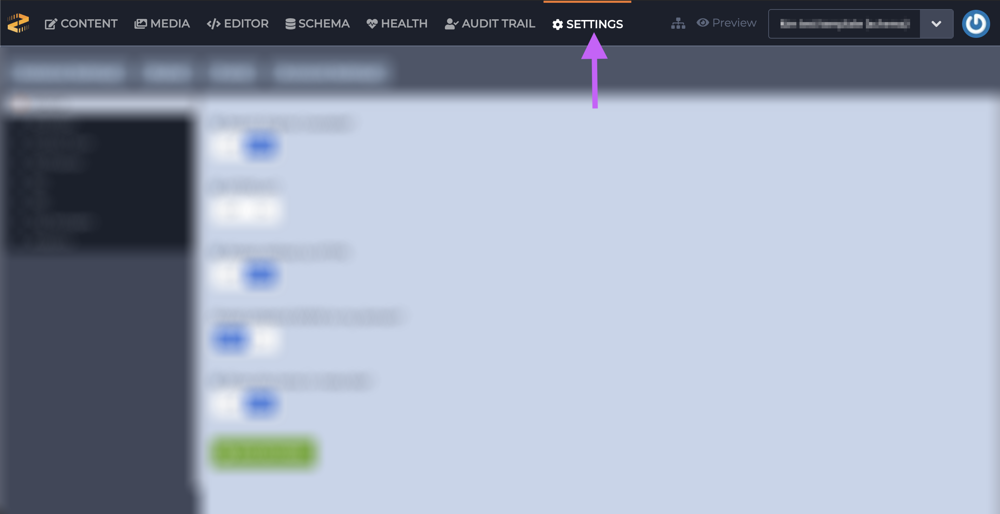
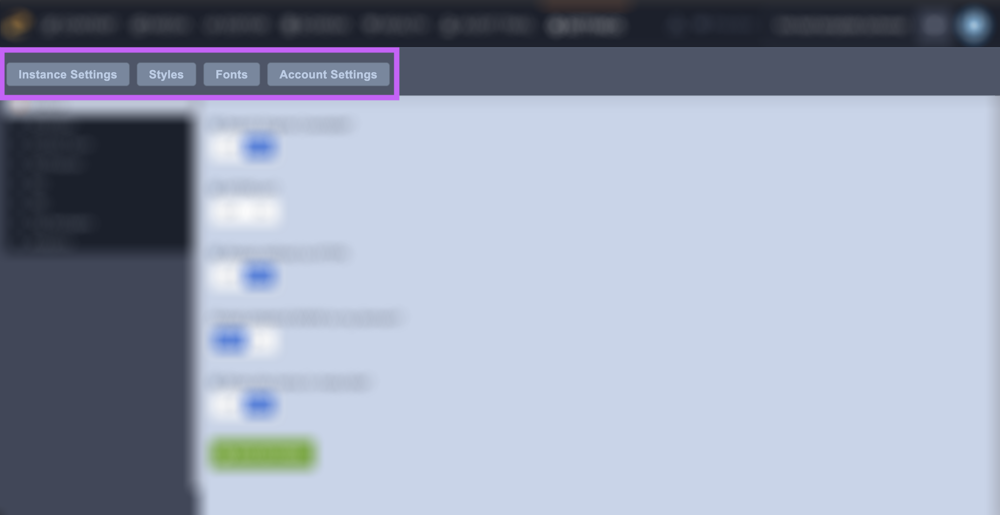
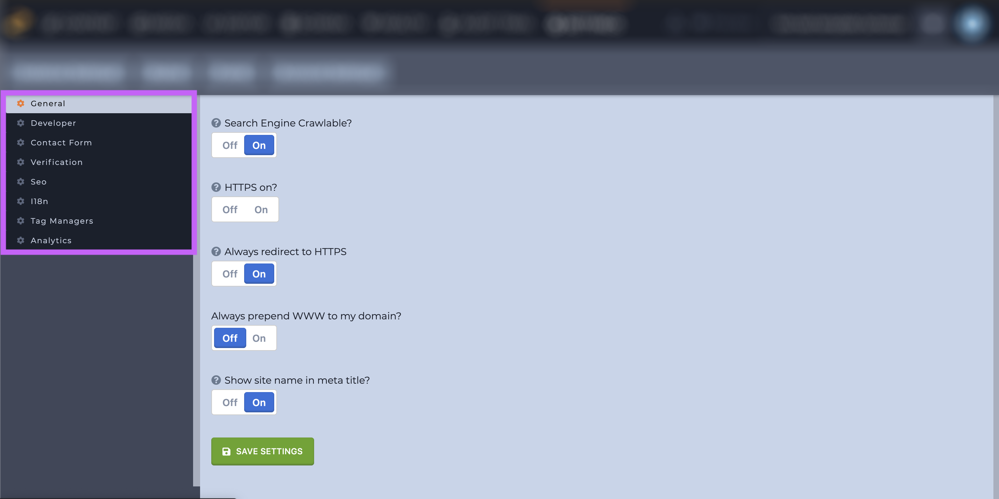
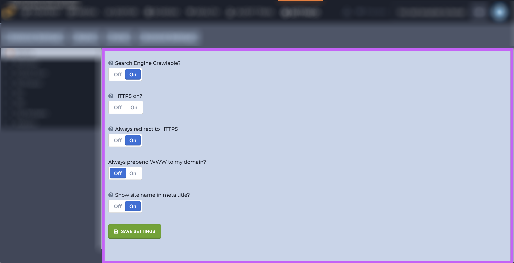

# Settings

### Introduction

An instance's settings control a number of an instance's attributes from forcing HTTPS to defining fonts. Learn how to access your instances setting below. 

### Accessing An Instance's Settings

An instance's settings are located under the Settings section in the Content Manger. 

An instance's settings are broken down into 4 subsections: 

* Instance Settings
* Styles
* Fonts
* Account Settings

Each subsection has their own utilities as well. Each subsections' utilities are located in the left-hand sidebar navigation \(outlined in purple below\).

Once one of the utilities is selected the main portion of the screen will show you your options \(outlined in purple below\). Options will vary depending on which utility has been selected.

### Accessing Instance Settings With Parsley

To call your settings using Parsley in the Editor, use the `{{ setting }}` reference tag. Type `{{ setting.` and you'll see a dropdown of all your available reference tags in your instance-wide settings.

