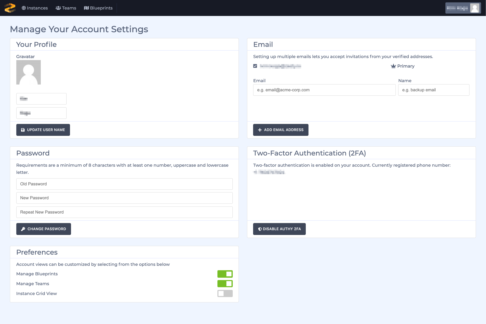
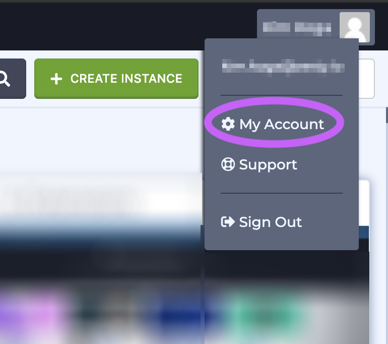

# Account Settings

### Overview

Accounts settings can be accessed though the Accounts management interface as well as through the content management interface. The following items can be updated through your account settings:

* User name
* Gravatar
* Primary email address
* Add back-up email address
* Password
* 2-factor authentication
* Preferences: manage blueprints, manage teams, and instance grid

### Accessing Account Settings

#### Accounts Interface

1. From the all-instances view, click on your user name/avatar in the upper right-hand corner outlined in purple below.

2. A dropdown menu will appear with options. Choose My Account.

#### Content Management Interface

1. Within the account interface navigate to the Settings section.

2. From the Settings section select Account Settings.

