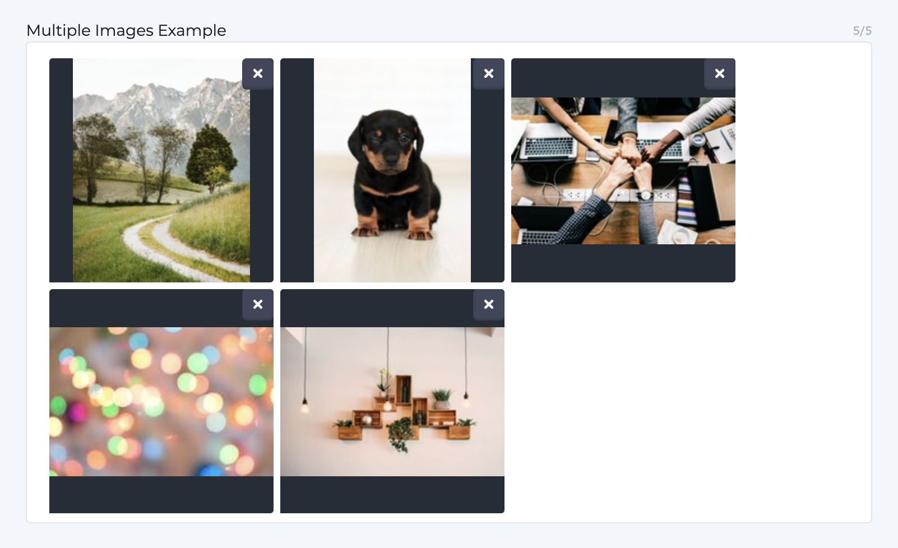

# Image Modifiers

### Overview

All of the following Parsley calls represent a way to modify images. When the modification is first done the media service will return a temporary token URL which will resolve to the new image once the modification is complete. Afterwards the image will have its final static URL. This ensures page requests continue to resolve while images are being generated.

### Looping through multiple images in a Media field

Users can upload multiple images to a single Media field as shown in the example below.



\
To access these images you'll need to loop through them with the following code:&#x20;

```
{{each media.{this.images} as media }}
	
{{end-each}}
```

In this example, `images` is the field's reference name.


&#x20;**** `media.`is a keyword for defining the scope of the call. It is not a variable name or reference to a model. \
\
Replace the`{this.images}`code with a reference to your model's specific field.   \
&#x20;\
The order of the images is determined by the order that they appear in in the content model.&#x20;


When wrapping this special each loop with an [if-conditional](https://zesty.org/services/web-engine/introduction-to-parsley/if-conditionals) be sure to use the media field's reference name to in the if-conditional. For example, if the reference name for your field is `images`  and you're checking for an empty field then your if-conditional will look like this:&#x20;

`{{ if {this.images} != '' }}`

### .getImage(width, height, type)

Function takes a width, height, and an optional type (fit or crop) parameter and returns a URL of the resampled image. There are many ways to utilize this function. Fit is the default type and does not need to be explicitly declared. Crop type requires 2 parameters and explicit declaration. The list below shows examples of these calls. Learn how crop and fit work with [this video](https://www.youtube.com/watch?v=gin0sTwN6U4\&t=).

```
// .getImage(W, H, fit or crop)


 


```

### .getImageFileName()

When called on an image reference, returns the image file name.

```
{{ page.image.getImageFileName() }}
```

### .getImageTitle()

When called on an image reference, returns the image title.

```
{{ page.image.getImageTitle() }}
```

### .getMediaURL()

Function does not take parameters and returns the original URL to that file. This is how to access files stored in media that are not images, such as PDFs and MP4s. You can also use this call to access the original file of an image that has not been optimized or altered by Zesty.io.

```
<a href="{{ page.download_file.getMediaURL() }}" >Download</a>
// <a href="https://domain.com/file.pdf" >Download</a>
```

### .gravatar(email)

Function takes a user's email and requests an image from the Gravatar API.

```

// 
```

### Responsive Images with `srcset`

In addition to Parsley you can use `srcset` to create responsive images. Learn more about `srcset` with [this MDN article](https://developer.mozilla.org/en-US/docs/Learn/HTML/Multimedia\_and\_embedding/Responsive\_images).&#x20;

This is an example of how `srcset` can be used with Parsley:

```
<picture>
			<source media="(max-width: 700px)" sizes="(max-width: 500px) 50vw, 10vw"
			srcset="{{this.hero_image_mobile.getImage()}} 138w, {{this.hero_image_mobile.getImage()}} 138w">
			
			<source media="(max-width: 1400px)" sizes="(max-width: 1000px) 100vw, 50vw"
			srcset="{{this.hero_image.getImage()}} 416w, {{this.hero_image.getImage()}} 416w">
			
			
</picture>
```
