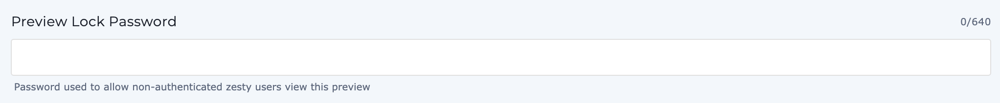

# Security

## Stage Preview Lock Protection

The WebEngine preview URL is locked from public consumption. As such it will only render if:

1.  The user is logged in _and_ has access to that instance. 
2. A valid password has been provided. This password is set by via the [Settings](https://zesty.org/services/manager-ui/settings)  under  `category: security` and `key: preview_lock_password` is set, a user may enter the password to start a verified session.


**Any instance created on or after Jan 1, 2021 is automatically locked.** If your instance is older and you would like Preview Lock Protection, please reach out to support. 


Once a user is verified by \(via password or their user login session\), a unique device imprint cookie _ZVerified_ is created and is used to quickly bypass the preview lock for every network request.

Preview Lock Protection exists to protect your un-published changes and to prevent users from using the preview URL in production.

#### Preview Lock Protection Password

For Instances created before Jan 1, 2021, contact your account manager, as you will need a setting  added to your instance. Once the Preview Lock Password text field has been added your preview URL will be password protected.

#### Setting a Preview Lock Protection Password

When the preview URL is being accessed by non-authenticated Zesty users, you may set a Preview Lock Password which prompts an unauthenticated user to enter a password. They may try 5 times before being locked out. 

## Production Authentication Headers

 Production sites can be blocked by forcing an authorization header to be added to each request like`Authorization: bearer [SECRET KEY]` . Authorization headers can be edited in manager ui &gt; settings &gt; security

**Headless Authorization** will be applied to Instant, Headless, and GQL APIs.

**Full WebEngine Authorization** will be applied to every request. This setting will collide with Headless Authorization, therefore, headless authorization needs to be removed when using Full WebEngine authorization.


Adding authorization secret key reflect immediately in production site and will block public access. Pages that are already cached will need to be [purged ](environment-states-and-caching-behaviors.md#ways-to-purge-refresh-the-cache-of-your-instance)for required authentication to take effect.


