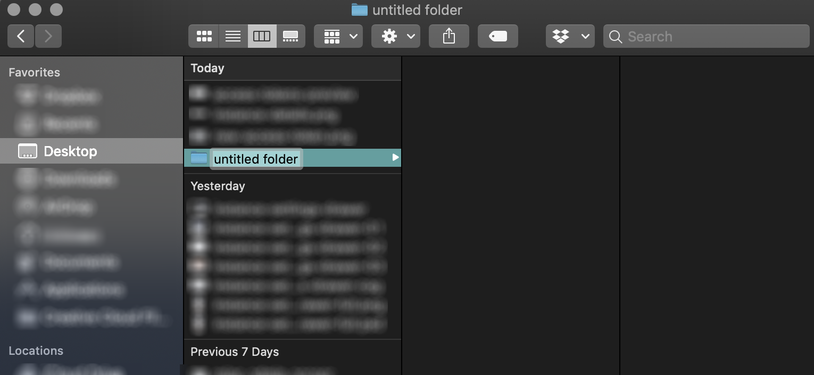
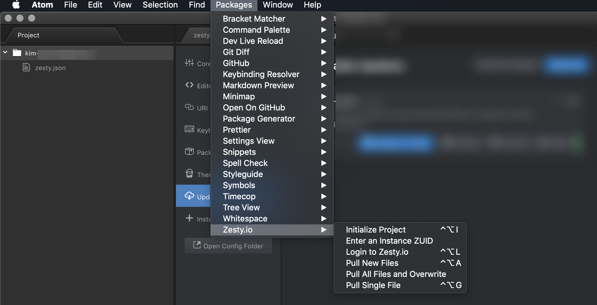

# Atom IDE Package

## Getting Started

To get started with the Atom IDE package you must first have the Atom editor installed. After you have Atom installed the next step is to install the zestyio-atom packages. After you've done that obtain the details of the instance that you want to edit in Atom. You will use details to connect to it to Atom.

If you don't have Atom, download and install the Atom editor directly from [Atom's site](https://atom.io/).

### 1. Install the Package

There are 2 ways to install the zestyio-atom package:&#x20;

* Command-line
* Atom UI

#### Command-line

Install the [`zestyio-atom`](https://atom.io/packages/zestyio-atom) package by running this command in your command-line.

```
apm install zestyio-atom
```

**Installing through the Atom UI**

The Atom Editor can also be installed through the Atom package manager. When you have [ATOM](https://atom.io) installed, open settings, click on install, search Zesty. Install **zestyio-atom** and **zestyio-parsley-atom**.

.png>)

### 2. Get Your Instance Details

#### A. Get your Instance ZUID

Login to your Zesty.io account and you'll arrive at the all-instances view. Find the instance that you want to work on and click the ⚙️(cog) icon on that instance's card and you'll see the Instance Settings Drawer slide out from the right side of the screen.  From here you can find your Instance ZUID:

.png>)

Make note of your instance's ZUID as you'll need it when you're connecting to Atom.

#### B. Create a new Access Token

Scroll down in the Instance Settings Drawer until you find the Access Tokens section.


Specify the name and the role of the token, select a [role](https://zesty.org/getting-started/roles-and-permissions),  and click the "Create Token" button. Make note of this token as you will need it when you're connecting your instance to Atom.&#x20;


The token will only be revealed to the user upon creation. After you close the modal (shown below) you will not be able to access the token again. Keep this token in a private place and do not share it with anyone.


.png>)

### 3. Connect to your Zesty instance

After installing Atom and the zestyio-atom & zestyio-parsley-atom packages you can now connect to your instance using the instance ZUID and token.

#### A. Create an empty directory for your instance.

Use the command-line to make a folder named after your instance:&#x20;

```bash
mkdir mydomain.com
```

Or use your computer's file manager to create a folder and name it after your instance.&#x20;



#### B. zesty.json file

Next create a new file inside you directory (or folder) called `zesty.json`.&#x20;

Add the following JSON to the `zesty.json` file.

```
{
 "instanceZUID": "INSTANCE_ZUID",
 "token": "INSTANCE_TOKEN"
}
```

Replace the `INSTANCE_ZUID` & `INSTANCE_TOKEN` with the values from you obtained in step 2.

#### C. Open your instance directory

In Atom to trigger the instance sync. _If Atom is already open you will need to restart it._&#x20;


Once syncing is completed you should see your instance code files in your Atom project file tree.


If you need to login to Zesty.io Atom will prompt you.

**Alternatively, connect to your instance through the User sign-in modal**

From Atom's navigation bar locate Packages, then hover over Zesty.io to see a secondary menu and select Login to Zesty.io.&#x20;



&#x20;\
This video covers using the sign-in modal method and includes instructions on downloading Atom: [https://www.youtube.com/watch?v=s98dR1M2u8E](https://www.youtube.com/watch?v=s98dR1M2u8E)
