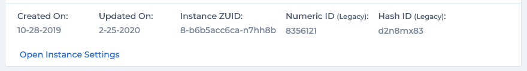
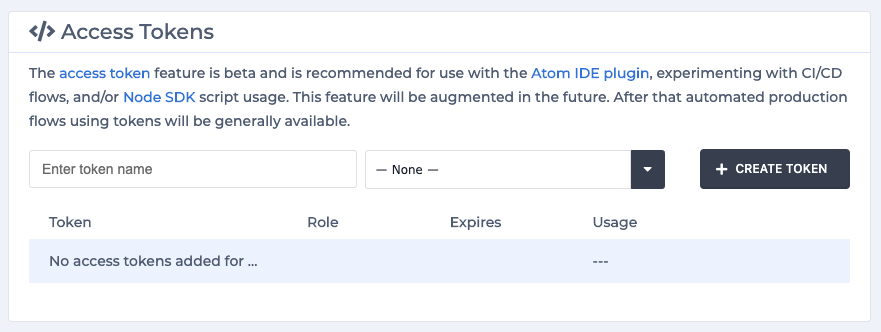
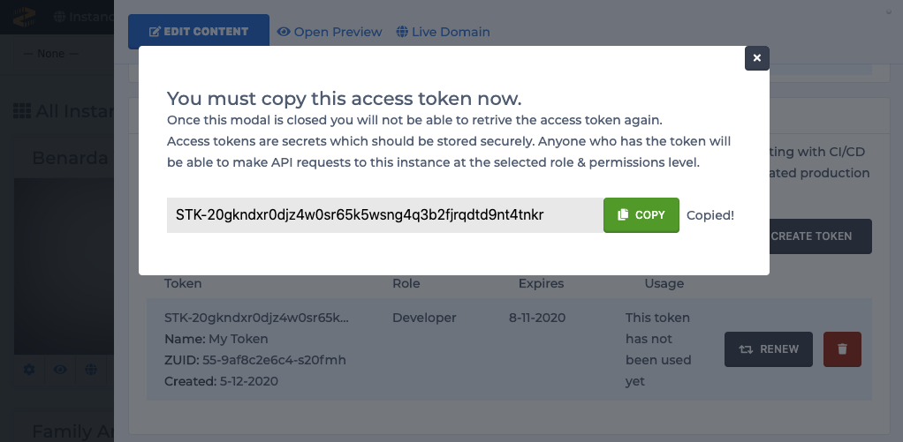

# Atom IDE Package

## Getting Started

To get started with the Atom IDE package you must first have the Atom editor installed. After you have Atom installed the next step is to obtain the details of your instance, you will use these to connect to it using Atom and then install the Zesty.io package.

Download and install the Atom editor directly from [Atom's site](https://atom.io/).

### Get your Instance ZUID

Login to your zesty account and you'll arrive at the all-instances view. From here click on the ⚙️\(cog\) icon on the instance card you want to connect to and you'll see the Instance Settings Drawer slide out from the right of the screen, from here you can find your Instance ZUID:



### Create a new Access Token

From the Instance Settings Drawer scroll down until you find the Access Tokens section.



Specify the name and the role of the token and click on Create Token.


The token will only be revealed to the user upon creation. After you close the modal \(shown below\) you will not be able to access the token again.




### Install the Package

Install the [`zestyio-atom`](https://atom.io/packages/zestyio-atom) package running this command in your command-line.

```text
apm install zestyio-atom
```

**Installing through the Atom UI**

The Atom Editor can also be installed through the Atom package manager. When you have [ATOM](https://atom.io) installed, open settings, click on install, search Zesty. Install **zestyio-atom** and **zestyio-parsley-atom**.


### Connect to your Zesty instance

After installing Atom and the zestyio-atom & zestyio-parsley-atom package you can now connect to your instance using the details obtained from your instance.

#### 1. Create an empty directory for your instance.

```bash
mkdir mydomain.com
```

Create a file within your instance directory named `zesty.json`.

#### 2. zesty.json file

Add the following JSON to the `zesty.json` file.

```text
{
 "instanceZUID": "INSTANCE_ZUID",
 "token": "INSTANCE_TOKEN"
}
```

In the `zesty.json` file replace `INSTANCE_ZUID` & `INSTANCE_TOKEN` with the values from you obtained from your instance.

#### 3. Open your instance directory

in Atom to trigger the instance sync. _If Atom is already open you will need to restart it._

**Once syncing is completed you should see your instance code files in your Atom project file tree.**

**Connecting to your instance through the User sign-in modal**

After installing Atom and the zestyio-atom & zestyio-parsley-atom package as necessary follow these steps.  
This video covers using the sign-in modal method and includes instructions on downloading Atom: [https://www.youtube.com/watch?v=s98dR1M2u8E](https://www.youtube.com/watch?v=s98dR1M2u8E)

#### 1. Create a folder for your instance.

#### 2. In your folder create a file named `zesty.json` and add the following JSON to that file.

```text
{
 "instanceZUID": "INSTANCE_ZUID",
 "token": "INSTANCE_TOKEN"
}
```

In the `zesty.json` file replace `INSTANCE_ZUID` & `INSTANCE_TOKEN` with the values from your instance. a\) You can omit the `INSTANCE_TOKEN` and the package will provide an interative login to Zesty.io. This will also happen if the token becomes stale. The login process will manage writing the new access token to your `zesty.json` file.

