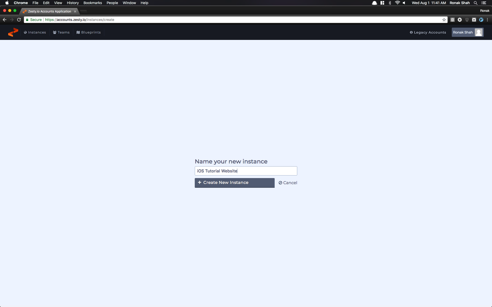

# iOS App Guide

Maintaining an iOS App can be extremely difficult and tricky. App Review times are typically 1-2 days and require excessive developer input \(when all that's really being changed is an image or a string\). Zesty.io allows developers to write their code once, and let marketers update the content continuously.

In this tutorial I'll be walking you through how to setup your Zesty.io instance and iOS App to allow the iOS App to get data from the Zesty.io instance.

## Setting up the Zesty Instance

### Creating the Instance

First, we'll need to create an instance \(if you haven't already\).



Any template will work, and in this example we'll be using the Bootstrap Template.


### Configuring the Content

Once we open up the manager, we'll need to configure the content that we'll load from our iOS App.

Go to Config and create a Set of Content Entries. Call it `Coupons`


Next, we'll add a few fields to load in, a Text Field called `name`, and a TextArea Field called `description`.


While we're here in the Config tab, we'll enable Basic JSON Endpoints by going to Site Settings -&gt; Sitewide Settings -&gt; Developer and clicking the right options.


After saving, go to Content and we'll add an entry to our `Coupons` Dataset


Now that our Zesty Instance is created, we can start making our iOS App!

## Making the iOS App

In order to make an iOS App, you'll first need to download [Xcode](https://itunes.apple.com/us/app/xcode/id497799835?mt=12), which also means that you'll need a [Mac](https://www.apple.com/mac/). After installing Xcode, you can move onto the next step, which involves actually creating the app and getting it setup.

### Setting up your project and installing libraries

Open up Xcode and Create a New Xcode project \(if you don't see this option, ⌘ ⇧N should also work\).

For our purposes, we'll just create a Single View App \(but you can choose any option you want for your project\)


Call it whatever you'd like, and for the Organization Identifier, Apple typically recommends using a reverse domain id, so if your domain is `example.com`, enter in `com.example`. This will make sure you have a proper Bundle ID created.


Hit Next, then create the project wherever you'd like. Additionally, if you'd like to use source control \(Git \[Github/Bitbucket\], etc\), make sure to specify that now.

Once you create your project, we're going to install some libraries.

We'll be using [Cocoapods](https://cocoapods.org), which is an open source package manager for iOS Applications. Cocoapods will make sure that your project works properly, and it will also allow you to use the library that we created to streamline using Zesty in your product.

To do this, we'll need to create a `Podfile`

Go to File -&gt; New -&gt; File...


Choose Other -&gt; Empty


Call it `Podfile`, and store it at the base of your project directory, alongside your `.xcodeproj` file


Inside `Podfile`, paste in this code: \(and replace iOS Tutorial App with the name of your Xcode Project Name

```text
source 'https://github.com/CocoaPods/Specs.git'
platform :ios, '10.0'
use_frameworks!

target 'iOS Tutorial App' do

    use_frameworks!

    pod 'ZestySwiftContentEndpointWrapper', '~> 0.2.0'
        pod 'SwiftyJSON', '~> 4.0'

  target 'iOS Tutorial AppTests' do
      inherit! :search_paths
      # Pods for testing
  end

  target 'iOS Tutorial AppUITests' do
    inherit! :search_paths
    # Pods for testing
  end

end
```

Save it, then close Xcode and open up the Terminal.

We'll now install the pods that we just specified in the `Podfile`

First, to install cocoapods, open up your terminal \(Can be found in Launchpad or Spotlight\) and enter in the following commands:

For macOS 10.11 and above \(El Capitan+\)

```text
sudo gem install -n /usr/local/bin cocoapods --verbose
pod setup --verbose
```

For macOS 10.10 and below

```text
sudo gem install cocoapods --verbose
pod setup --verbose
```

Sidenote: the `--verbose` flag is included so you can see the progress of each command, as these commands usually take a while to run.

Now, after Cocoapods has been installed, we'll navigate to your project's directory.

**Note**: If you're unfamiliar with terminal commands, simply open up a terminal window , type in `cd`, then hit space. Then drag the folder from Finder to the terminal and hit enter.

Once you've navigated to the directory, run `pod install` and sit back and watch all the libraries install. While they install, here's a quick overview what's being installed

* ZestySwiftContentEndpointWrapper : This Cocoapod allows easy retrieval of your Zesty data / endpoints without any hassle


After running `pod install`, you may notice that an `.xcworkspace` file was created. This is now going to be the file that you open up when you want to work on your app. This is how Cocoapods integrates the libraries into your project.

Open up your xcode workspace \(just double click on the `.xcworkspace` file in finder\), and Build your project \(⌘B\). This will complete the setup of your Cocoapods. You may get an error about Code Signing. This is easily fixed, you simply need to add a team in your project settings.

**Important**: You must use the `.xcworkspace` file to make use of the Zesty Library!

### Pulling Data from Zesty.io

Now that everything has been setup, we can pull our data from Zesty!

We'll start by creating the UI For our Project. Open up `Main.storyboard` from the side menu, and drag a `UITableView` object from the objects inspector into the view controller. \(For Xcode 10, the inspector is located on the top\)


After adding it, click on the table view, then the Constraints Inspector on the bottom, and set the following Constraints \(0 on all edges\)


After this, hold the `control key` and drag from the table view to the view controller symbol \(2 times\). Select Data Source and Delegate.


Next, we'll need to link the tableview to our view controller. Click the Two Circles Icon on the top right,


and control drag the tableview to create a new outlet. Call it `tableView`.


After all of this, we can close the second window \(there should be an X\), and open up `ViewController.swift`

Change the contents of `ViewController.swift` to look like the below code:

```text
import UIKit
import ZestySwiftContentEndpointWrapper

class ViewController: UIViewController, UITableViewDataSource, UITableViewDelegate {

    @IBOutlet weak var tableView: UITableView!
    var zesty: ZestySwiftContentEndpointWrapper!
    var items: [[String: String]] = []

    override func viewDidLoad() {
        super.viewDidLoad()
        // Do any additional setup after loading the view, typically from a nib.

        self.zesty = ZestySwiftContentEndpointWrapper(url: "REPLACE WITH ZESTY PREVIEW DOMAIN")
        self.getData()
    }

     /// Call this function whenever you want to look for new data
    func getData() {
        self.zesty.getArray(for: "REPLACE WITH ARRAY ZUID") { (array, error) in
            if error == nil {
                self.items = array
                self.tableView.reloadData()
            }
        }
    }

    func tableView(_ tableView: UITableView, numberOfRowsInSection section: Int) -> Int {
        return self.items.count
    }

    func tableView(_ tableView: UITableView, cellForRowAt indexPath: IndexPath) -> UITableViewCell {
        let item = self.items[indexPath.row]
        let cell = UITableViewCell(style: .subtitle, reuseIdentifier: "SubtitleCell")

        cell.textLabel?.text = item["name"]
        cell.detailTextLabel?.text = item["description"]

        return cell
    }


}
```

A few things to note:

* When we create the ZestySwiftContentEndpointWrapper, we need to specify a domain. For development purposes, we recommend using the Zesty-Provided Preview Domain.
* In our `getData()` function, we need to specify the array zuid of the dataset we created, `Coupons`.
  * We can figure this out by going back to our `Content` or `Config` page, and looking at the url when we've selected coupons


After filling in those details, run your project on the iOS Simulator \(⌘R\), and see the magic happen!

## The Final Product


### Next Steps

Now that you know how to use the BasicJSONAPI with iOS / Swift, you can do incredible things!

I recommend checking out the example ZestyBurger iOS App for a more complex example, which uses the `getCustomJSONData` functions that the library provides.

