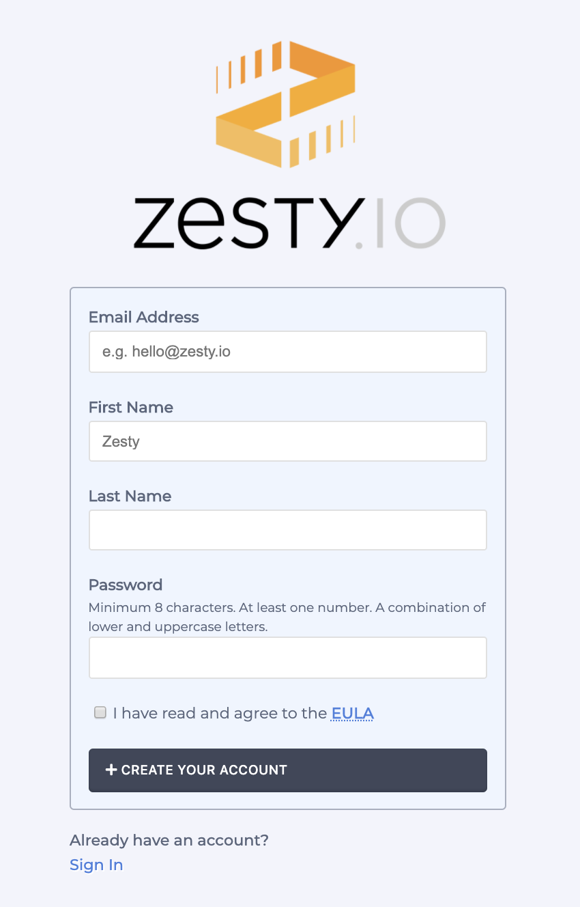
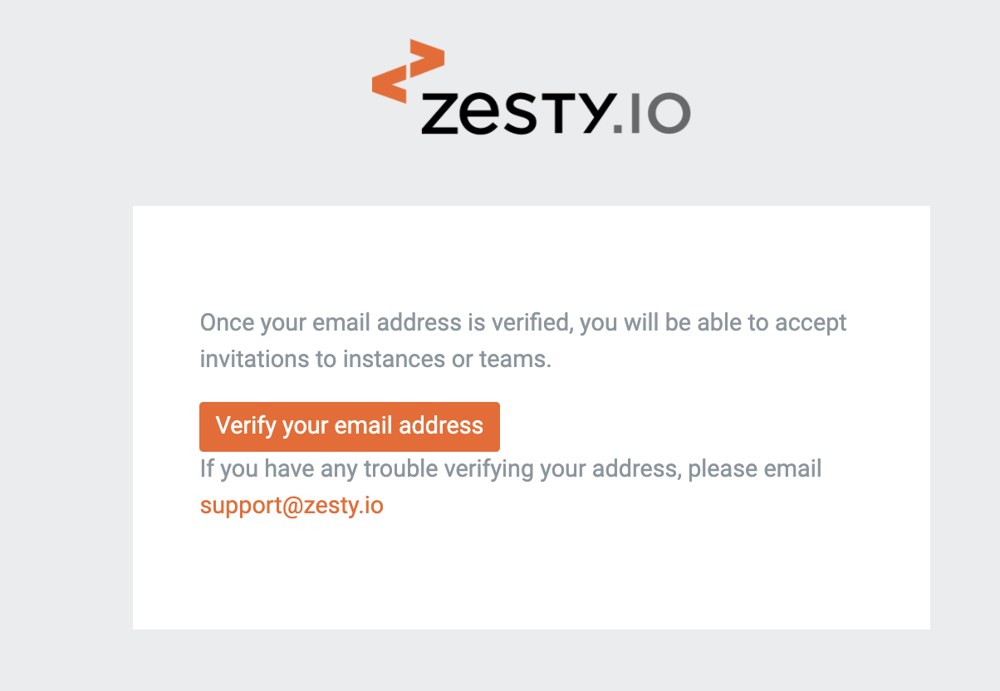
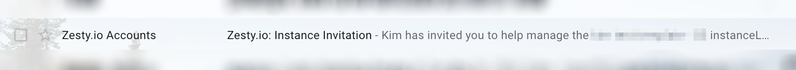
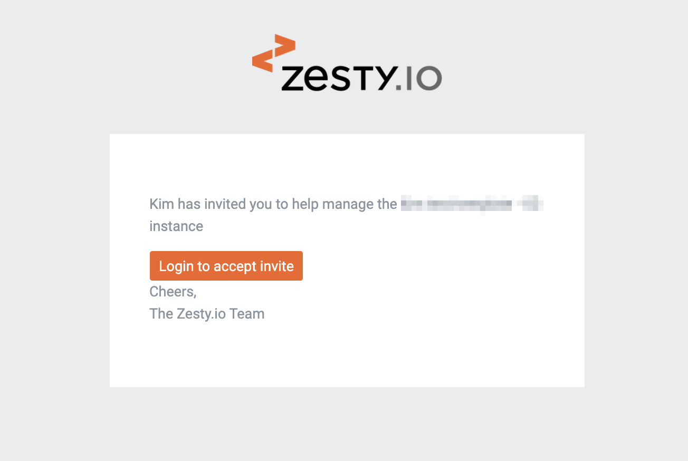
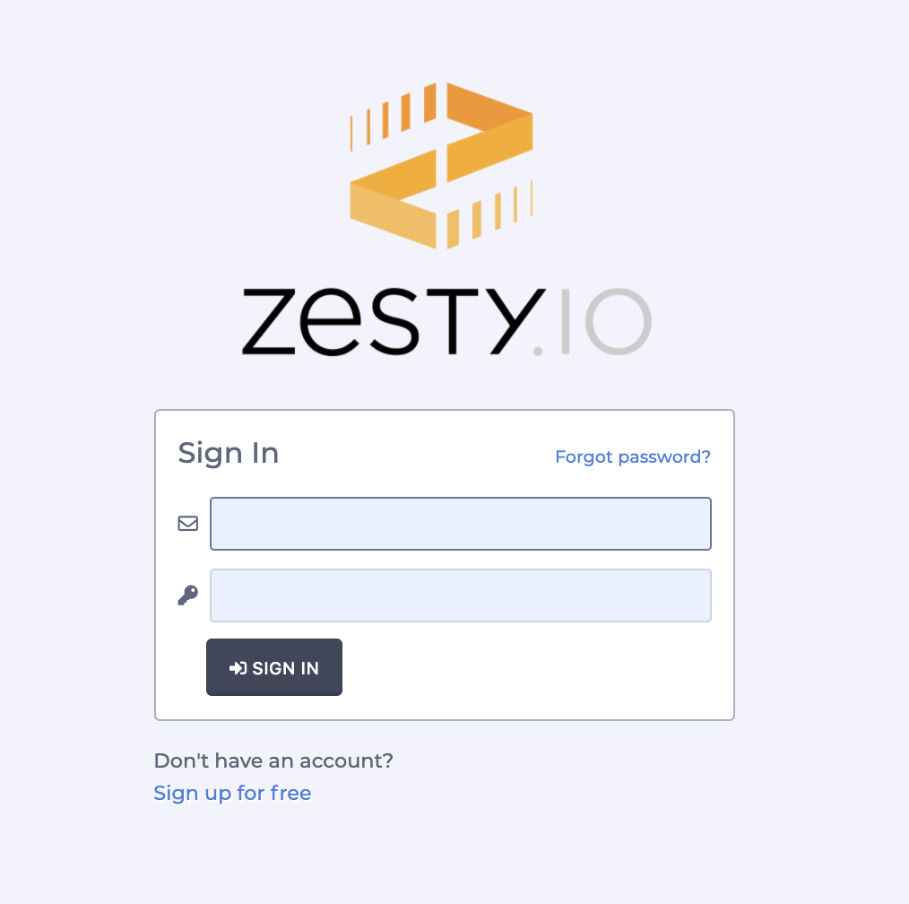
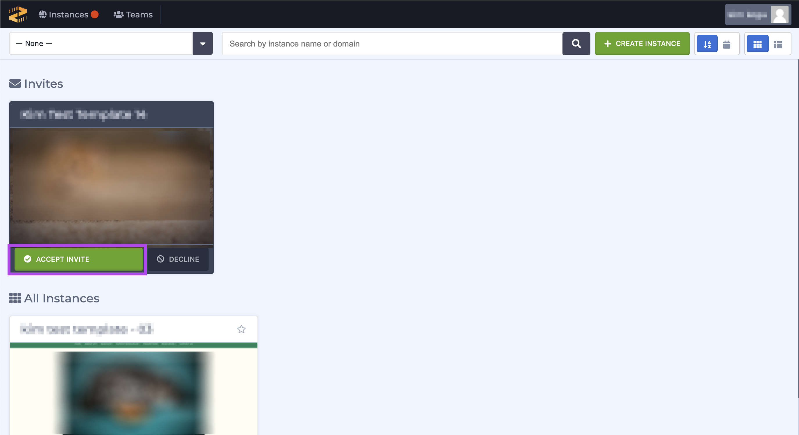
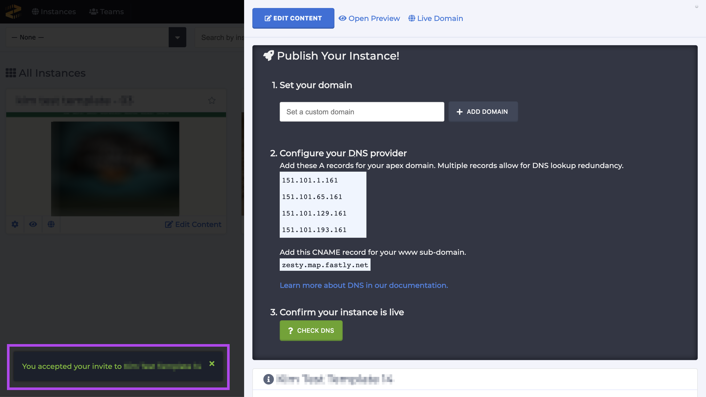

# Accepting an Invite to an Instance

### Overview

Only users of an instance can access it and edit its content. To become a user of an instance a user needs to be its [owner](https://zesty.org/getting-started/roles-and-permissions#owner), part of [team](https://zesty.org/guides/adding-a-team) that's assigned to it, or invited to access it. After a user is invited to access an instance they'll need to accept their invite before they can access the instance. Likewise, if a user is not the owner or a team member of an instance they'll need be invited _and_ accept that invite to an instance before they can access it. 

There are 2 ways to login to accept your invite: via email and by navigating to [https://accounts.zesty.io/login](https://accounts.zesty.io/login). 


Even though a user does _not_ have a Zesty.io account they can still be invited to access an instance. However, they will need to create an account _before_ they can accept their invite.


### Before you begin

If you've never created an account in Zesty.io then [create an account](https://accounts.zesty.io/signup).

1. Navigate to [https://accounts.zesty.io/signup](https://accounts.zesty.io/signup) to sign up for an account.

2. After you've created an account, check your email and verify your account. 


If you don't see a verification email in your inbox check your spam folder. 


3. Click the orange "Verify your email address" button to verify your email address.

### Steps

There are 2 ways to get to the Zesty.io login screen:

#### Get to the login screen via email 

1a. Locate the invitation in your inbox. 

2a. Open the email and click on the orange "Login to accept invite" button, which will route you to the Zesty.io login screen.

#### Get to the login screen via URL

1b. Navigate to the [Zesty.io login](https://accounts.zesty.io/login) screen.

#### After getting to the login screen follow the steps below:

2. Use your account credentials to login to your account. 

3. There will be an Invites section in your all-instances view. Click the green Accept Invite section to accept your invite.

4. Once you accept your invite the instance's settings drawer will open and you'll see a  notification in the lower left-hand corner that you've accepted access to an instance. 

### Troubleshooting

#### Email Mismatch

If you've been invited to access an instance but you do not see an invitation once you login, ensure that the invite email and Zesty.io account email _are an exact match_. For example, you'll have issues accessing your invitation if your account has been created with a personal email address, and the invitation was sent to a professional email address.

**Invitee doesn't have a Zesty.io account**

Anyone can be invited to access an instance whether or not they have an existing Zesty.io account. However, only users who **do have an existing account** will be able to accept an invite. Before you try to accept an invite be sure that you have a Zesty.io account under the email that you've been invited with.

**Unable to accept invite via email link**

If you're unable to accept an invite via the link in the email you can login to your account and view invitations in the Accounts interface and accept them there. Invitations to instances show up in their own section above the instances that you already have access to.  

