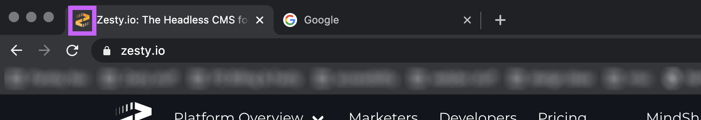
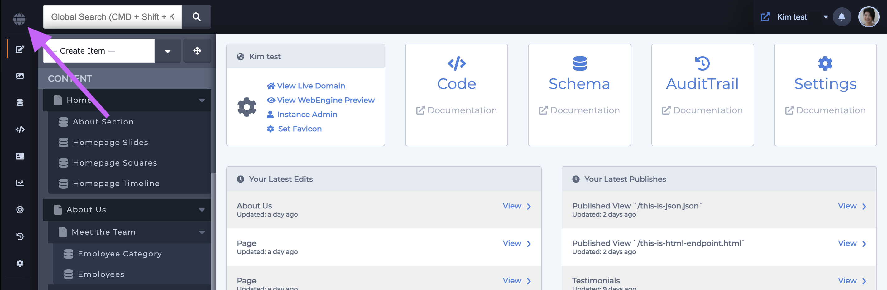
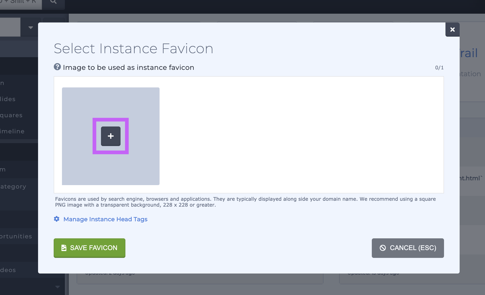
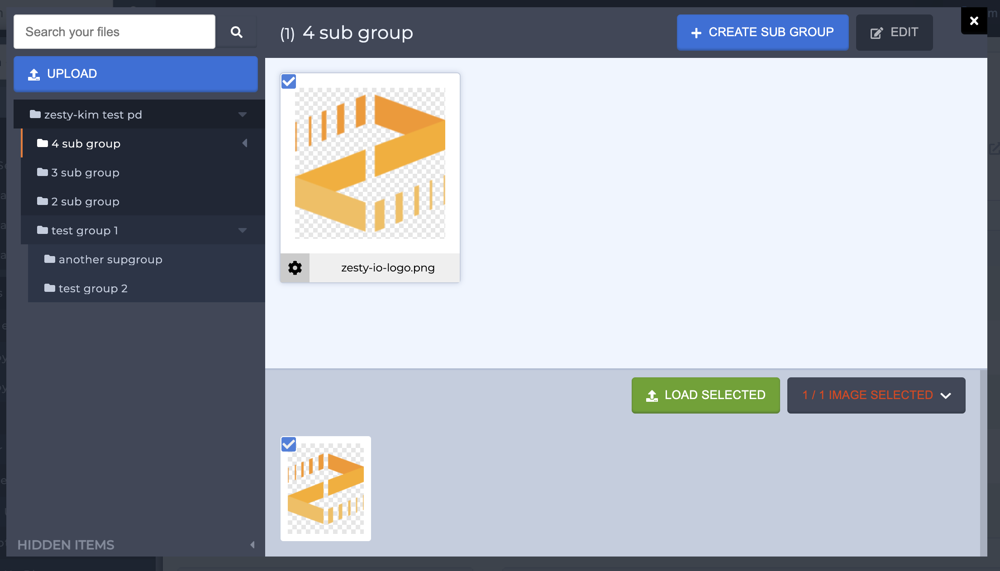
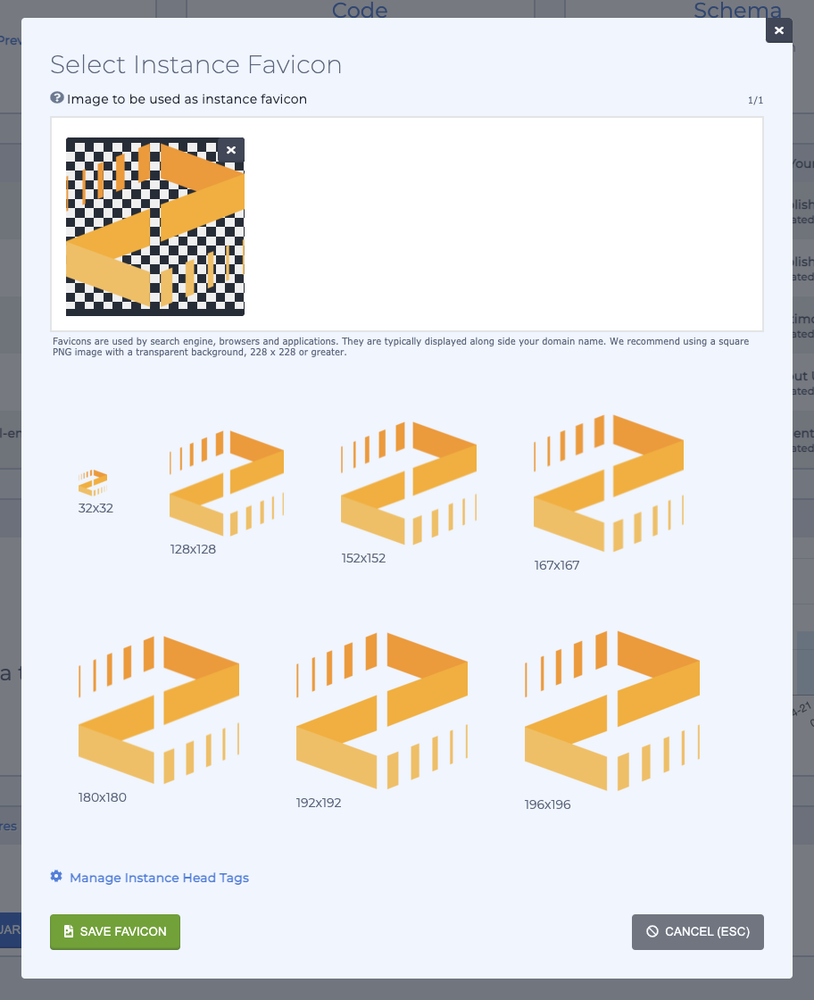
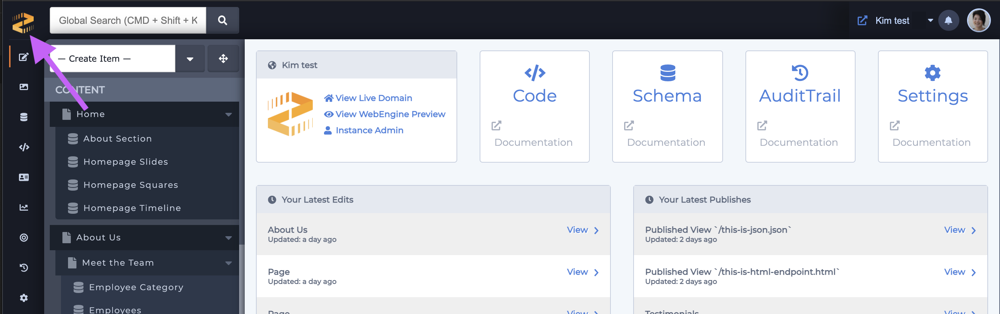
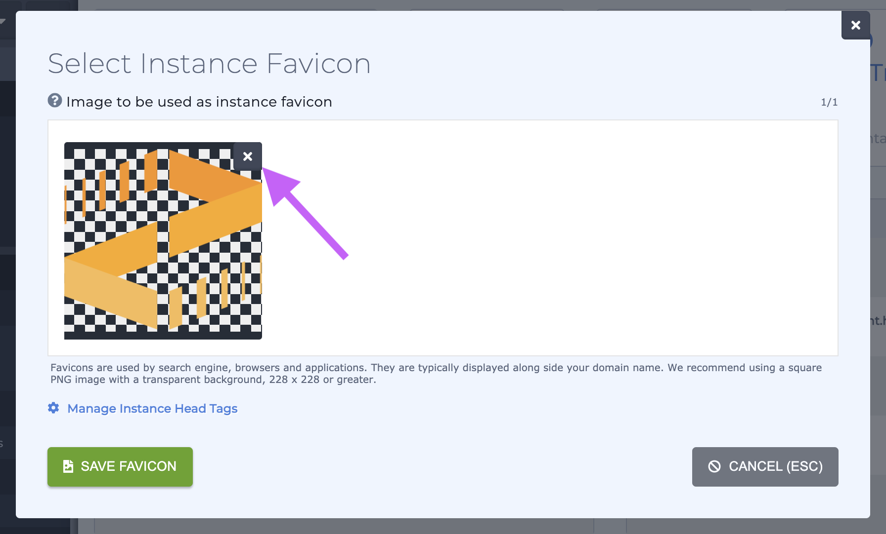

# Adding a Favicon

### Overview

Favicons are typically 16x16 pixel icon that's shown in a browser's tabs and bookmark lists. They not only serve as branding, but they help users easily identify your site in bookmark lists and among multiple browser tabs. 

### Steps to add a favicon

1. From the Content Manger click on the globe icon in the upper left-hand corner to launch the favicon modal

2. Click the +  in the favicon modal to launch the media modal. 

3. From the media modal select an existing image or upload a new image by dragging new images into the modal. Then select the image you want by clicking on it and click the green **Load Selected** button.

4. With your favicon selected, Zesty will show you the favicon at different sizes. If you're satisfied then click the green **Save Favicon** button. _Note: you may need to scroll to see all sizes and **Save Favicon** button._

Congratulations! You've added a favicon.   
Your selected favicon will appear in the upper left-hand corner of the content manager where the globe icon was. 

### Updating an existing favicon

1. Click on the favicon which is in the upper left-hand corner to launch the favicon modal \(shown in step 1 above\). 

2. Click on the X in the corner of the existing favicon to remove it. 

3. Then click on the plus to add a new image \(show in step 2 above\) to select a new favicon.

