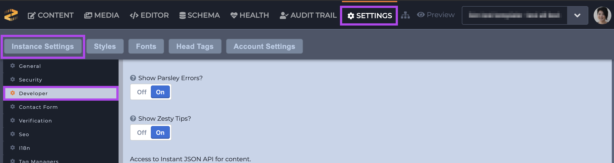
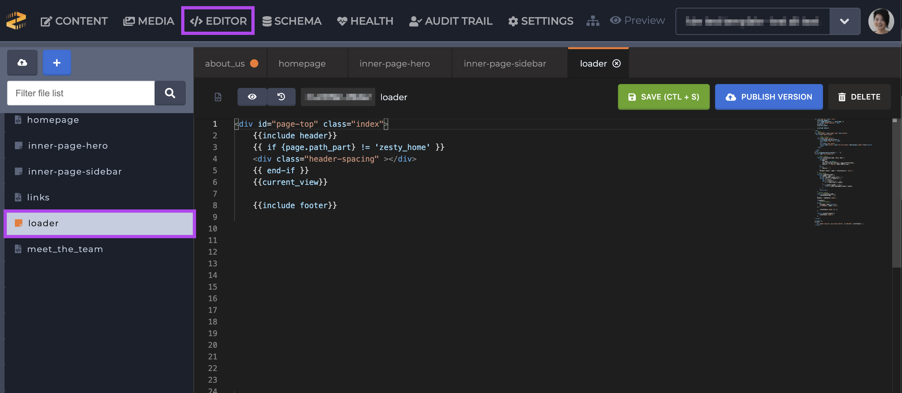
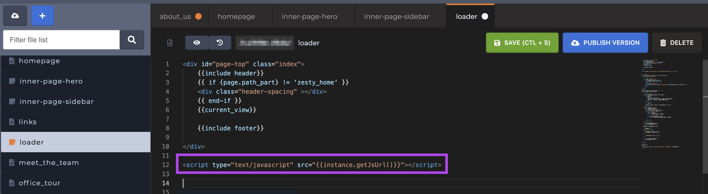
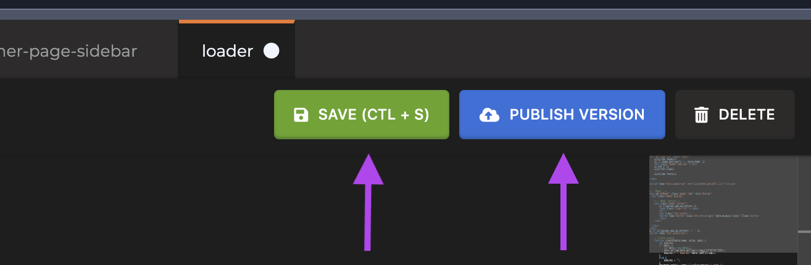

# Bottom Loading JavaScript

### Steps

Follow these steps to bottom load your JavaScript.

1\. Navigate to your Settings section -> Instance Settings category -> Developer.&#x20;

2\. Toggle the "Automatically include JavaScript" in head setting to _Off_ and save.

3\. Navigate to the Editor and find the Loader listed under Views, and select it.

4\. Add a script tag with the following Parsley call in the `src` attribute `{{instance.getJsUrl()}}`. For example: ``

5\. Save and Publish your changes to send them live.&#x20;

