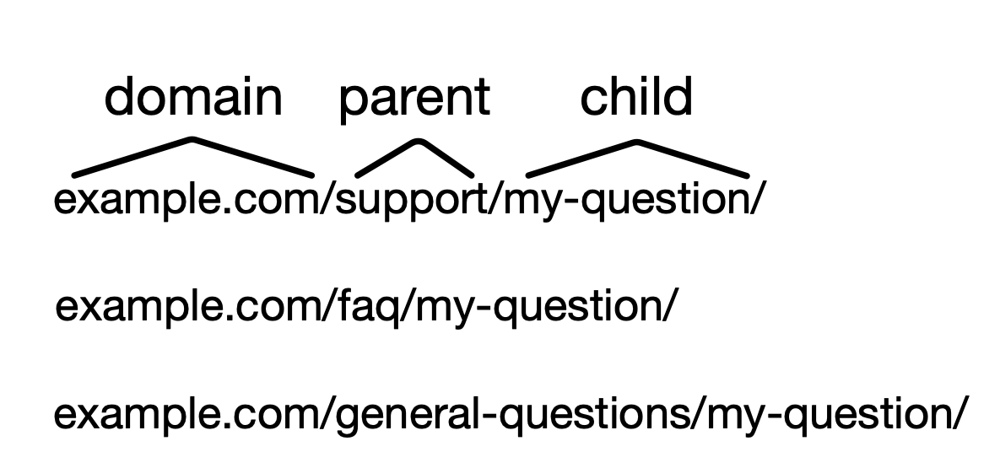
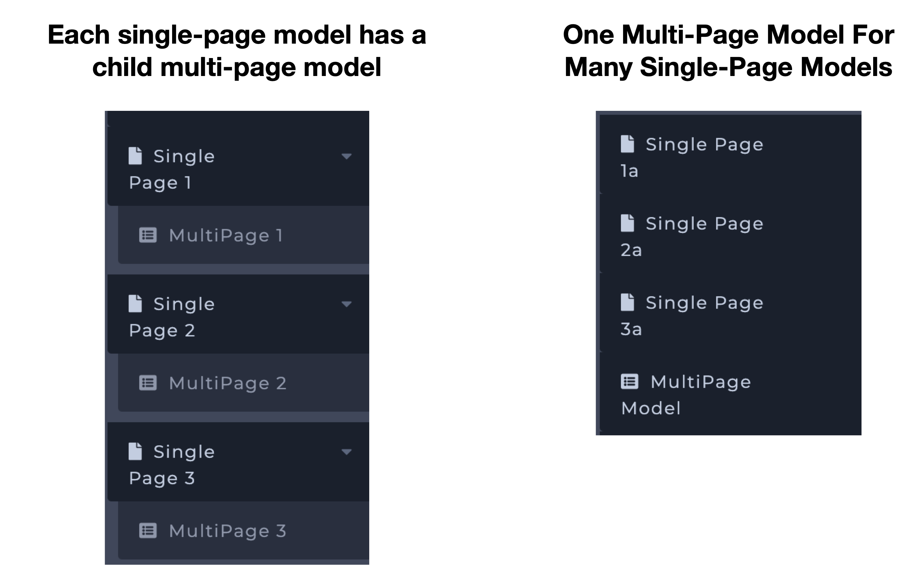
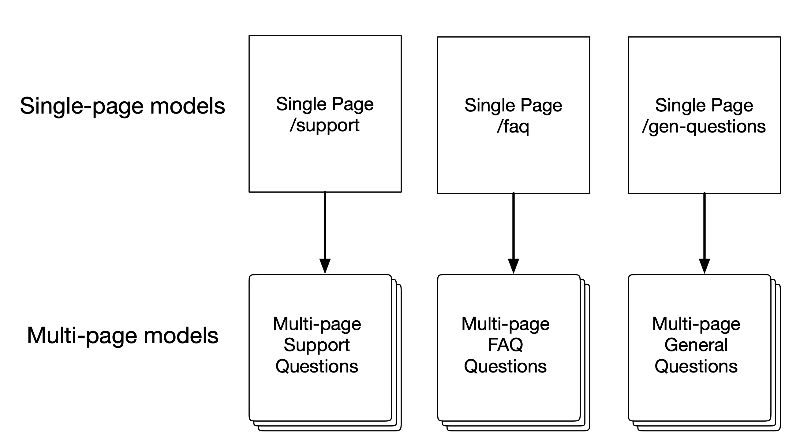
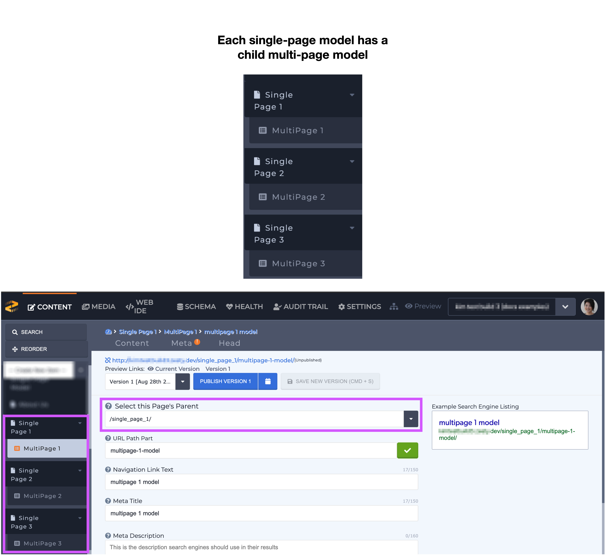
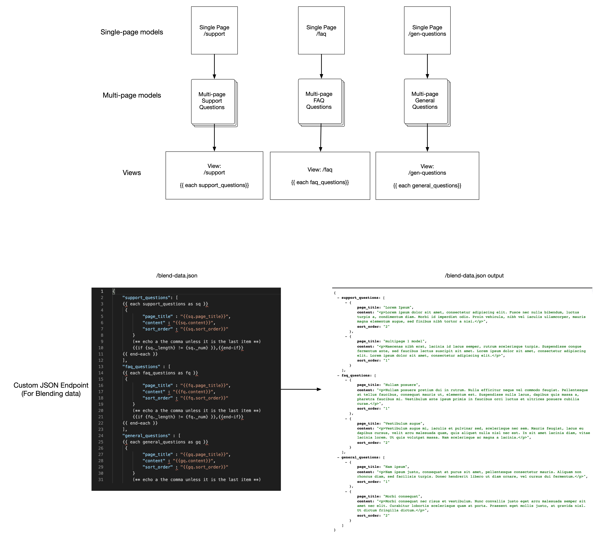
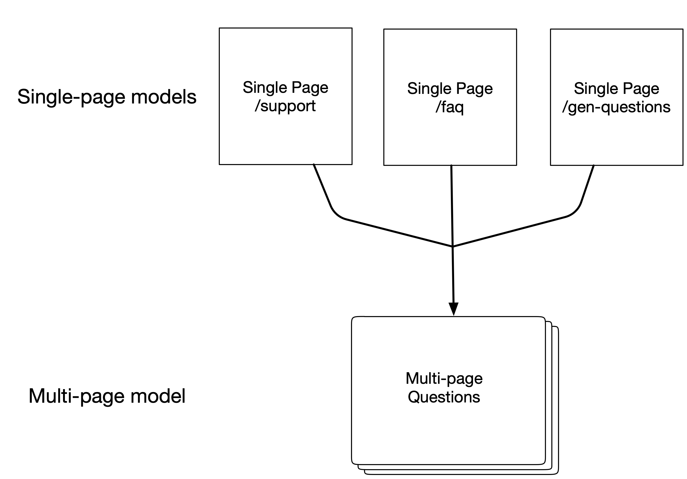
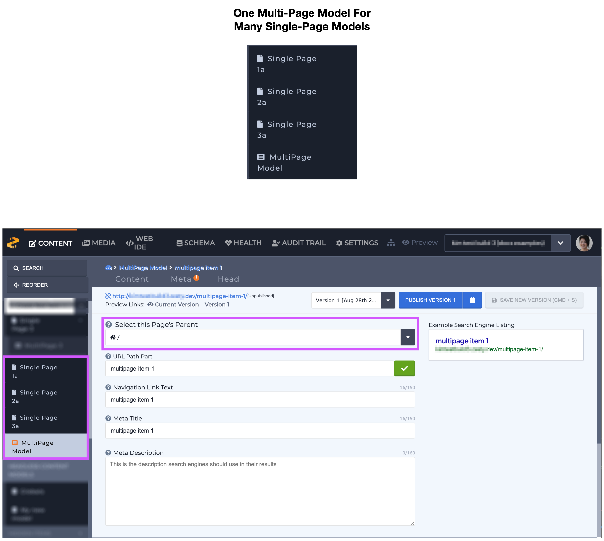

# Building Related Single and Multi-page Content Models

### Overview

When building your instance's Schema it's important to consider what you'd like your URL paths to look like and to understand how building those paths will impact your content manager and developer.

When you're building an instance with multiple single-page content models that are related to multi-page model(s) it can be confusing to know which way to build them. Do you make one multi-page model for each single-page model? Or do you make a one multi-page model for _all_ of your single-page models? There are at least a couple different ways to architect your content models and this article will help you understand the implications of 2 types of builds.

_Note:_ having a general, global understanding your teams needs including basic coding skills will help you further assess their needs and understand how to [build your Schema](https://zesty.org/guides/building-related-single-and-multi-page-content-models#building-your-schema).


Some of the images below contain hard-to-read text. Click the images to expand them & zoom-in to read text.


### Considerations Before Building

#### Routing

It's important to understand the URL paths that you're trying to create before you build your Schema. Breaking up the URL into parent, child, grandchild will then help you understand which _content models_ will be the parents, children, grandchildren, and so on. For example, if your URL paths need to be: `/support/my-question/`, `faq/my-question`, `general-questions/my-question` all of these URLs follow the structure of `/parent/child/`. If you had a longer URL the structure would be: /parent/child/grandchild/great-grandchild and so on. The structure of the path will likely reflect how you'll build your Schema, however it doesn't mean that you'll need to build in a one-to-one fashion. These builds are further described in the [Building Your Schema ](https://zesty.org/guides/building-related-single-and-multi-page-content-models#building-your-schema)section below.

#### Understanding your team's needs

Understanding your content manager's needs allows you to balance them with  your developer's needs. It'll also help you understand how your content team prefers to enter data and what needs to be done with the data which can influence how to decide to construct the Schema. With this understanding you can see where compromises may need to be made as well.

**Content Manager**&#x20;

The content manager(s) will be the person(s) who are [entering/editing content](https://zesty.org/guides/content-entry-drafts-and-publishing). Consider how much effort managing content will take. The content manager may find it easier to do all of their work in one multi-page model **** (shown above as _One multi-page model for many single-page models_), or they may find it easier to organize their content into several multi-page models (Shown above as _Each single-page model has a child multi-page model_). Be sure to communicate with your content team so you can take their needs into consideration.

**Developer**

Your developer(s) will need to consider how this information will be consumed and where it will be sent. How will the content be displayed and on which pages? Will the content be sent elsewhere (e.g. a mobile app)? How will content be assorted or combined? The answers to these questions will help you understand how complex the code will need to be.

### Building Your Schema

Below we've described 2 different ways of designing a setup:

* Each single-page model has a child multi-page model
* One multi-page model for many single-page models

#### Each single-page model has a child multi-page model

Each single-page model will have a multi-page model as its child. When this structure is built each multi-page model will have their [parent selected](https://zesty.org/guides/building-the-schema-and-selecting-fields#step-3-model-parent) when it's created.

**Schema**&#x20;

When the [Schema is built](https://zesty.org/guides/building-the-schema-and-selecting-fields) it will reflect the diagram below where the single-models are the parents and the multi-page models are the children.

**Content**&#x20;

The Schema's structure is reflected in the content navigation sidebar. When the content manager is entering content the parent will automatically be selected for them in the Meta section and they will need to enter their content in multiple models.&#x20;

**Code**

If the content from each model must be combined and assorted developers can use a [custom JSON endpoint](https://zesty.org/services/manager-ui/editor/custom-file-types-endpoints#creating-a-custom-file-type-from-the-web-ide) to combine the entries, and use JavaScript to filter and display the data. Each single-page model can use a [Parsley each loop](https://zesty.org/services/web-engine/introduction-to-parsley/each-loop-deep-dive) to display its related multi-page model information.&#x20;

#### One Multi-Page Model For Many Single-Page Models

Single-page models will have one multi-page model. When this structure is built the multi-page model will **not** have any [parent item](https://zesty.org/guides/building-the-schema-and-selecting-fields#step-3-model-parent) selected.

**Schema**

When the [Schema is built](https://zesty.org/guides/building-the-schema-and-selecting-fields) it will reflect the diagram below where the single-models are a multi-page model are top-level items. The arrow indicates that the related articles (following our example) will all be housed in a single multi-page model.

**Content**

The content manager will be able to enter all of their content into one multi-page model, however they will need to select the item's parent from the Meta tab. If a parent isn't selected then the article will be a top-level item.

**Code**

Since the content is already gathered in a single model, displaying the content on a page requires a single [each loop](https://zesty.org/services/web-engine/introduction-to-parsley/each-loop-deep-dive) to iterate through all the content. If the content needs to separated out by its parent that can be done with an [if-conditional](https://zesty.org/services/web-engine/introduction-to-parsley/if-conditionals) (shown below) or multiple each loops with [`where` filters](https://zesty.org/services/web-engine/introduction-to-parsley/each-loop-deep-dive#using-where-to-your-results).

### Conclusion

There are multiple ways to build architect your content models based on the a user's needs. These examples show 2 ways of doing this, including examples of code a developer might use to build their views. Take this information into consideration and use it with your own innovative [Parsley](https://zesty.org/services/web-engine/introduction-to-parsley) and JavaScript techniques to design your [Schema](https://zesty.org/services/manager-ui/schema) build your [views](https://zesty.org/services/web-engine/view-templating).
