# Content Entry, Drafts, and Publishing

## Introduction

Once you're finished [building your schema](building-the-schema-and-selecting-fields.md) it's time to enter your content. Throughout this guide you'll learn that basics of content entry for single pages, multi-page sets, and headless sets, publishing your content, and more.

## Identifying Content Model Types

The left-hand sidebar of the Content section lists all of your content models. Each content model type is identified by its icon.

### Single Pages

Single page are denoted by a page icon.

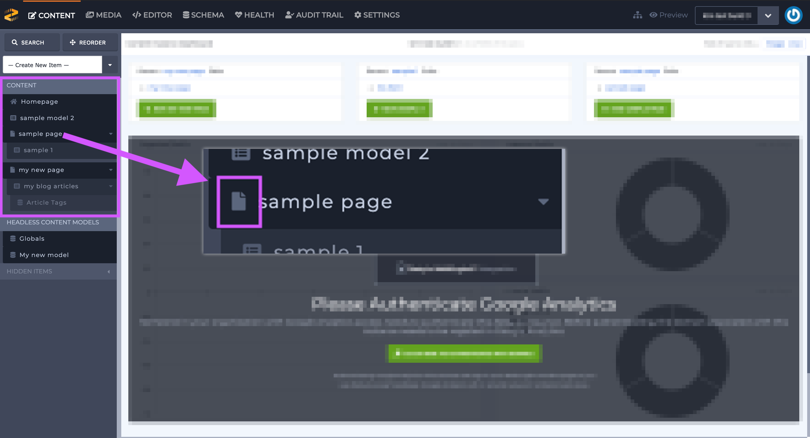

### Multi-Page Sets

Multi-page sets are denoted by a list icon.

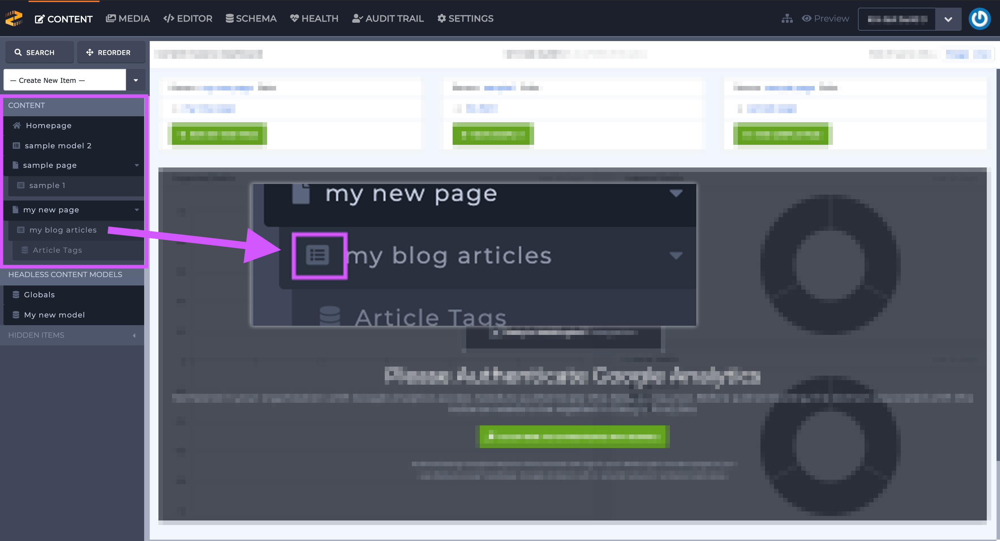

### Headless Sets

Headless sets are denoted by a database icon.

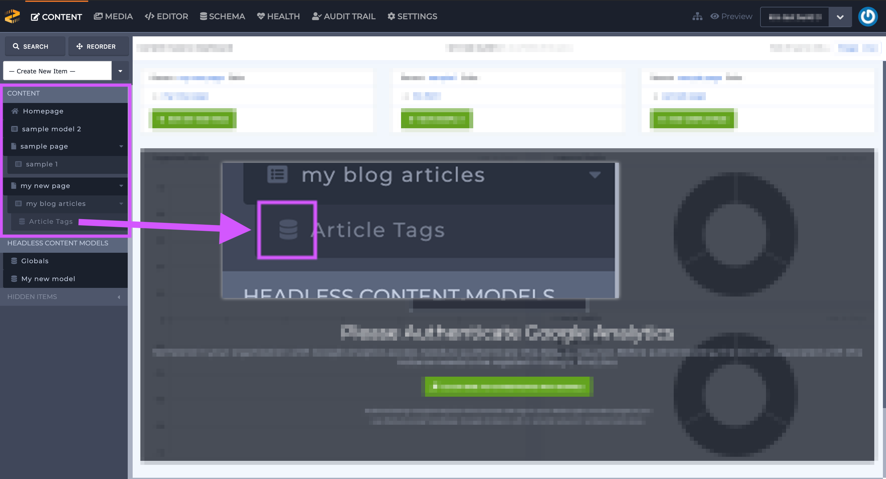

## Entering and Editing Content

### Single Page

1. Determine which single-page content model you want to edit and click on it to select it. 

When a single-page content model is selected from the left-hand sidebar navigation, the main portion of the screen shows that page's content \(outlined in purple below\) and allows you to edit it.

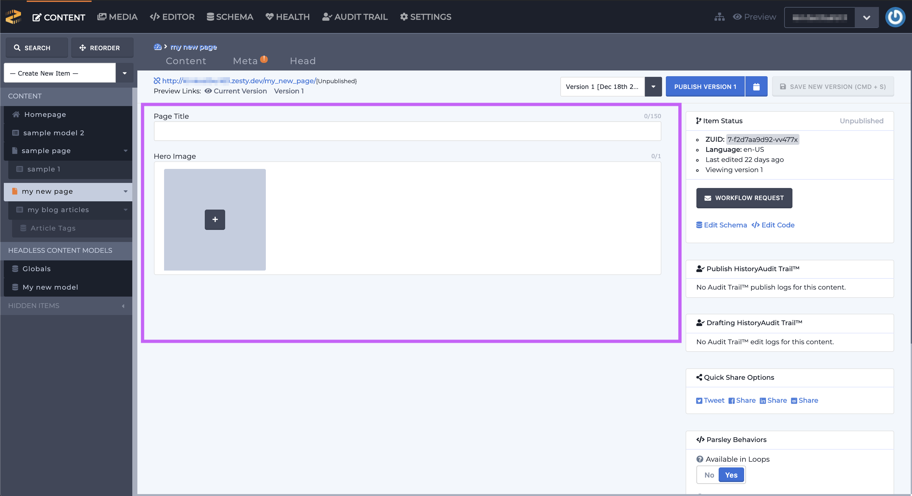

1. Determine which piece\(s\) of content you want to update. Pieces of content are identified by their [field labels](https://zesty.org/services/manager-ui/schema/adding-fields#label-v-reference-name) which were assigned in the Schema section. Field Labels are located above each field.

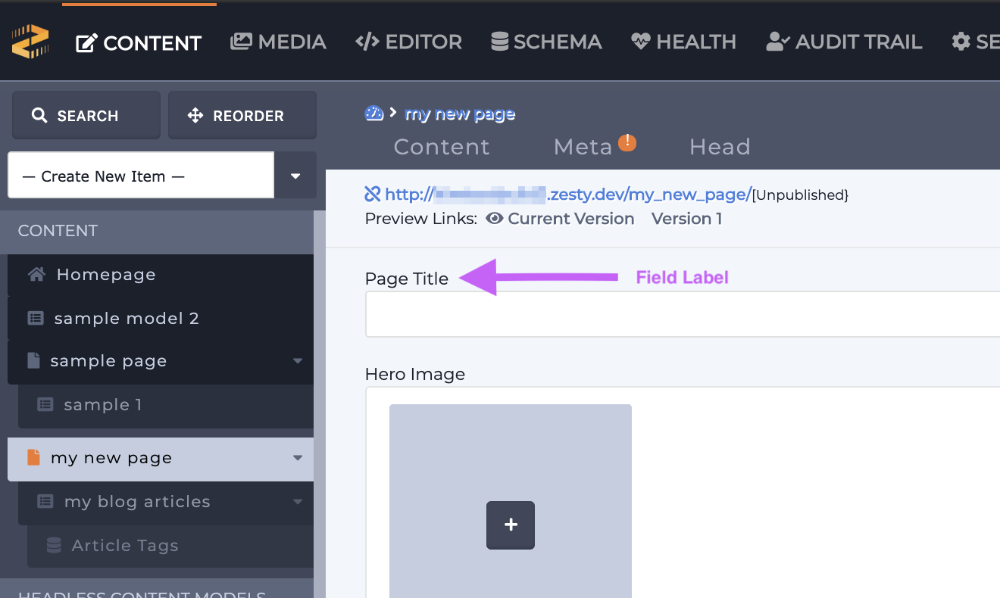

1. Edit/add content according to the field type. Then click the green Save New Version button in the upper right-hand corner of the item editing view.

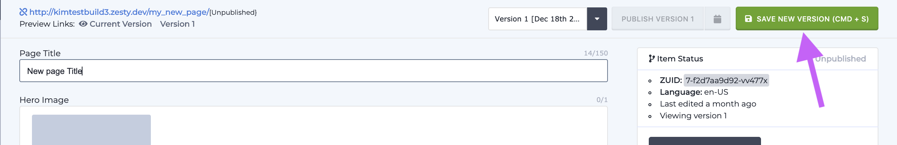

### Multi-page and Headless sets

Multi-page and headless sets have the same flow when it comes to editing and adding new content.

Follow the steps below to **create a new multi-page or headless set item**. 

1. Determine which multi-page or headless set that you want to add a new entry for and click on it to select it. 


Parented multi-page and headless sets will be nested under their respective parent.

Unparented multi-page sets will appear in the left-hand sidebar navigation under the Content section.

Unparented headless sets will appear in the left-hand sidebar navigation under the Headless Content Models section.


When a multi-page or headless set is selected from the left-hand sidebar nav, the main portion of the screen shows that set's table-listing view. If there are already entries in the table-listing view they will be listed in the main portion of the screen, if not the main portion of the screen will look similar to the image below.

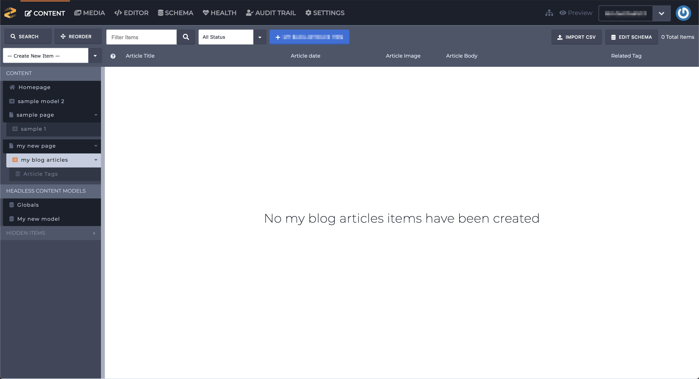

1. Locate the table-listing view menu and click the blue button \(outlined in purple below\) to add a new entry. The blue button will have a plus sign and your set's name; for example: + my blog articles.

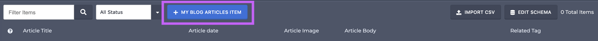

1. Enter your content in the fields and click the green Create New Item button. As soon as you click the Create New Item button your item will be created.  

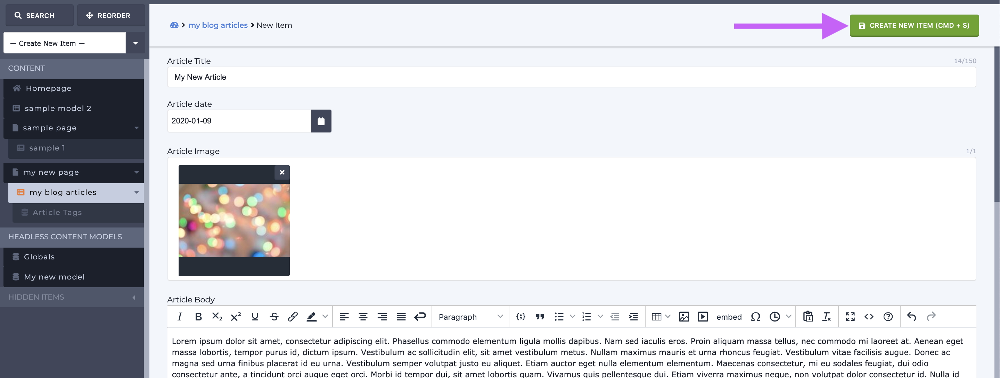

Follow the steps below to **edit an existing multi-page or headless item**.

1. Determine which multi-page or headless set has the item that you want to edit and click on it to select it. The set's table-listing view will show all of the set's items. 

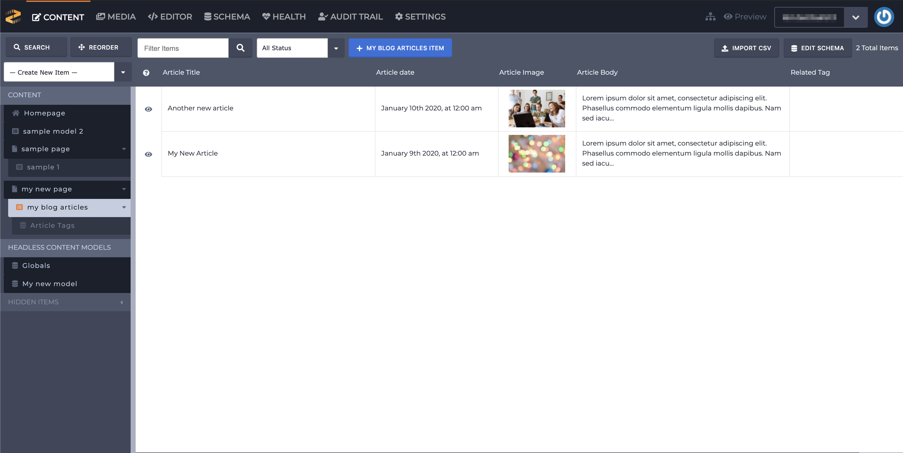

1. Identify the item that you want to edit and click on it to select it. When the item is selected the item's editing view will show in the main portion of the screen \(outlined in purple\). 

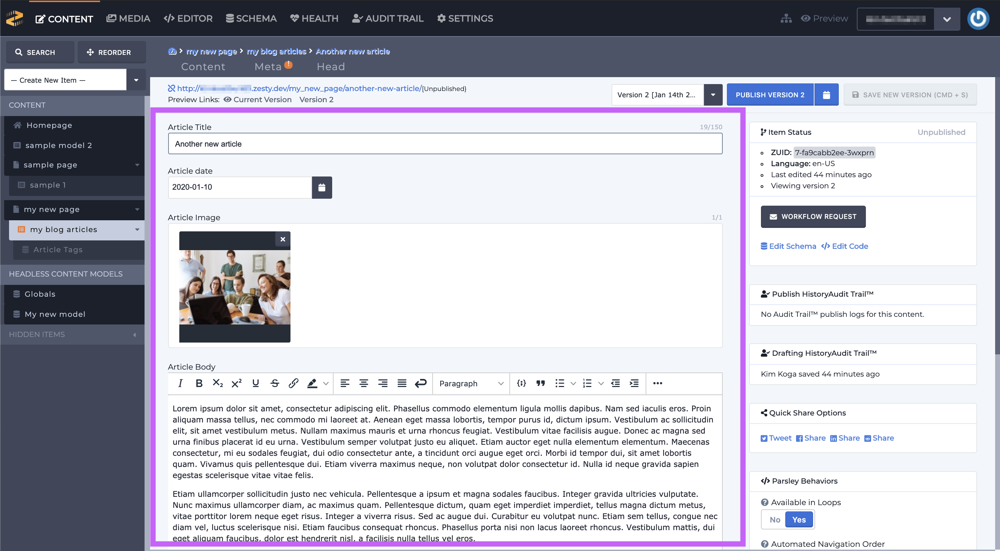


Whether you're editing a single-page item, multi-page set item, or headless set item the item editing views will look the same.


1. Determine which piece\(s\) of content you want to update. Pieces of content are identified by their [field labels](https://zesty.org/services/manager-ui/schema/adding-fields#label-v-reference-name) which were assigned in the Schema section. Field Labels are located above each field.
2. Once you're finished editing click the green Save New Version button.

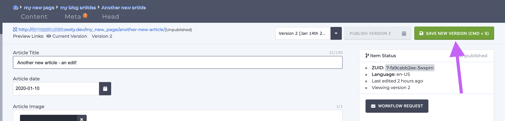

### Globals

Globals is a special headless set that is built-in to every Zesty.io instance and it's used for an instance's global pieces of content such as logo, instance name, general contact information, hours of operation, and anything else a user wants to keep there.

This headless set does **not** have a table-listing view and does **not** allow for multiple entries. However, users can add fields to it via the Schema section. When Globals are selected in the left-hand sidebar navigation the editing view looks exactly like the other content editing views.

## Drafts and Publishing

Every time an edit is saved, a new draft or version is created. Drafts are created in numerical order. The current draft number is indicated in the dropdown next to the blue publish button. Once you save changes a link will be available to preview you changes. You'll also be able to preview your changes.

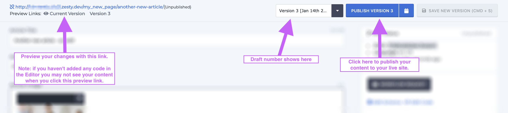


Note: Preview links are only available for items with URLs. Content models that have URLs are single page models and multi-page models.

If your item\(s\) has not been coded in the Editor section your preview might show a blank page.


### Conclusion

Repeat these processes as many times as needed to finish entering your content. Once you've finished entering content we'll hop over to the Editor section and start coding.

